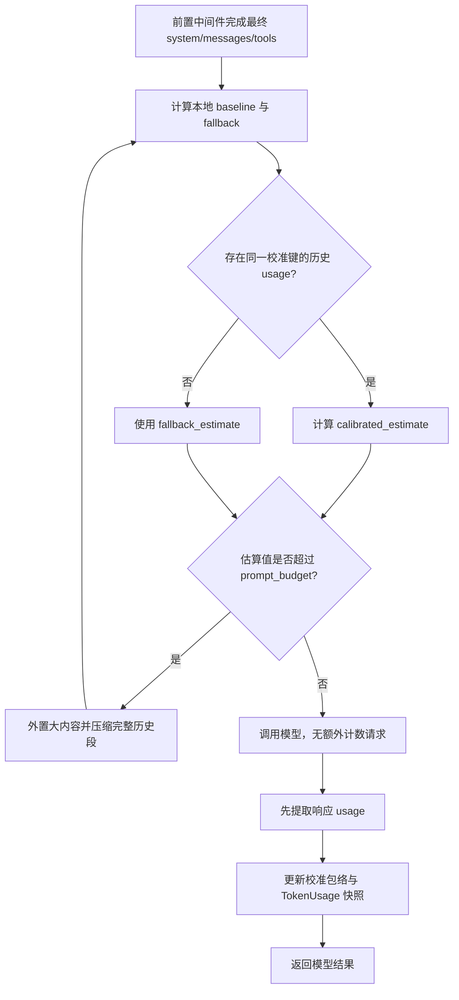

# 模型 Token 估算校准与上下文准入方案

> **后续方案说明（2026-07-31）：** 本文的统一预算和 usage 正误差校准继续有效；后续实现中完整工具 schema 不再进入校准键，改为仅记录诊断 hash，具体迁移与验收以 [多级上下文压缩重构实施方案](./2026-07-31-多级上下文压缩实施方案.md) 为准。

> 状态：**阶段 0～3 已实施，阶段 4 容器与 Ollama/Qwen 验收完成；GPUStack/vLLM 待具备环境后补验**
> 日期：2026-07-23
> 版本：v3
> 范围：Chatbot、SubAgent 及摘要调用的上下文准入、usage 校准、溢出恢复和 UI 计数口径；MCP/工具按需加载另行实施。

## 1. 结论

本方案不调用 `/tokenize`，不探测 GPUStack/vLLM 路由，不引入新的 Tokenizer 或计量服务。

采用一条统一链路：

1. 第一次模型调用前，对最终 `system + messages + tools` 做本地保守估算。
2. 模型响应后读取供应商返回的输入 usage，校准本会话的估算误差。
3. 后续调用使用校准后的保守估算做准入；超过输入预算时，在调用模型前持续压缩。
4. 上下文溢出且响应带 usage 时，先保留真实 usage，再压缩并只重试一次。
5. UI 将供应商实测总量与本地估算分项明确区分。

这样不会给首 Token 增加额外网络往返，也不依赖 Ollama、GPUStack、vLLM 或具体模型是否提供计数端点。

必须明确其能力边界：新会话、新模型或新工具集合的第一次超大请求，在响应前没有真实 usage，因此无法保证模型级精确计数。系统只能保守估算，并在供应商返回明确溢出后执行一次恢复。若未来数据证明“首次请求溢出”仍是高频问题，再单独评估模型原生计数能力，不在本期预建。

## 2. 问题与目标

### 2.1 已确认问题

当前 `TokenUsageMiddleware` 和 `YuxiSummarizationMiddleware` 使用 `count_tokens_approximately` 判断上下文大小。它不能准确覆盖本地模型的 tokenizer、聊天模板、中文文本、工具协议和工具 JSON Schema。

已观察到同一次请求：

```text
项目本地估算输入：20,284
供应商实际输入：32,601
模型上下文窗口：32,768
```

摘要中间件因低估而提前停止压缩，真实调用随后填满模型窗口，并出现：

```text
模型在生成可见正文前已达到上下文上限
```

当前 `_build_snapshot()` 还会先检查空正文 `finish_reason=length` 并抛出异常，之后才读取 usage，导致本次最有价值的实际输入量无法进入恢复流程。

### 2.2 目标

- 长对话中只要模型至少成功返回过一次 usage，后续准入就使用校准后的保守值。
- 摘要停止条件、主模型准入和子智能体准入使用同一估算函数与同一预算。
- 达到预算后持续压缩完整历史交互段，直到校准估算低于预算，而不是只压缩一次。
- `finish_reason=length` 不被当作跨供应商通用的上下文溢出信号；必须结合正文、工具调用、usage 和实际窗口判断。
- 不限制模型真实输出长度；`min_output_reserve_tokens` 仅用于预留输入预算。
- 不新增用户必填参数，不增加正常模型调用的网络请求。
- UI 不再把估算分项冒充为模型实测值。

### 2.3 非目标

- 不实现 `/tokenize`、GPUStack Generic Proxy、路由发现、正负缓存或相关超时。
- 不引入 LiteLLM、tiktoken 或模型专用 tokenizer。
- 不为不同部署后端创建适配器类层次。
- 不处理 MCP/工具 Schema 的按需加载；本期只保证已加载内容全部进入估算。
- 不创建跨会话数据库或 Redis 校准缓存。

## 3. 统一预算

所有模型调用继续使用：

```text
prompt_budget =
    context_length
    - effective_output_reserve
    - context_safety_tokens
```

其中：

- `context_length`：模型真实上下文窗口。
- `min_output_reserve_tokens`：预估需要保留的最低回复空间，不作为模型 API 的输出限制。
- `effective_output_reserve`：默认等于 `min_output_reserve_tokens`；如果调用方显式设置了真实的 `max_tokens`/`max_completion_tokens` 输出上限，则取两者较大值。
- `context_safety_tokens`：模型模板、协议和本地估算的不确定性缓冲。
- `prompt_budget`：最终模型输入必须满足的上限。

`prompt_budget` 已经扣除了输出预留和安全缓冲，不再额外引入第二个百分比阈值、`verification_line` 或模型窗口的固定保留比例。

## 4. 本地估算与 usage 校准

### 4.1 最终请求估算

估算必须发生在附件、Skill、文件系统、Todo、SubAgent 和工具过滤等中间件完成之后，并覆盖真正发给模型的：

- 最终动态系统提示词；
- 私有摘要；
- 当前工作消息；
- 工具调用与工具结果；
- 工具 Schema。

复用现有 `count_tokens_approximately` 作为稳定基线，同时增加无模型硬编码的中文/JSON 保守值：

```text
baseline = count_tokens_approximately(final_request)

unicode_estimate =
    ceil(ascii_text_chars / 4 + non_ascii_text_chars)

serialization_estimate =
    ceil(serialized_messages_and_tools_chars / 2)

fallback_estimate =
    max(baseline, unicode_estimate, serialization_estimate)
```

约束：

- `/2` 只是首次请求的保守启发式，不宣称是 tokenizer 上界。
- JSON 序列化必须使用 UTF-8 语义（例如 `ensure_ascii=False`），否则中文被转义为 `\uXXXX` 后会人为放大字符估算。
- 图片等多模态块不得把 base64 字节长度当作文本 Token；沿用现有图片估算并标记为估算。
- 所有预算判断必须调用同一个估算入口，不能让摘要和 TokenUsage 各自维护一套算法。

### 4.2 校准包络

每次模型响应都从 `AIMessage.usage_metadata` 读取供应商输入/输出 usage。当前 OpenAI 兼容模型已启用 `stream_usage=True`；其他后端缺失 usage 时继续使用本地保守估算。

校准公式：

```text
baseline = 本次调用前保存的稳定本地基线
actual_input = 供应商报告的本次实际输入

positive_error = max(actual_input - baseline, 0)
ratio = max(actual_input / baseline, 1)

max_positive_error = max(历史值, positive_error)
max_ratio = max(历史值, ratio)

calibrated_estimate = max(
    fallback_estimate,
    baseline + max_positive_error,
    ceil(baseline * max_ratio),
)
```

设计约束：

- 只累积正误差，较小的新误差不能降低已经观察到的保护上界。
- 不使用平均值、移动平均或 P95 作为准入上界。
- `baseline <= 0`、usage 缺失、usage 为零或字段矛盾时不更新校准。
- 输出 usage 不参与输入估算倍率计算。
- 校准只存入已有 LangGraph `token_usage` 状态，不增加数据库表。

### 4.3 校准范围

校准键由以下稳定结构组成：

```text
模型 spec
+ 规范化部署地址
+ 请求协议版本
+ 工具 Schema 指纹
```

以下变化必须重置校准：

- 模型或部署地址改变；
- OpenAI 兼容请求协议实现改变；
- 实际注入模型的工具 Schema 改变。

以下内容不进入校准键：

- 用户消息和历史正文；
- 动态系统提示词正文；
- 附件内容；
- 私有摘要正文。

它们每轮都已进入新的本地 baseline。将正文或其哈希放进校准键只会使校准频繁失效，并可能把敏感内容带入状态。

校准默认仅在当前对话检查点内有效。跨会话缓存暂不实现；只有监控证明多个新会话的首次请求仍频繁溢出时，再增加有界的模型级缓存。

## 5. 调用时序



正常响应后不立即调用摘要模型。下一次模型调用前，当前用户输入、工具结果和最新 AIMessage 都已进入最终请求，此时再统一判断和压缩。

不需要单独存储 `must_compact_next_call`：每次调用前都会重新构造最终请求并应用同一校准包络；额外标记会形成第二套准入真相源。

## 6. `length` 与溢出恢复

### 6.1 响应分类

| 情况 | 处理 |
| --- | --- |
| 正常响应且有 usage | 保存实测输入/输出，更新校准。 |
| 有可见正文或工具调用的 `length` | 保留结果；以 `actual_input + actual_output >= context_window - context_safety_tokens` 判断是否触及整个上下文，仅用于诊断。下一轮仍按最终请求重新准入。 |
| 无可见正文、无工具调用的 `length`，且有 usage | 先提取 usage 并更新临时校准，再抛出携带 usage 的上下文异常。 |
| 供应商明确返回 context overflow 且无 usage | 强制压缩所有可安全压缩的旧历史后重试一次。 |
| `length` 有正文但总量远离上下文窗口 | 视为普通输出截断，不触发上下文恢复。 |

`finish_reason=length` 不是模型无关的“输入超上下文”信号。只有空响应、供应商明确异常，或实测总量接近有效窗口时，才进入对应的上下文处理。

### 6.2 带 usage 的恢复

新增一个最小的 `ContextOverflowError` 子类，仅携带：

- 本次调用前的 baseline/fallback；
- 供应商实际输入/输出；
- 更新后的校准上界；
- 有效上下文窗口。

摘要中间件捕获后：

1. 用异常携带的校准值临时覆盖本次恢复请求的 `token_usage`。
2. 按完整消息段压缩，保持 `AI tool_call` 与对应 `ToolMessage` 成对。
3. 每轮用校准估算重新判断。
4. 低于 `prompt_budget` 后重试模型一次。
5. 只有重试成功才原子提交摘要状态与新 `token_usage`。

### 6.3 无 usage 的恢复

没有实际 usage 时无法知道低估量，不再假装精确：

1. 外置可外置的大工具结果和当前大输入。
2. 摘要所有可安全压缩的已完成旧历史段，保留当前用户轮次及未完成协议。
3. 重试一次。
4. 仍失败则返回明确容量错误，不无限重试。

如果系统提示词、工具 Schema、私有摘要索引和当前不可压缩输入本身已超过 `prompt_budget`，直接返回 `ContextBudgetConfigurationError`。继续摘要历史无法解决固定开销问题。

## 7. UI 数据口径

`TokenUsagePayload` 调整为单一语义：

| 字段 | 语义 |
| --- | --- |
| `input_tokens` | 上一次模型输入总量；优先供应商实测，否则为校准/首次保守估算。 |
| `input_source` | `provider_usage` / `calibrated_estimate` / `fallback_estimate`。 |
| `provider_input_tokens` | 供应商报告的输入；缺失为 `null`，不得用估算冒充。 |
| `provider_output_tokens` | 供应商报告的输出；可能包含隐藏推理，仅用于诊断。 |
| `baseline_input_tokens` | 稳定本地基线。 |
| `estimated_input_tokens` | 本地近似分项之和；仅用于解释构成，不参与准入。 |
| `breakdown_estimate` | `{messages, private_summary, system, tools}`，全部标记为本地估算。 |
| `protocol_correction_tokens` | `provider_input_tokens - estimated_input_tokens`；允许为负。 |
| `max_positive_error` / `max_ratio` | 当前校准包络。 |
| `prompt_budget` | 安全输入预算。 |
| `input_budget_delta` | `prompt_budget - input_tokens`。 |
| `context_window` | 模型配置的完整上下文窗口。 |
| `context_remaining_after_input` | `context_window - input_tokens`。 |

主站和 iframe 统一展示：

- 主标题为“上次模型输入”，标记“实测”“校准估算”或“首次估算”。
- 主进度使用 `input_tokens / context_window`。
- 单独显示安全输入预算和距预算余量。
- “消息、私有摘要、系统、工具”明确标注为本地估算构成。
- 有实测总量时显示“模型协议/模板校正”，不把差额偷偷摊回各分项。
- “已压缩”只显示历史统计，不计入上次请求的构成。
- 内部摘要事件继续在流出口过滤，不成为可见聊天消息。

## 8. 实施步骤

### 阶段 0：冻结回归样本

进度：`[x] 已完成`

涉及：

- `backend/test/unit/middlewares/test_token_usage_middleware.py`
- `backend/test/unit/middlewares/test_summary_middleware.py`

步骤：

1. 固定“本地估算 20,284、供应商实际输入 32,601、窗口 32,768”的回归样本。
2. 增加中文、长工具 Schema、动态系统提示词、长工具结果和私有摘要样本。
3. 覆盖空正文 `length` 有/无 usage、有正文 `length`、明确 provider overflow 四类结果。

验收：

- 测试能复现旧逻辑误判安全。
- 测试不依赖真实模型、网络、GPUStack 或数据库。

### 阶段 1：统一估算与 usage 校准

进度：`[x] 已完成`

涉及：

- `backend/package/yuxi/agents/middlewares/token_usage.py`
- `backend/test/unit/middlewares/test_token_usage_middleware.py`

步骤：

1. 在现有 `token_usage.py` 内增加共享的最终请求估算和校准函数，不新建供应商适配层。
2. 扩展 `TokenUsagePayload`，删除含义重叠的旧总量字段。
3. 调整快照顺序：先提取 usage、构造校准结果，再判断是否抛出空正文 `length` 异常。
4. 实现携带 usage 的最小上下文异常。
5. 同步与异步包装路径共用相同纯函数，避免两套算法。

验收：

- 第一次请求只进行本地计算，没有额外 HTTP 调用。
- 成功响应后保存供应商实测值和校准包络。
- 新的小误差不会降低历史最大正误差或倍率。
- 模型或工具 Schema 改变后校准失效。
- 空正文 `length` 的 usage 不丢失。

### 阶段 2：接入摘要准入和恢复

进度：`[x] 已完成`

涉及：

- `backend/package/yuxi/agents/middlewares/summary.py`
- `backend/test/unit/middlewares/test_summary_middleware.py`

步骤：

1. 将 `_request_tokens()` 改为复用 `token_usage.py` 的共享估算入口。
2. 正常准入使用当前校准键对应的 `calibrated_estimate`，没有校准时使用 `fallback_estimate`。
3. 压缩循环以 `prompt_budget` 为唯一停止条件，不再添加额外百分比阈值。
4. 捕获带 usage 的上下文异常，用临时校准值持续压缩后重试一次。
5. 无 usage 的明确溢出只执行一次“最大安全压缩 + 重试”。
6. 保持当前中间件顺序：Summary 包裹 TokenUsage，TokenUsage 位于 ModelRetry 之前；不修改 graph。
7. 摘要模型输入也使用同一预算和估算入口，避免摘要调用自身溢出。

验收：

- 32,601 实测样本会持续压缩，直至校准估算低于 27,648 后才重试。
- 不拆散工具调用与工具结果。
- 正常响应后不额外调用摘要模型。
- 固定开销不可容纳时不调用 provider。
- 每次模型调用最多发生一次上下文恢复重试。

### 阶段 3：统一 UI 与文档

进度：`[x] 已完成`

涉及：

- `web/src/components/AgentChatComponent.vue`
- `chat-iframe/src/components/ChatInput.vue`
- 两端现有或新增的最小 TokenUsage 纯函数测试
- `docs/agents/middleware.md`
- `docs/intro/model-config.md`
- `docs/develop-guides/changelog.md`

步骤：

1. 主站和 iframe 同时切换到新字段，不保留两套总量优先级。
2. 区分供应商实测总量、本地分项估算和协议/模板校正。
3. 修正进度条分母和“上次模型输入”时间口径。
4. 更新配置说明：`min_output_reserve_tokens` 只做预算预留，不限制模型输出。
5. 说明首次请求边界和 usage 缺失时的行为。

验收：

- 相同 payload 在两个 UI 上显示相同总量、来源、百分比和余量。
- 分项始终标记为估算。
- 私有摘要不泄漏到聊天流。
- 无 usage 时 UI 不显示“实测”。

### 阶段 4：容器验证与部署

进度：`[~] 容器与 Ollama/Qwen 已验收，当前环境未配置 GPUStack/vLLM`

步骤：

1. 在 Docker Compose 的 `api-dev`、`worker-dev` 中运行新增及现有中间件测试和格式检查。
2. 使用 Ollama 与 GPUStack/vLLM 分别验证 usage 提取；不调用任何计数端点。
3. 执行长对话、多附件、长工具结果、重复摘要和子智能体场景。
4. 验证压缩后继续追问仍保留用户目标、关键约束、文件路径和工具结果索引。
5. 仅重启受影响服务；修改 UI 时才构建 `web` 和 `chat-iframe`。

当前验收记录：

- 远端部署提交：上下文管理 `29a9af90`，Web 构建工具链修复 `353f7e63`。
- API 容器内中间件与状态测试 `55 passed`；Web、chat-iframe 生产构建通过，四个目标服务运行正常。
- 在此前已发生上下文上限错误的 52 条消息会话中，Ollama `qwen3.6:35b` 成功恢复并继续回答；供应商实测输入压缩至约 `14k / 32k`，连续追问稳定在约 `14.1k / 32k`。
- 压缩后模型仍能同时找回新校验码 `RECOVERY-7351` 和早期来文文号 `上铁辆〔2020〕316号`；新回复未出现内部摘要标题。
- UI 正确显示“模型服务实测”，并将本地消息、摘要、系统、工具估算与“模型协议/模板校正”分开呈现。
- 当前仅配置 Ollama Qwen 和 DeepSeek 官方 API，没有 GPUStack/vLLM 端点；后者保留为部署该后端时的必验项，不以其他供应商代替。

性能验收：

- 所有模型调用前没有额外网络请求。
- 相比实施前不增加 Token 计数导致的首 Token 等待。
- 支持 usage 的模型从第一次成功响应开始校准。
- 缺失 usage 的模型保持可用，但始终标记为本地估算。

## 9. 测试矩阵

| 场景 | 计数来源 | 期望 |
| --- | --- | --- |
| 新会话普通短对话 | `fallback_estimate` | 直接调用模型，无网络预检。 |
| 新会话大中文/工具 JSON | `fallback_estimate` | 保守估算超过预算则先压缩；仍可能存在首次模型级误差。 |
| 同模型第二轮及以后 | `calibrated_estimate` | 使用最大正误差和最大倍率准入。 |
| Ollama 返回 usage | `provider_usage` | 保存实际输入并校准下一轮。 |
| GPUStack/vLLM 返回 OpenAI usage | `provider_usage` | 与 Ollama 使用同一校准逻辑。 |
| usage 缺失或无效 | `fallback_estimate` | 不污染校准，继续保守估算。 |
| 工具 Schema 改变 | `fallback_estimate` | 重置旧校准。 |
| 动态 system/附件改变 | `calibrated_estimate` | 重新计算 baseline，不重置校准。 |
| 空正文 `length` 且有 usage | overflow recovery | 保留 usage，压缩后重试一次。 |
| 明确 overflow 且无 usage | forced recovery | 最大安全压缩后重试一次。 |
| 有正文 `length` 且总量触顶 | `provider_usage` | 保留正文并记录诊断，下一轮正常重新准入。 |
| 有正文 `length` 但总量未触顶 | `provider_usage` | 视为输出截断，不误触发上下文恢复。 |
| 固定 system/tools 超预算 | admission rejection | 调用前返回明确容量错误。 |
| 长工具结果 | calibrated admission | 先外置大结果，再判断是否需要摘要。 |
| 摘要自身输入过长 | shared budget | 分批摘要，不让摘要调用越窗。 |
| 输出 usage 含隐藏 reasoning | provider usage | 不把全部输出量当作下一轮持久化历史。 |
| 主站与 iframe | same payload | 显示完全一致的总量、来源和余量。 |

## 10. 配置与兼容性

本方案不新增配置：

| 配置 | 用途 | 未配置时 |
| --- | --- | --- |
| `context_length` | 模型完整上下文窗口。 | 使用现有模型元数据/默认值；无法解析时明确报配置错误，不猜测为 32K。 |
| `min_output_reserve_tokens` | 给回复预留的预算估值，不限制模型真实输出。 | 使用全局默认值。 |
| `context_safety_tokens` | 覆盖首次估算和协议不确定性。 | 使用全局默认值。 |

不同上下文窗口、不同参数量以及 Qwen、DeepSeek 等模型共用同一公式。模型名称、参数量和部署后端不进入硬编码分支。

## 11. 已知边界

本方案能够解决：

- 多轮对话已有 usage 后，本地估算持续严重低估；
- 摘要按错误估算提前停止；
- 空正文 `length` 在抛错前丢失 usage；
- 压缩只执行一次但实际仍超限；
- UI 混用供应商实测总量和本地估算分项；
- 计数预检影响首 Token。

本方案不能承诺：

- 新校准键第一次任意超大请求绝不溢出；
- 没有 usage 的供应商可以被本地公式精确计数；
- 通用文本公式准确计算多模态视觉 Token；
- 历史摘要能够解决系统提示词和工具 Schema 固定开销过大。

这些边界必须通过 UI 来源标识、状态字段和明确容量错误暴露，不能用静默回退掩盖。

## 12. 完成定义

- [x] 统一估算与校准函数已实现，Summary 和 TokenUsage 不再各自计数。
- [x] 所有模型调用前均无 `/tokenize` 或其他计数网络请求。
- [x] usage 在空正文 `length` 抛错前被保留。
- [x] 校准键、最大正误差和最大倍率有单元测试。
- [x] 摘要按校准值持续收敛，恢复最多重试一次。
- [x] 主智能体、子智能体和摘要调用使用同一预算。
- [x] 固定开销不可容纳时在 provider 调用前失败。
- [x] 主站和 iframe 的总量、来源、分项和百分比口径一致。
- [x] 私有摘要不进入可见事件流。
- [x] 容器测试、格式检查、Ollama 长对话验收和文档同步完成。
- [ ] GPUStack/vLLM 端点具备后，补充 usage 提取与长对话验收。
