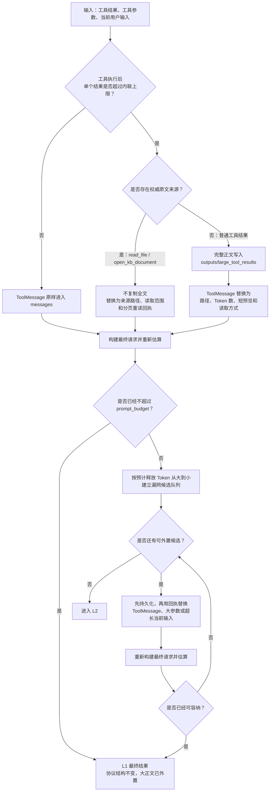
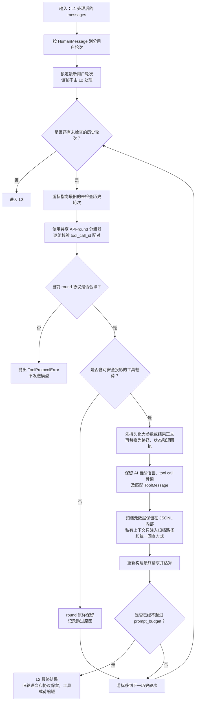
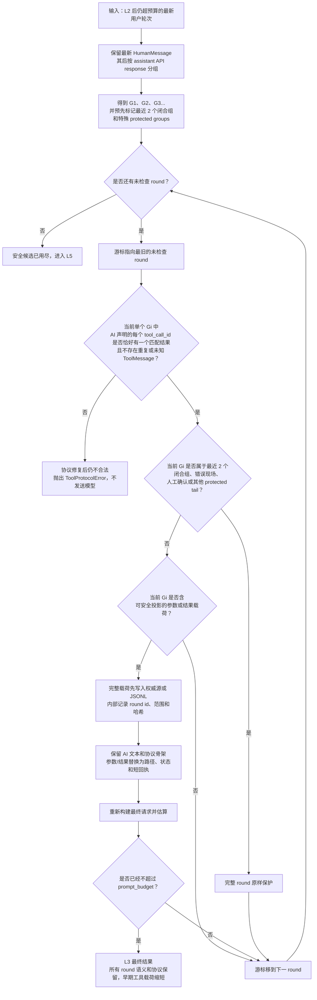
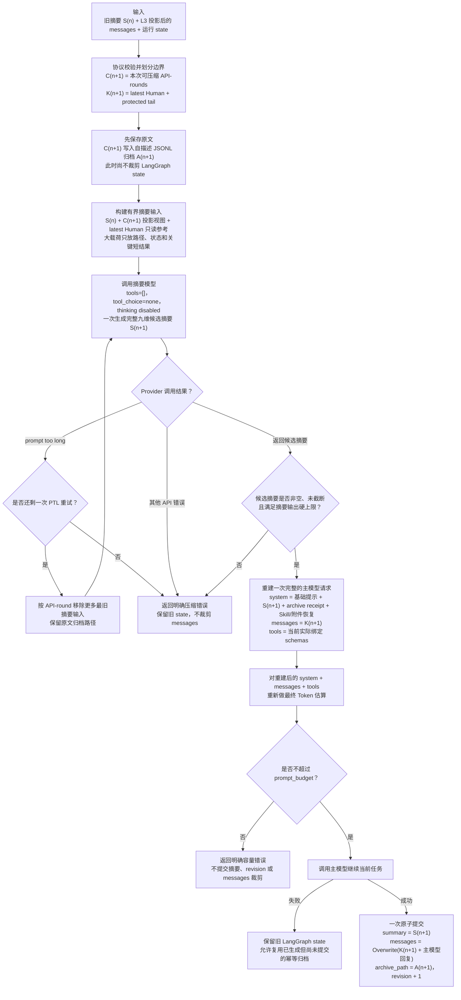

# 多级上下文压缩重构实施方案

> 日期：2026-07-31
> 状态：方案已确认，最终审核通过，待实施
> 适用范围：主 Agent、SubAgent、流式与非流式模型调用、本地 OpenAI 兼容模型服务
> 目标模型：Qwen3.6-27B、Qwen3.5-35B 等本地模型，实际上下文窗口 32K～256K
> 设计基线：本地 `D:\study\claude-code-sourcemap` 中的 Claude Code 2.1.88 可验证源码行为 + Yuxi 当前运行边界
> 本文是后续上下文压缩实施的唯一主方案。2026-07-22 的方案保留为现状演进记录，2026-07-23 的 Token 方案继续作为预算基础，但与本文冲突的压缩编排和校准键设计以本文为准。

## 1. 决策摘要

本次不是继续给现有“滚动摘要”增加条件分支，而是把它重构为一个按预算驱动的多级上下文压缩控制器：

```text
构建最终请求与预算快照
        │
        ▼
L1 大载荷外置
        │ 仍超预算
        ▼
L2 旧历史工具载荷投影
        │ 仍超预算
        ▼
L3 当前用户轮次的早期 API-round 载荷投影
        │ 仍超预算
        ▼
L5 全量结构化 Autocompact
        │
        ▼
重新估算并调用主模型
        │ 供应商仍报告溢出
        ▼
使用实测 usage/错误分类做一次恢复性压缩与重试
```

确定以下约束：

1. 不实现 L4 Context Collapse，不创建占位类、配置项、状态字段或空分支。
2. 只保留一个 `ContextCompactionMiddleware`。它由现有 `YuxiSummarizationMiddleware` 原地重构并重命名，不并行维护两套压缩系统。
3. `summary.py` 重命名为 `context_compaction.py`；只增加一个纯逻辑文件 `context_projection.py`，不按 L1～L5 拆出一批细碎类和文件。
4. L1、L2、L3 均为确定性处理，不调用 LLM；只有 L5 生成语义 checkpoint。
5. L2/L3 共用同一个 API-round 分组、协议校验和载荷投影实现；它们只因选择范围和 protected tail 策略不同而分层。
6. L2/L3 不删除任意完整 `AIMessage + ToolMessage` round，只外置或缩短安全工具载荷；完整 API-round 的移除只允许由 L5 在语义摘要成功后完成。
7. 压缩原子边界从 Human turn 下沉到 API round，直接解决“单次用户请求连续几十次工具调用时没有旧轮次可压缩”的问题。
8. 原始消息必须先归档，压缩只改变模型活动视图和有界 checkpoint，不删除不可恢复的原文。
9. 每一级执行后重新构建最终请求并计数；一旦已经低于 `prompt_budget` 就停止，不为了追求更短而继续压缩。
10. 模型窗口来自部署契约，不根据模型名称、参数规模或公开模型卡猜测。
11. L5 后必须恢复当前运行仍需要的 Skill、工具、附件、Todo 和文件引用；不能只留下自然语言摘要。
12. 压缩失败、固定开销过大、工具协议不合法或模型输出截断必须显式分类，不能统一伪装成普通回答。
13. L5 摘要失败不得由代码伪造 degraded checkpoint；单次主请求中的摘要调用严格有界，失败后立即结束，不在当前架构上增加不可可靠提交的跨请求熔断状态。

## 2. 目标与非目标

### 2.1 必须解决的问题

| 当前问题 | 根因 | 本方案对应措施 |
| --- | --- | --- |
| 单个用户请求内连续工具调用后报“无安全交互段” | `_message_segments()` 只按 `HumanMessage` 分段，最新 Human turn 不可拆 | L3 收缩当前轮较早 API-round 的工具载荷；仍超预算时 L5 按 API-round 摘要并移除早期 round |
| 小窗口、多 Skill、多工具时预检仍可能低估 | 工具 schema、system、摘要和协议开销变化大，本地计数不等于服务端模板计数 | 统一最终请求估算、正误差校准、稳定校准键、显式部署窗口和安全缓冲 |
| Skill 激活后历史校准失效 | 当前 `_calibration_key` 包含完整工具 schema | 校准键只绑定 endpoint/model/protocol；schema hash 只做诊断 |
| 大工具结果外置后，旧工具载荷仍不断累积 | 当前只处理超过单结果上限的正文，较小结果、完成参数和重复回执仍会累积 | L2/L3 共用确定性投影器，保留协议和 AI 自然语言，只外置或缩短安全工具载荷 |
| 摘要只能压缩旧 Human turn | 当前 L5 的选择边界与旧分段函数相同 | L5 使用 API-round 安全边界，保留 latest Human 和 protected tail；协议修复后仍不合法则显式报错 |
| 摘要输出可能膨胀或被字符前缀截断 | 提示词中的 token 要求不是模型输出硬限制，前缀截断会先丢尾部 NEXT STEPS | 给摘要调用设置真实输出上限；要求结构化 checkpoint；超限时按字段优先级裁剪 |
| `finish_reason=length` 可能表现为突然中断或被错误重试 | 当前空正文 `length` 被当成上下文溢出，有正文又可能被当作正常完成 | 输入溢出以 provider 明确拒绝为准；`length` 默认按输出耗尽处理，并单独拦截不完整工具调用 |
| 压缩后 Skill 工具仍激活，但 Skill 说明可能消失 | Skill 正文只是历史中的普通 `ToolMessage` | L5 显式恢复活跃 Skill 清单和受限指令内容；`SkillsMiddleware` 继续按状态绑定依赖 |
| 固定 system/tools 开销过大时反复压缩无效 | 缺少“不可压缩固定开销”分类 | 预算快照先计算 fixed overhead；固定部分已超预算则立即返回配置错误 |
| 摘要模型失败时可能重复尝试或提交半成品 | 缺少分级提交和有限重试契约 | 归档、活动视图和 checkpoint 在主模型成功后原子提交；摘要失败保留旧 state，单次请求最多两次摘要调用 |

### 2.2 成功标准

完成后应满足：

- 32K 窗口下，单个 Human turn 内至少 30 个串行工具 round 可以持续执行，不再因“无旧轮次”中断。
- 并行 tool calls 只有在该 AIMessage 的所有 `tool_call_id` 都有唯一匹配结果时才允许被投影或进入 L5 cutoff。
- 任意主模型调用前，最终 `system + messages + tools` 的保守准入值不超过 `prompt_budget`。
- 多 Skill 激活和动态 MCP schema 变化不会清空已经积累的 tokenizer 正误差校准。
- L1/L2/L3/L5 可以在测试中分别独立触发；L2/L3 共用同一投影实现，但能证明选择范围和保护策略不同。
- L5 后模型仍知道当前目标、用户约束、已完成工作、关键文件、活跃 Skills 和下一步。
- 模型服务报告 prompt too long 时最多恢复重试一次；不会出现无限压缩或无限模型重试。
- 所有被模型活动视图移除的原始内容均有可读归档路径和内容哈希。
- 主模型失败时不提交本次压缩 cutoff；主模型成功时通过一个 `Overwrite` 提交一致的有界 checkpoint。

### 2.3 非目标

- 不实现 Claude Code 的 Context Collapse。
- 不实现 Anthropic cache editing、prompt cache 定位删除或服务端 cache reference。
- 不新增上下文微服务、数据库表或独立向量记忆系统。
- 不承诺“无限历史的每个细节都永远留在摘要中”；完整细节通过归档按需读取。
- 不把模型名称作为上下文窗口事实来源。
- 不通过任意截断未闭合 tool call、静默丢弃当前输入或缩小模型输出上限来掩盖输入预算问题。
- 不由确定性代码总结或删除包含任意语义的完整 AI round。
- 不生成 degraded checkpoint，不用低质量回退掩盖摘要失败。
- 不在本次重构中解决 SQLite checkpointer 静默退化问题；它作为多 worker 续轮可靠性的独立后续任务记录。

## 3. Claude Code 参考边界

### 3.1 可验证参考

Claude Code 参考项目已经下载到本机：

```text
D:\study\claude-code-sourcemap
```

实施阶段必须先检查该目录。只要本地目录和所需源码文件存在，就直接读取本地副本，不访问 GitHub、不执行 `git fetch/pull`，也不使用研究文章替代源码核对。只有本地副本缺失或文件损坏时，才另行确认是否允许访问远程仓库。

研究基于该本地仓库的 commit：

```text
a8a678cb6244e6770e1e421767ff0987a1d95549
```

Claude Code 2.1.88 在 `restored-src/src/query.ts` 中的可验证顺序是：

```text
applyToolResultBudget
→ snipCompactIfNeeded
→ microcompactMessages
→ applyCollapsesIfNeeded
→ autoCompactIfNeeded
```

对 Yuxi 有直接价值的实现事实：

1. 大工具结果预算先于历史压缩执行。
2. Snip 和 Microcompact 可以在同一次请求中先后执行，不是互斥策略。
3. Microcompact 在 Autocompact 前执行，先用低成本确定性手段回收空间；可验证实现只处理允许列表中的旧工具结果内容，不删除任意完整 assistant round。
4. `services/compact/grouping.ts` 已从 Human-turn grouping 改为 API-round grouping，注释明确指出这是为了支持整个工作负载只有一个 Human turn 的 agentic session。
5. Autocompact 为摘要输出预留真实 token 空间，并在 compact 请求自身 prompt too long 时按 API-round 丢弃最旧输入后重试。
6. `buildPostCompactMessages()` 不只保留摘要，还重新注入附件、Skills、计划模式、工具/MCP 状态和 hook 结果。
7. Autocompact 有失败计数和熔断，防止在不可恢复状态下每轮重复调用压缩模型。
8. Compact prompt 强制文本输出并禁止工具调用；普通 streaming 摘要路径显式关闭 thinking。

### 3.2 不能声称复刻的部分

还原仓库没有 `snipCompact.ts` 和 `snipProjection.ts` 的完整算法实现。只能从调用点确认 Snip 的顺序、投影视图、boundary、removed UUID 和 protected tail 等集成行为。

因此：

- L2/L3 的选择范围是适配 Yuxi 消息协议的本地策略，不声称逐行复刻 Claude Code Snip；载荷投影遵循 Claude Microcompact 的保守边界，不删除任意完整 assistant round。
- L2/L3 的 API-round 边界直接参考 `groupMessagesByApiRound()`，但协议合法性由 Yuxi 在投影前独立校验。
- Claude Code 的 20K 摘要输出、13K buffer、每 Skill 5K 等绝对值针对其模型和 200K 级窗口，不能直接复制到 32K 本地模型；本方案复制其“真实预留、有限输出、压缩后恢复”的原则，数值按部署预算缩放。
- Context Collapse 仍是 feature-gated 实验能力，而且启用时会抑制主动 Autocompact，二者不是普通 L4→L5 串行关系。本项目因此不实现 L4。

## 4. 当前实现基线

### 4.1 已有能力，直接复用

- `token_usage.py`
  - `resolve_context_budget()` 已统一解析窗口、最低输出预留和安全缓冲。
  - `estimate_model_request()` 已对最终 system/messages/tools 做本地保守估算。
  - `TokenUsageMiddleware` 已记录 provider usage 并把正误差带到下一次调用。
  - 当前空正文 `finish_reason=length` 已能携带 usage 抛出异常，但异常语义需要在本次方案中校正。
- `summary.py`
  - 已有普通工具结果二次外置、源文件窗口收缩、大工具参数归档、超长当前输入归档。
  - 已有不可变 JSONL 历史归档。
  - 已有主模型成功后通过 `Overwrite` 原子提交消息裁剪。
  - 已有一次 provider overflow 恢复重试。
- `composite.py`
  - 工具执行后即可按单结果上限外置。
  - `Command` 的 `goto`、`graph` 和其他 update 能原样保留。
- `skills.py`
  - `activated_skills` 是独立 LangGraph state。
  - 每次模型调用按激活状态重新绑定本地工具和 MCP 工具。
- Agent 运行链
  - 主 Agent 和 SubAgent 都注册相同的压缩、usage 和 retry 基础能力。

这些能力已经有较完整单元测试，不应重写为新框架。

### 4.2 必须替换的核心

当前 `_message_segments()` 遇到新的 HumanMessage 才切段，`_build_plan()` 始终保留最后一个 segment。其直接后果是：

```text
HumanMessage
AI(tool call 1)
Tool(result 1)
AI(tool call 2)
Tool(result 2)
...
AI(tool call 30)
Tool(result 30)
```

整段被视为最新用户轮次。即使前 28 个工具 round 已完全结束，也不能被压缩；L1 用尽后只能报：

```text
最终请求仍超过模型可用输入预算，且不存在可安全压缩的完整历史交互段
```

本次重构的核心不是调整该异常条件，而是用明确的“历史用户轮次 + API round”两层边界替代 `_message_segments()`。

## 5. 目标模块与命名

### 5.1 文件职责

| 文件 | 重构后职责 |
| --- | --- |
| `middlewares/context_compaction.py` | 唯一压缩控制器；预算循环；L1 最终准入、L2、L3、L5；归档；原子提交；溢出恢复 |
| `middlewares/context_projection.py` | API-round 分组；工具协议校验；L2/L3 共用的安全载荷投影；protected tail 选择；不执行 IO 和模型调用 |
| `middlewares/token_usage.py` | 部署预算解析；最终请求估算；usage 校准；schema 诊断 hash；length/overflow 分类 |
| `backends/composite.py` | 工具执行阶段的 L1 快速外置；文件系统归档读写原语 |
| `middlewares/skills.py` | 激活状态、动态工具/MCP 绑定；L5 后活跃 Skill 指令恢复 |
| `buildin/chatbot/graph.py` | 注册一个 `ContextCompactionMiddleware` |
| `buildin/subagent/graph.py` | 与主 Agent 使用同一压缩控制器，不另建简化版 |
| `middlewares/__init__.py` | 导出 `create_context_compaction_middleware` |

只增加一个纯投影模块，不新增 `l1.py`、`l2.py`、`compaction_manager.py`、`context_service.py` 等文件。`context_compaction.py` 保持线性编排和副作用边界，`context_projection.py` 只承载需要被 L2/L3 复用且适合纯函数测试的协议逻辑。

### 5.2 类和工厂命名

```text
YuxiSummarizationMiddleware
→ ContextCompactionMiddleware

create_summary_middleware
→ create_context_compaction_middleware

ContextSummaryState
→ ContextCompactionState
```

为降低 checkpoint 迁移风险，首期保留已有状态键：

```text
context_summary
context_compacted_through
context_archive_path
context_revision
```

`context_summary_quality` 只为兼容旧 checkpoint 保留读取能力，新实现不再写入该键；后续确认无旧状态依赖后再单独清理。其余类名和文件名表达“多级压缩”，没有行为价值的状态字段重命名不纳入本次实施。

## 6. 统一预算与 Token 可靠性

### 6.1 部署窗口是契约，不是推断

`context_window` 必须表示当前服务实例真正允许的最大总上下文：

- vLLM/GPUStack：以实际部署的 `--max-model-len` 或管理端等价配置为准。
- Ollama：以实例实际 `OLLAMA_CONTEXT_LENGTH`、模型运行参数和显存约束为准。
- OpenAI 兼容网关：以网关最终转发实例的限制为准，而不是前端展示的模型卡。
- 无法从服务发现真实值时，由管理员在模型配置中显式填写；缺失时拒绝启用 Agent，不按模型名猜默认值。

继续使用：

```text
prompt_budget =
    context_window
  - effective_output_reserve
  - context_safety_tokens
```

其中：

```text
effective_output_reserve =
    max(min_output_reserve_tokens, 本次显式 max_tokens/max_completion_tokens)
```

### 6.2 最终请求准入口径

每次模型调用都对真正发送的内容计数：

```text
system message
+ private compact context
+ active messages
+ full tool schemas after Skill/MCP gating
+ protocol/template uncertainty envelope
```

不能用“历史消息 token”代替最终请求 token，也不能在 SkillsMiddleware 改变工具集合前使用旧快照。

中间件顺序必须保证压缩控制器看到最终 system 和最终 tools。若现有 wrapper 嵌套顺序无法满足，应增加覆盖顺序的集成测试后调整注册位置，不能凭列表阅读猜调用次序。

### 6.3 保守估算和正误差校准

运行时计数能力按以下优先级选择：

1. **已验证的本地精确计数**：tokenizer、`chat_template`、tool template、special tokens 和服务端部署版本均有相同 hash，并通过部署校准集验证后才可启用。
2. **服务端 `/tokenize`**：只用于部署校准、诊断和测试，不在每次在线模型调用前同步请求，避免增加首 token 延迟和引入新的单点故障。
3. **保守 fallback + provider usage 校准**：任何模板无法验证的部署都使用该路径，这是首期默认实现。

仅下载同名 Qwen tokenizer 不足以成为“精确计数”，因为 vLLM、Ollama、GPUStack 或网关可能使用不同 chat/tool template。首期不强制实现本地 tokenizer 适配器；只有能同时验证上述模板契约的 provider adapter 才可以作为后续小改动接入。

首期继续使用无需网络预检的 fallback：

```text
fallback = max(
    LangChain approximate count,
    Unicode-aware estimate,
    serialized JSON estimate
)

size_bucket = request_size_bucket(fallback)

positive_gap =
    max(provider_input - fallback, 0)

admission =
    fallback
  + max_positive_gap[size_bucket]
```

调整校准逻辑：

```text
calibration_key = hash(
    provider endpoint
  + model deployment id
  + request protocol/template version
)
```

工具 schema 不再进入 `calibration_key`。额外记录：

```text
tool_schema_hash
tool_count
system_prompt_hash
```

这些字段只用于诊断“本次请求结构为何变化”，不决定校准是否有效。原因是工具 schema 已进入本次 fallback；Skill 激活后清空误差包络反而会在最危险的请求上失去保护。

只学习相同请求规模下的低估绝对值：

```text
size_bucket:
  small   = fallback <= 8K
  medium  = 8K < fallback <= 32K
  large   = 32K < fallback <= 128K
  xlarge  = fallback > 128K

positive_gap = max(provider_input - fallback, 0)
```

不再使用历史最大倍率。小请求上的模板或分词倍率不能外推到大请求，否则会导致大窗口请求被过度估算和过早压缩。每个 `calibration_key` 只维护四个规模桶的最大正 gap；请求落入没有样本的桶时使用 `fallback`，未知误差继续由已经从 `prompt_budget` 扣除的 `context_safety_tokens` 保护。

provider usage 缺失时保留已有包络，不把本地估算当成新实测样本。provider usage 明显非法时记录诊断并忽略该样本。校准桶是简单状态映射，不引入回归模型、滑动预测或在线网络预检。

`TokenUsagePayload` 新增 JSON 可序列化的 `max_positive_gap_by_bucket`。旧 checkpoint 中的 `max_positive_error/max_ratio` 只允许兼容读取和诊断，不把旧倍率迁入新 admission；首次获得新 usage 后写入规模桶字段，稳定运行一段时间后再单独清理旧字段。

Qwen 的 thinking/reasoning token 同样消耗输出空间。部署返回的 usage 若能区分 reasoning token，则将其计入 provider output；不能区分时也必须由 `effective_output_reserve` 整体覆盖，不能只按最终可见正文估算输出预留。

### 6.4 固定开销预检

压缩前单独计算：

```text
fixed_overhead =
    system
  + private compact context 的最小归档回执
  + current tool schemas
  + protocol correction envelope
```

若：

```text
fixed_overhead + 最小当前输入回执 > prompt_budget
```

则任何历史压缩都不会有效。必须直接抛出 `ContextBudgetConfigurationError`，错误中包含：

- 实际 `context_window`
- 输出预留
- safety tokens
- system 估算
- tools 估算
- tool count
- 最大的 schema 名称/估算
- 建议动作：减少工具、减少同时激活 Skill、修正部署窗口或使用更大窗口模型

不得继续调用 L5 消耗一次模型请求。

### 6.5 摘要模型自身预算

L5 仍使用当前 Agent 模型，首期不引入第二个摘要模型配置。摘要调用必须设置真实输出硬上限：

```text
scaled_summary_limit =
    max(1024, min(8192, floor(context_window * 0.10)))

summary_output_limit =
    min(deployment_max_output, scaled_summary_limit)
```

若部署没有公开独立的 `deployment_max_output`，使用 `scaled_summary_limit`，并通过真实调用校准。这个缩放值不是准确率假设，而是防止把 Claude Code 面向大窗口的固定 20K 直接套到 32K 本地模型。

摘要请求也使用独立预算：

```text
summary_prompt_budget =
    context_window
  - summary_output_limit
  - context_safety_tokens
```

摘要输入超过该值时，先在本地按 API-round 从最旧组开始收敛到 `summary_prompt_budget`。若服务仍返回 prompt too long，再移出更多最旧组并重试一次；仍失败则返回明确压缩错误，不提交摘要或消息裁剪。

### 6.6 部署校准工具

部署校准工具不是线上压缩步骤，而是模型服务上线前或部署参数变化后的诊断脚本。计划新增：

```text
backend/scripts/calibrate_context_budget.py
```

它解决三个问题：

1. 当前本地估算相对该部署真实 chat/tool template 会低估多少。
2. provider usage 是否完整、可信，thinking token 是否计入输出。
3. 管理端填写的 `context_length`、输出预留和 safety tokens 是否足以保护真实请求。

脚本使用合成数据，不读取真实会话。它构造中文、英文、JSON、不同工具数和 Skill 激活前后的请求，分别记录：

```text
local baseline
conservative fallback
服务端 /tokenize（端点支持时）
chat completion 返回的 provider input/output usage
正 gap 和请求规模桶
是否发生 prompt too long
建议的 context_safety_tokens
```

计划命令：

```bash
docker compose exec api uv run python scripts/calibrate_context_budget.py \
  --model <provider:model> \
  --context-window 32768 \
  --tool-counts 0,5,20,50 \
  --output outputs/context-calibration/<deployment>.json
```

默认只发送远低于窗口的安全样本。需要验证接近窗口或真实 overflow 边界时，由管理员在隔离测试实例显式增加：

```bash
--probe-near-limit
```

该选项可能占用较多推理资源，不在生产高峰运行，也不默认探测超过窗口的请求。

脚本至少覆盖：

- 中文、英文、混合文本
- 大 JSON 和 tool call 参数
- 0、5、20、50 个工具 schema
- Skill 激活前后
- 32K、64K、128K、256K 配置
- 接近窗口的成功请求和明确 overflow 请求
- provider usage 正常、缺失、错误三种情况

使用时机：

- 新增模型部署后。
- 修改 vLLM `--max-model-len`、Ollama context length 或网关模板后。
- 更换 tokenizer/chat template 后。
- 线上监控出现新的正误差峰值或 provider overflow 后。

输出 JSON 报告并在终端给出摘要。该脚本只提供上线证据和配置建议，不自动修改生产配置，也不能凭一次成功请求“证明”服务物理窗口；真实窗口仍以部署契约和 near-limit 验收共同确认。

## 7. 多级压缩详细设计

### 7.1 统一控制循环

`ContextCompactionMiddleware` 的同步和异步路径必须共享同一规划语义：

```text
1. 读取已有 context_summary 和 revision
2. 构建最终请求与 BudgetSnapshot
3. 若已可容纳，直接调用主模型
4. 执行 L1，重新估算；可容纳则停止
5. 执行 L2，重新估算；可容纳则停止
6. 执行 L3，重新估算；可容纳则停止
7. 执行 L5，重新估算
8. 仍超预算则返回明确容量错误
9. 调用主模型
10. 只有主模型成功才一次性提交归档水位、summary 和 messages Overwrite
```

每级返回同一种内部 plan 信息：

```text
level
messages_before / messages_after
tokens_before / tokens_after
archive_paths
messages_changed
archive_changed
summary_changed
protected_reason
```

该 plan 只在本次调用内存在，不新增 LangGraph 公共状态结构。

### 7.2 L1：大载荷外置

L1 负责可逆、确定性的体积治理。

#### L1 流程与数据变化



典型数据变化：

```text
处理前 messages:
  AIMessage(tool_call_id=t1, name=read_file)
  ToolMessage(tool_call_id=t1, content=<10K Token 文档正文>)

处理后 messages:
  AIMessage(tool_call_id=t1, name=read_file)
  ToolMessage(tool_call_id=t1, content=<来源路径、范围和重读回执>)

文件系统:
  有权威源：继续以原文件/知识库文档为准，不创建重复全文
  无权威源：新增 /outputs/large_tool_results/<tool-id>-<hash>.txt

context_summary:
  不变
```

#### 工具执行后快速保护

继续由 `YuxiFilesystemMiddleware` 处理：

- 普通 ToolMessage 超过单结果内联上限时写入 `outputs/large_tool_results`。
- 回执保留工具名、状态、token 数、完整路径、短预览和读取方式。
- `read_file`、`open_kb_document` 等已有权威源的窗口不复制第二份全文，只返回缩窗/重读提示。
- `Command` 中多个 ToolMessage 分别处理，保留其他 state update。

该阶段不知道最终 system/tools 开销，只是快速保护，不承担最终上下文安全保证。

#### 模型调用前权威收敛

压缩控制器按“实际缺口”选择候选：

1. 尚未外置的大 ToolMessage。
2. 已完成工具调用中的大参数。
3. 超长当前用户输入正文。

候选按预计可释放 token 从大到小处理，每次成功外置后重新估算。当前输入外置判断必须基于：

```text
prompt_budget - fixed_overhead - 必要 protected tail
```

不能再以“当前输入本身是否超过整个 prompt budget”为条件。

所有正文先持久化再替换；持久化失败时不得声称已保存，也不得从活动视图删除。

### 7.3 L2：旧历史工具载荷投影

L2 只处理最新 HumanMessage 之前已经完成的用户轮次。

#### L2 流程与数据变化



典型数据变化：

```text
处理前某个旧轮次:
  Human("分析订单超时")
  AI("先读取连接池配置", tool_call=read_file, args=<大参数>)
  Tool(read_file result=<10K 正文>)
  AI("继续定位使用位置", tool_call=grep)
  Tool(grep result=<大量命中>)
  AI("超时原因是连接池配置过小")

处理后活动 messages:
  Human("分析订单超时")
  AI("先读取连接池配置", tool_call=read_file, args=<参数归档回执>)
  Tool(read_file result=<来源路径、范围和重读回执>)
  AI("继续定位使用位置", tool_call=grep)
  Tool(grep result=<结果归档路径、状态和短预览>)
  AI("超时原因是连接池配置过小")

历史归档:
  archive-r1-...jsonl
    turn_id=U1
    records=<被外置的工具参数和结果原文>
    content_hash=<归档内容哈希>

private_compaction_context:
  <archive_receipt
    archive_path=".../archive-r1-...jsonl"
    reread="使用 read_file(path, offset, limit) 分段读取" />

context_summary:
  不变
```

L2 使用与 L3 相同的安全投影规则：

- 保留所有 HumanMessage。
- 保留 AIMessage 中的自然语言内容、tool call 名称、ID 和协议顺序。
- 保留与每个调用匹配的 ToolMessage，只把已持久化正文替换为短回执。
- 允许投影已完成工具调用的大参数，但不得改变工具名、调用 ID 或执行结果状态。
- 未知工具、任意 MCP 工具、含人工确认/中断语义的工具默认不做专用字段提取；只有通用的“完整正文持久化后替换为路径回执”可应用。
- 从最旧历史轮次开始逐组处理，每次成功投影后重新估算；达到预算立即停止。

L2 不物理删除前端聊天记录，也不从模型活动视图删除完整 round。JSONL 记录继续携带 `turn_id`、`api_round_id`、message ID、记录序号和哈希，用于代码校验与诊断；这些细粒度索引不直接暴露给模型。模型私有上下文只保留最新归档路径和统一回查说明，避免要求本地小模型解析 `path#records=...` 之类的复合引用。

### 7.4 L3：当前轮早期 API-round 载荷投影

L3 是解决本次核心故障的关键层。

#### L3 流程与数据变化



典型数据变化：

```text
处理前最新用户轮次:
  Human(U3)
  G1 = AI("读取设计文档", read_file, args=<大参数>) + Tool(<10K 正文>)
  G2 = AI("搜索调用位置", grep) + Tool(<大量命中>)
  G3 = AI(edit) + Tool(成功)
  G4 = AI(list_files) + Tool(文件清单)
  G5 = AI(edit) + Tool(成功)
  G6 = AI(pytest) + Tool(通过)

处理后活动 messages:
  Human(U3)
  G1 = AI("读取设计文档", read_file, args=<参数回执>) + Tool(<来源路径和重读回执>)
  G2 = AI("搜索调用位置", grep) + Tool(<归档路径、状态和短预览>)
  G3 = AI(edit) + Tool(成功)
  G4 = AI(list_files) + Tool(有界文件清单)
  G5 = AI(edit) + Tool(成功)      # protected，原样保留
  G6 = AI(pytest) + Tool(通过)    # protected，原样保留

context_summary:
  原有摘要
  不变

历史归档:
  archive-r2-...jsonl
    保存 G1/G2 被外置的参数和结果正文
    round id、记录范围和哈希仅供代码内部定位
```

#### 分组

最新 HumanMessage 保留为当前轮起点。其后的消息按每次 assistant API response 分组：

```text
G0: HumanMessage
G1: AIMessage(tool_calls=[a,b]) + ToolMessage(a) + ToolMessage(b)
G2: AIMessage(tool_calls=[c])   + ToolMessage(c)
G3: AIMessage(tool_calls=[d])   + ToolMessage(d)
...
```

这里的“当前 round”始终指游标当前指向的单个分组 `Gi`，不是 `G1...Gn` 的总集合。控制器会循环检查所有分组：协议不合法时立即报错；属于 protected tail 的合法分组原样保护；其余合法分组只投影可安全外置的工具载荷。

Yuxi 的消息通常已经是一轮一个 `AIMessage`，因此不需要照搬 Claude 的 streaming assistant-id 合并细节；但测试必须覆盖同一 response 被拆成多个 chunk/message 的适配情况。

#### 闭合条件

API-round 分为两类：

- 不含 tool call 的普通 assistant response 本身就是闭合 round。L2/L3 没有工具载荷可投影，只会原样跳过；位于已完成历史中的这类 round 可以作为 L5 cutoff 的完整单元。
- 含 tool call 的 round 只有同时满足以下条件才可投影或进入 L5 cutoff：
  1. 每个 tool call 都有非空唯一 ID。
  2. 后续 ToolMessage 的 `tool_call_id` 集合与调用集合完全相等。
  3. 不存在重复结果、未知结果或结果跨到下一个 assistant response。
  4. round 内没有等待人工输入、中断或取消状态。

HumanMessage 按 Claude Code `groupMessagesByApiRound()` 的边界作为独立前缀组处理。最新 HumanMessage 始终属于 survivors；更早 HumanMessage 只有在其所属用户交互已经完成时，才可与相邻的完整历史组一起进入 L5，不能单独从未完成交互中移除。

`PatchToolCallsMiddleware` 必须先修复从历史恢复时产生的悬挂调用。压缩器随后再次执行上述严格校验；若仍存在缺失、重复、未知或跨 round 的 ToolMessage，说明状态已经不满足模型 API 契约，必须抛出 `ToolProtocolError`。不能把畸形协议原样发送给模型，也不能由压缩器为了凑预算静默伪造 ToolMessage。

#### Protected tail

默认保护最近 2 个已闭合 round；若只有 1 个则保护 1 个。除此之外还必须保护：

- 最近一次错误结果及其调用；
- `ask_user_question` 等中断协议；
- 当前回答直接依赖但尚未写入文件/产物的结果。

protected tail 是算法常量，不新增首期管理配置。验收数据证明 2 个 round 明显不足或浪费后，再单独评估配置化。

#### 投影结果

更早的合法 round 从最旧开始检查。工具参数或结果只有在完整正文成功持久化后才能被路径回执替换；AIMessage 自然语言、tool call 名称和 ID、ToolMessage 配对及错误状态始终保留。通用回执至少包含工具名、完成/失败状态、权威源或归档路径、短关键结果、产生或修改的文件路径以及错误码。

专用字段提取只允许用于项目明确支持且有稳定语义的工具；未知工具和 MCP 工具不得依赖工具名猜测结果结构。它们只能使用“完整正文持久化后替换为有界通用回执”这一通用规则。

每成功投影一个 round 就重新估算，达到预算立即停止。若所有安全载荷均已投影仍超预算，则保留当前投影视图进入 L5；L5 使用同一 API-round 分组结果选择语义压缩边界。

L3 完成后的实际模型请求形状为：

```text
system:
  基础系统提示
  + 旧 context_summary（若有）
  + archive_receipt(最新 archive_path, 统一回查方式)

messages:
  Human(U3)
  + G1～G4 的原始 AI 文本和工具协议骨架，载荷替换为有界回执
  + G5～G6 的原始 protected rounds

tools:
  当前实际绑定的工具和 MCP schemas
```

这样单个用户请求执行 20～30 次工具调用时，先释放占比最大的参数和结果载荷；若剩余协议骨架仍使请求过长，L5 可以在不依赖旧 Human turn 的情况下摘要并移除 G1～G4 等早期 API-round。

### 7.5 L4：暂不实现

本阶段没有 L4 运行步骤。

不做以下工作：

- 不增加 `ContextCollapseManager`。
- 不创建 collapse store、commit log 或 read-time projection。
- 不增加 feature flag。
- 不为了编号连续而保留空函数。

未来若独立评估 L4，必须先证明它相对 L2/L3/L5 的额外收益，并单独设计与 L5 的互斥关系。

### 7.6 L5：全量结构化 Autocompact

L5 在 L1～L3 后仍超预算时执行，是语义兜底而不是普通工具过程清理。

#### L5 流程与数据变化

读图符号：

```text
S(n)   = 当前已有九维摘要；首次压缩时为空
C(n+1) = 本次准备从活动视图移除并交给摘要模型的信息
K(n+1) = 本次必须原样保留的 survivors
A(n+1) = C(n+1) 对应的自描述 JSONL 原文归档
S(n+1) = 摘要模型生成的完整替代摘要
```



这张图只有两个会改变持久运行状态的时点：归档文件可以在主模型调用前幂等生成；`context_summary`、`messages`、`revision` 和生效的归档指针只能在主模型成功后一起提交。摘要成功但重建后的完整请求仍超预算，也不能把半成品摘要写进 state。

首次与再次 L5 的状态变化：

```text
首次 L5:
  输入：S0=空 + C1 + K1
  归档：C1 -> A1
  摘要：S0 + C1 -> S1
  成功提交：summary=S1, messages=K1+回复, archive=A1, revision=1

再次 L5:
  输入：S1 + 本次新增 C2 + 当前 K2
  归档：C2 -> A2；A1 继续保留
  摘要：S1 + C2 -> 完整替代摘要 S2
  成功提交：summary=S2, messages=K2+回复, archive=A2, revision=2

注意：
  context_summary 是 S1 -> S2 替换，不是 S1 + S2 叠加
  activated_skills、uploads、Todo 和其他非 messages state 不被 Overwrite
```

#### 四级压缩后的最终状态对照

| 层级 | 活动 `messages` | 私有上下文 | 不可变归档 | 达到预算后的最终结果 |
| --- | --- | --- | --- | --- |
| L1 | 工具协议配对不变；大正文、大参数或超长输入替换为可重读回执 | `context_summary` 不变 | 普通大结果写入 `large_tool_results`；有权威源时只引用原来源 | 保留完整当前交互结构，以路径和短回执代替大载荷 |
| L2 | 旧历史的 Human、AI 文本和工具协议骨架均保留；安全工具载荷替换为有界回执 | `context_summary` 不变；只注入最新归档路径和统一回查方式 | 被外置的大参数和结果正文保存；JSONL 自带内部定位元数据 | 不丢失旧轮语义，先回收占比最大的工具载荷 |
| L3 | 最新 Human 和所有 API-round 仍保留；早期合法 round 的安全工具载荷缩短，最近 2 个 round 原样保护 | `context_summary` 不变；只注入最新归档路径和统一回查方式 | 被外置的当前轮参数和结果正文保存 | 单个用户请求内先做无模型、低风险回收，仍过长则进入 L5 |
| L5 | 只保留 `survivors`，主模型成功后以 `Overwrite(survivors + response)` 提交 | `S(n) + C(n+1)` 生成完整替代摘要 `S(n+1)`；运行 state 独立恢复 | 本次 `C(n+1)` 保存为新 revision，旧 revision 继续保留 | 以九维 checkpoint、真实近期消息、运行状态和工具 schema 重建有界请求 |

四级都只改变模型下一次调用看到的活动视图，不删除前端会话记录或归档原文。某一级已经使最终请求低于 `prompt_budget` 时立即停止，不继续执行后续级别。

#### 输入边界

L5 可消费：

- 已有私有 summary/checkpoint。
- 所有已完成历史轮次。
- 当前轮可安全压缩的闭合 API rounds。
- L2/L3 投影后的协议骨架、路径回执和代码可验证的归档引用。

L5 必须保留：

- 最新 HumanMessage 或其外置回执。
- protected tail。
- 中断/人工确认状态。

进入 L5 前工具协议必须已经由 `PatchToolCallsMiddleware` 修复并通过压缩器严格校验。校验失败的协议不是 survivor，而是请求级错误。

#### 输出结构

L5 只生成一份九维语义 checkpoint。九个维度在同一次模型调用中生成，不是分别调用九次模型：

```text
1. Primary Request and Intent / 主要请求与意图
2. Key Technical Concepts / 关键技术概念
3. Files and Code Sections / 文件、代码位置和必要片段
4. Errors and Fixes / 错误、修复及用户纠正
5. Problem Solving / 已解决问题和排查过程
6. All User Messages / 本次摘要覆盖的所有非工具用户消息
7. Pending Tasks / 待办任务
8. Current Work / 压缩前正在进行的工作
9. Optional Next Step / 与最近明确请求直接相关的下一步
```

9 个维度直接参考 Claude Code compact prompt。摘要模型生成完整 checkpoint，代码只负责输入边界、归档、基础有效性校验和真实近期消息保留，不再让模型生成额外的用户台账、语义 archive index 或 `<recent_verbatim>` 文本块。`archive_path` 属于原文完整性和可回查元数据，不是第十个摘要维度。

9 个维度是摘要 prompt 的强内容要求，不是需要代码严格解析标题和顺序的序列化协议。现有管理员 `summary_prompt` 只作为附加领域指令拼接，例如“重点保留测试输出”，不能替换九维基础要求。代码只硬校验非空、非 API 错误、未发生输出截断以及最终预算可容纳；缺少标题或顺序变化只记录质量指标，不为修复外观格式额外调用模型。

第 6 项 `All User Messages` 的含义是：

- 列出本次被语义摘要覆盖的所有 HumanMessage，不包括 ToolMessage。
- 首次 L5 时覆盖本次 `messages_to_compact` 中的全部用户消息。
- 再次 L5 时，上一版第 6 项继续保留旧用户请求，本次新增用户消息追加进去。
- 明确请求、约束、纠正和未完成事项要详细保留；已经完成且很旧的请求可以压缩成一行，但不能删除会改变任务理解的反馈。
- 完整原文仍在不可变归档，不要求活动 checkpoint 无限保存所有旧消息的逐字全文。

不再增加 `<recent_verbatim>`。原因是 L5 本来就必须把最新一条 HumanMessage 作为真实 LangChain 消息保留在 `survivors` 中；再复制到 system summary 会重复占用 Token，并使同一用户请求出现两个来源。

最终保真尾部为：

```text
latest HumanMessage 原文
+ 最近 2 个已闭合 API rounds
+ 中断/人工确认消息
```

普通多轮对话没有工具协议时，只额外保留最新 HumanMessage 即可，不固定复制最近 6 条用户和助手消息。这个设计比让摘要模型在第 9 项“尽量原文引用”更可靠：第 9 项给出下一步，排在摘要之后的真实最新 HumanMessage 才是权威任务来源；两者冲突时必须以真实消息为准。

字段优先级从高到低为：

```text
用户约束/纠正/待办/当前工作/下一步
> 文件、代码位置与证据路径
> 错误和修复
> 关键技术概念与已完成工作
> 过程叙述
```

输出过长时先压缩低优先级过程叙述，再缩减更早已完成用户消息的描述，但不能删除用户纠正、当前约束、待办和下一步，也不能继续使用“截取字符串前 N 个字符”的方式。

#### 已有摘要的增量处理

第一次 L5 前，状态近似为：

```text
context_summary = 空
messages = [旧历史, ..., latest Human, protected tail]
```

控制器划分：

```text
messages_to_compact = 可以安全压缩的旧历史和闭合 API rounds
survivors = latest Human + protected tail
```

第一次摘要调用的输入是：

```text
九维摘要内容要求
+ messages_to_compact
+ latest Human 作为只读 continuation context
```

其中 latest Human 只帮助模型判断第 8、9 项，不要求写进第 6 项，因为它会以真实消息留在最终请求中。一次模型调用生成 `S1`，原消息归档为 `A1`。主模型成功后状态变成：

```text
context_summary = S1
context_archive_path = A1
context_revision = 1
messages = [latest Human, protected tail, 主模型新回复]
```

后续对话继续产生新消息。第二次触发 L5 前：

```text
context_summary = S1
messages = [上次保留尾部, 新用户消息, 新工具 rounds, ...]
```

第二次控制器只选择本次新增的 `messages_to_compact_delta`，摘要调用输入为：

```text
九维摘要内容要求
+ previous_summary = S1
+ messages_to_compact_delta
+ 当前 latest Human 作为只读 continuation context
```

一次模型调用生成完整替代摘要 `S2`：

```text
S2 = merge(S1, messages_to_compact_delta)
```

新压缩原文归档为 `A2`。主模型成功后：

```text
context_summary = S2        # 替换 S1，不是 S1 + S2 叠加
context_archive_path = A2   # 状态指向最新清单，A1 仍保留在文件系统
context_revision = 2
messages = [当前 latest Human, 当前 protected tail, 主模型新回复]
```

合并规则：

1. 模型把 previous summary 与本次新增内容合并成新的完整九维 summary。
2. 已确认事实、用户约束和未完成任务默认继承；只有新增原文明确纠正或完成时才能替换状态。
3. L2/L3 的路径回执和协议骨架作为本次新增内容参与摘要；完整大载荷不重新注入摘要请求。
4. 新 summary 通过基础有效性和预算校验后，才原子替换旧 `context_summary`。
5. 本次没有新增可压缩信息时不执行 L5，也不重写旧 summary。
6. 摘要漂移无法只靠 prompt 完全消除；真实 latest Human、protected tail 和不可变归档是校验与恢复依据。

#### 压缩请求自身过长

参考 Claude Code 的 prompt-too-long 恢复方式：

1. 原始消息先全部归档。
2. 用 API-round 分组摘要输入。
3. 本地预估超限时先从最旧组开始移出摘要模型输入，只保留统一归档路径；服务仍返回 PTL 时再移出更多最旧组。
4. 保留最近工作、用户约束、已有 checkpoint 和 protected tail。
5. 最多进行 2 次摘要调用，第二次只用于真实 PTL，不用于修复标题格式。

被移出摘要输入的细节仍可从归档读取，但不允许声称模型已经语义总结了未看到的内容。

#### 摘要调用契约与有界失败

摘要调用必须使用当前 Agent 模型的独立绑定：

```text
tools = []
tool_choice = none
thinking/reasoning = disabled（provider 支持时）
max_tokens/max_completion_tokens = summary_output_limit
```

prompt 首尾都明确要求只返回文本。摘要为空、API 错误、输出截断、重试后仍 PTL 或最终请求无法容纳时，保留旧 LangGraph state 并返回明确 `ContextCompactionError`；不得由代码推测用户目标并生成 degraded checkpoint。

Claude Code 的三次失败熔断用于同一个 query loop。Yuxi 当前每次 `get_graph()` 会重建 Middleware，且摘要异常路径无法通过现有 wrapper 原子提交跨请求失败计数；为此新增进程缓存会在多 worker 下产生不一致，新增持久失败状态又会扩大本次范围。因此首期不照搬跨请求熔断，只保证：

- 本地预估先收敛摘要输入，不消耗模型调用。
- 正常摘要调用一次；只有 provider 明确返回 PTL 时允许再调用一次。
- 其他失败不重试摘要，不调用主模型，不提交 cutoff。
- 记录失败类型、模型、部署键和预算快照，后续若真实监控证明存在大量用户重复提交，再独立设计持久熔断。

这个边界已经杜绝一次 Agent 请求内的无限摘要循环，同时不引入无法可靠维护的跨 worker 状态。

#### 压缩后恢复

“压缩后恢复”不是恢复被删除的整段聊天，而是把压缩后继续工作必需、但不能可靠依赖摘要模型记住的运行状态重新放回下一次模型请求。

Yuxi 实际发送给模型的请求分为三个部分：

```text
system_message:
  基础系统提示
  + Skill/附件等 Middleware 生成的运行提示
  + <private_compaction_context>
      compact boundary / revision
      九维 context_summary
      最新归档路径和回查说明
      活跃 Skill 恢复段

messages:
  最新用户输入或其 L1 回执
  + protected tail

tools:
  当前基础工具
  + activated Skills/MCP 动态绑定的完整 schema
```

这里的顺序是“最终请求中的上下文排列”，不是重新执行历史工具。最新用户请求作为真实 HumanMessage 排在 summary 之后；protected tail 中的工具调用继续作为真实、已完整配对的 `AIMessage + ToolMessage` 协议存在，不能转换成文本摘要。

Yuxi 与 Claude Code 的具体消息类型不同，但必须达到同一目的：

- `activated_skills` 不被 messages 的 `Overwrite` 覆盖。
- `SkillsMiddleware` 每次模型调用继续依据该状态绑定本地工具和 MCP 工具。
- 对当前轮已读取并激活的 Skill，恢复其 slug、路径和受限指令正文。
- Skill 恢复总预算不超过最终 `prompt_budget` 的 10%，单 Skill 不超过该预算的均分上限；至少保留每个 Skill 的开头规则和引用路径。
- 如果活跃 Skill 太多无法全部恢复正文，所有 Skill 均保留 slug/path，正文按激活顺序和最近使用顺序分配；明确提示模型在继续相关操作前重新读取对应 `SKILL.md`。
- AttachmentMiddleware 继续从独立 state 注入附件路径，不把附件全文复制进 summary。
- Todo、工具节点和 MCP 依赖保持独立 state；消息裁剪不得覆盖这些键。
- 本轮产生的关键文件、artifact 和归档路径必须进入 checkpoint。

## 8. 状态、归档和原子提交

### 8.1 归档格式

继续使用：

```text
/outputs/conversation_history/archive-r<revision>-<first>-<last>-<hash>.jsonl
```

每条记录至少包含：

```text
archive_id
record_index
message_id
message type
content
tool name
tool_call_id
tool_calls
additional_kwargs
content hash
compaction level
turn_id
API-round id
```

同一内容写入必须幂等；只有路径哈希与内容一致时才把 `already exists` 视为成功。

首期不新增独立 manifest/index 文件。归档 JSONL 本身同时保存原文和定位元数据，代码内部可以生成：

```text
archive_ref =
  <archive virtual path>#<archive_id>
  或 <archive virtual path>#records=<first>-<last>
```

`archive_ref` 只用于代码校验、幂等写入、测试和诊断，不直接要求模型解析。模型请求中只注入最新 `archive_path` 和统一回查说明，需要细节时通过现有 `ls/read_file(path, offset, limit)` 工具分段读取原始 JSONL。更旧 revision 的路径从 `/outputs/conversation_history/` 查找，不能猜测内容。

归档在压缩 plan 阶段先按目标 revision 幂等写入。主模型成功后，`context_archive_path` 才切换到最新 JSONL 归档；主模型失败时 state 保持旧指针，新文件作为未引用的幂等候选保留，后续相同 plan 可复用。

### 8.2 状态提交

压缩 plan 可以在主模型调用前生成归档文件，但 LangGraph state 只在主模型成功后提交：

```text
messages = Overwrite([planned messages_after, model response])
context_summary = semantic checkpoint
context_compacted_through = stable message id
context_archive_path = latest JSONL archive
context_revision = previous + 1
```

提交字段按 plan 标志决定，但通过同一个外层 `Command` 一次应用：

- `messages_changed`：L1/L2/L3/L5 只要改变活动消息，就提交 `messages Overwrite`。
- `archive_changed`：只表示本次生成了需要成为最新历史入口的 JSONL manifest；即使没有生成新语义摘要，也提交最新 manifest 路径并递增 revision。单个 `large_tool_results` 或正文文件的路径已写入对应消息回执，不因文件写入本身推进 revision。
- `summary_changed`：只有 L5 成功生成语义 checkpoint 时才替换 `context_summary` 和推进 `context_compacted_through`。
- 三个标志都为 false 时不创建压缩 Command。

`context_revision` 表示模型活动视图/最新 manifest 的提交版本，不等同于“语义摘要执行次数”。同一主模型调用内 L2/L3 后继续进入 L5 时，共用一个待提交的 `previous_revision + 1`；可以生成多个内容寻址文件，但最终 `context_archive_path` 指向能串起本次投影回执和 L5 被移除消息的最新 manifest，revision 只增加一次。

LangChain 会把内层和外层 Middleware 的 `Command` 分开累积，外层压缩器看不到内层 `TokenUsageMiddleware` 的 update，因此不实现不可落地的“外层主动合并并检测内层键冲突”。注册顺序必须让 `ContextCompactionMiddleware` 位于 `TokenUsageMiddleware` 外层，依赖框架的 inner-first、outer-last Command 顺序，使 usage 更新保留且最终 `messages Overwrite` 最后生效；该行为必须由真实 `create_agent` 集成测试验证。

主模型失败时：

- 不增加 revision。
- 不推进 compacted watermark。
- 不覆盖 messages。
- 允许保留尚未被状态引用的幂等归档文件，后续可复用或清理。

### 8.3 同步与异步一致性

当前同步/异步实现存在大量镜像代码。实施时允许把“纯规划”提取为少量共享函数，但不为了去重把线性流程拆成许多 helper。

要求：

- 分组、候选选择、预算判断和 plan 结构由同步/异步共用。
- 只有归档 IO、摘要模型调用和主模型调用保留 sync/async 两套薄适配。
- 两条路径必须使用相同测试参数化验证。

## 9. 中间件顺序与异常职责

目标职责：

| 组件 | 职责 |
| --- | --- |
| Filesystem middleware | 工具执行后 L1 快速外置 |
| Attachment middleware | 注入附件路径，不注入全文 |
| Skills middleware | Skill 发现、激活、工具/MCP 门控、压缩后恢复 |
| PatchToolCalls middleware | Agent 入口先修复历史悬挂调用；压缩器仍需二次严格校验 |
| Todo/SubAgent | 保持现有行为 |
| ContextCompactionMiddleware | 最终请求预算快照、L1/L2/L3/L5、一次 overflow 恢复 |
| TokenUsageMiddleware | 采集 provider usage、更新校准、分类 `length` |
| ModelRetryMiddleware | 只重试暂态网络/服务错误，不重试上下文容量错误 |

由于 Middleware 列表顺序和 wrapper 实际嵌套方向可能相反，验收必须用探针测试真实调用顺序：

```text
Skills 修改 tools/system
→ ContextCompaction 看到修改后的最终请求
→ TokenUsage 记录实际发送请求
→ LangChain 同时保留 inner usage Command 和 outer compaction Command
→ ModelRetry 不捕获 ContextOverflowError
```

### 9.1 输入溢出与 `finish_reason=length`

两者不是一回事：

```text
输入溢出：
请求发送时 system + messages + tools 已超过服务窗口，
通常返回 HTTP 400/413、prompt too long 或 context length exceeded。

finish_reason=length：
请求已经被服务接受，但生成过程用完了本次输出 token 上限。
```

因此处理规则简化为：

1. 服务明确拒绝 prompt/context length
   - 分类为 `input_overflow`。
   - 进入一次 L1→L2→L3→L5 恢复性压缩。
2. `finish_reason=length` 且已有正常正文
   - 分类为 `output_exhausted`。
   - 保存并标记为未完成回答，不压缩历史后自动重写同一答案。
   - 后续可用“继续生成”请求续写。
3. `finish_reason=length` 且工具调用 JSON/参数不完整
   - 分类为 `tool_call_truncated`。
   - 绝不执行该工具调用，下一模型轮明确要求重新生成完整调用。
4. `finish_reason=length` 且无可见正文
   - 本地 Qwen 可能把输出额度消耗在 thinking/reasoning token。
   - provider usage 能证明输出额度耗尽时，仍按 `output_exhausted` 处理。
   - 若 provider input 已超过本地 `prompt_budget`，说明准入估算或部署配置不一致：先用实测 input 校准，再进行一次恢复性压缩。
   - usage 缺失时返回明确的“输出被截断且原因无法校验”，不默认伪装成输入溢出。

`finish_reason=length` 本身不再作为上下文压缩触发器。只有明确输入溢出，或真实 provider input 证明本地准入失效，才触发恢复性压缩。

### 9.2 恢复性重试

主模型首次调用仍报告 `input_overflow` 时：

1. 有真实 usage：更新正误差包络后重新运行 L1→L2→L3→L5。
2. 无 usage：将本次判定附加安全余量，尽可能压缩全部安全候选。
3. 最多重试主模型一次。
4. 重试前仍必须通过本地最终请求准入。
5. 重试仍 overflow 时返回包含预算快照的容量错误，不交给普通 ModelRetry。

## 10. 分阶段实施

实施顺序以“每阶段可独立运行和回滚”为原则，不一次性重写 1100 行 Middleware。

### P0：冻结基线与故障样本

修改：

- 只增加测试和测试 fixture，不改生产行为。

新增失败用例：

- 单 Human turn、20～30 个闭合工具 round，当前实现报“无安全交互段”。
- 并行 tool calls 只完成一部分时不得压缩。
- Skill 激活使 schema 改变后校准失效。
- 有正文 `finish_reason=length` 被当作正常完成。
- system + tools 本身超过 prompt budget 时只返回无分项诊断的通用容量错误。

退出标准：

- 测试稳定复现问题。
- 保存当前 32K 模型预算快照和失败日志。

验收记录（2026-07-31）：

- 远端 `docmind-dev` 已切换并验证 `codex/context-compaction-refactor` 的 `264c62f8`；`api` 容器执行 `test_summary_middleware.py` 与 `test_token_usage_middleware.py`，38 项全部通过。
- 当前可用 32K 部署为 `openai:qwen3.6:35b`：`context_length=32768`、`min_output_reserve_tokens=4096`、默认 `context_safety_tokens=1024`，得到 `prompt_budget=27648`。
- 失败日志由以下基线测试固化：`test_current_single_human_tool_chain_has_no_safe_historical_segment`、`test_current_incomplete_parallel_tool_round_is_not_compacted`、`test_tool_schema_change_resets_the_conversation_calibration`、`test_current_length_response_with_visible_content_is_not_input_overflow`、`test_current_fixed_overhead_reports_generic_capacity_error_without_diagnosis`。

### P1：预算与响应分类校正

修改：

- `token_usage.py`
- 对应单元测试
- Docker 内校准脚本

任务：

- 从校准键移除完整工具 schema。
- 增加 schema/system 诊断 hash。
- 校准以 `fallback` 为统一基准，按请求规模桶维护最大正 gap，不再使用历史最大倍率。
- 增加 fixed overhead 分解。
- 完成明确输入溢出与三类 `length` 结果的分类。
- 验证 provider usage 缺失/错误时不污染校准。

退出标准：

- Skill/schema 变化后已有正误差仍生效。
- `output_exhausted` 不触发历史压缩。
- 固定开销不可容纳时零次调用摘要模型。

验收记录（2026-07-31，P1.1）：

- 校准键现仅绑定 endpoint、部署模型身份、请求协议和模板版本；工具 schema 与 system prompt 的 SHA-256 只写入诊断快照，不再使既有校准失效。
- 准入值改为 `fallback + 当前请求规模桶最大正 gap`，保留旧 `max_positive_error/max_ratio` 仅用于兼容读取和诊断；不再用倍率或跨桶误差决定压缩时机。
- `finish_reason=length` 已明确分类为 `input_overflow`、`output_exhausted` 或 `tool_call_truncated`；只有实测 provider input 超过本地 `prompt_budget` 才触发一次历史压缩恢复。
- L1/L5 前新增固定开销预检，诊断包含窗口、输出预留、安全缓冲、system/tools 估算、工具数与最大 schema；命中时不会调用归档或摘要模型。
- 本地与 `docmind-dev` API Docker 容器均已通过 `pytest test/unit/middlewares/test_token_usage_middleware.py test/unit/middlewares/test_summary_middleware.py`（42 项）及 Ruff；远端 HEAD 为 `19a6b417`，无需重启服务。

验收记录（2026-07-31，P1.2）：

- `backend/scripts/calibrate_context_budget.py` 已在 `docmind-dev` 的 API 容器中对 `openai:qwen3.6:35b`（32,768 窗口、4,096 输出预留、1,024 safety、27,648 prompt budget）生成常规和显式近窗两份 JSON 报告，路径为 `backend/outputs/context-calibration/qwen3.6-35b-safe.json` 与 `backend/outputs/context-calibration/qwen3.6-35b-near-limit-v2.json`。
- 0/5/20/50 个合成工具 schema 的 provider input 分别为 71/738/2,158/5,008，均不高于本地 fallback；正误差桶均为 0。
- 近窗补测由 17,659 input tokens 自适应到 23,491，达到 23,500 目标的 90% 阈值；报告明确标记 `near_limit_reached=true`，不再把高字符量但远离真实窗口的样本误作近窗成功。
- 脚本单元测试在本地和 API Docker 容器均通过；该离线工具不读取会话、不修改模型部署或线上校准状态。

### P2：重命名并建立多级控制骨架

修改：

- `summary.py` → `context_compaction.py`
- 类、工厂、导出、主 Agent/SubAgent graph
- 测试文件同步重命名
- `docs/agents/middleware.md`

任务：

- 保留所有已有行为和状态键。
- 把当前 plan 明确标记为 L1/L5。
- 建立每级执行后重新估算的线性控制流。
- 不在此阶段改变压缩边界。

退出标准：

- 原有 summary/token/tool offload 测试全部通过。
- graph 中只注册一个新的压缩 Middleware。
- 全仓无 `YuxiSummarizationMiddleware` 和 `create_summary_middleware` 运行引用。

验收记录（2026-07-31）：

- `summary.py` 与对应单元测试已重命名为 `context_compaction.py`、`test_context_compaction_middleware.py`；状态键仍使用既有 `context_summary`、`context_archive_path` 和 revision，不要求迁移历史 checkpoint。
- 主 Agent 与 SubAgent 都只通过 `create_context_compaction_middleware()` 注册一个 `ContextCompactionMiddleware`；P2 保留现有 L1 载荷外置和 L5 摘要边界，不改变压缩选择策略。
- 本地与 `docmind-dev` API Docker 容器的 `test_compaction_stream.py`、上下文压缩和 token usage 回归共 43 项通过，Ruff 通过；远端 HEAD 为 `c3585ed1`，生产模块和 Agent 测试已无旧模块、类或工厂导入。

### P3：实现共享投影引擎与 L2

修改：

- `context_compaction.py`
- 新增 `context_projection.py`
- 历史归档测试

任务：

- 按 assistant response ID 建立 API-round grouping。
- 对每个 round 严格校验 tool call/result ID 集合。
- 实现不执行 IO 的安全投影决策；保留 AI 文本和工具协议骨架。
- 控制器先持久化大参数/结果，再应用路径回执。
- L2 只选择 latest Human 之前的旧历史，最旧优先、逐组重算。

退出标准：

- 旧轮工具载荷能够缩短，但完整 AI/Tool round 不被确定性删除。
- 协议修复后仍悬挂、重复或未知的 ToolMessage 明确报错。
- 未知/MCP 工具不做基于工具名的语义猜测。
- 前端持久历史和 JSONL 归档仍能看到完整原文。

验收记录（2026-07-31）：

- `context_projection.py` 已按本地 Claude Code 固定参考副本的 assistant-response ID 边界分组；完整消息序列会拒绝空、重复、未知、跨 round 或未闭合的工具结果。`ToolProtocolError` 保留既有容量错误基类，调用方可获得具体未闭合 call ID，且主模型不会收到坏协议。
- L2 只遍历最新 HumanMessage 前的 closed、非错误、非 `ask_user_question` round，从最旧轮开始。AI/Tool 消息、tool name 和 `tool_call_id` 原样保留；结果正文和大参数写入线程隔离路径后才替换为短回执。
- 新增 `test_context_projection.py` 及中间件回归，覆盖串行/并行、重复/未知/未闭合/跨 round ID、确认保护、单轮 30 个 round 的候选边界，以及结果/参数归档。本地 39 项、`docmind-dev` API Docker 中含流事件回归的 40 项均通过，Ruff 和格式检查通过；服务保持健康，未重启容器。

### P4：接入 L3 当前轮投影

修改：

- `context_compaction.py` 和 `context_projection.py`
- 当前轮/并行工具/中断测试

任务：

- 复用 P3 的 API-round grouping、协议校验和投影函数。
- 保护最近 2 个 round 和特殊状态。
- 从当前 Human turn 最旧 round 开始投影安全载荷。
- 安全载荷用尽仍超预算时携带投影视图进入 L5。

退出标准：

- 单 Human turn 30 个串行 round 不再报“无安全交互段”，L3 不足时能进入 L5。
- 并行 5 个 tool calls 只有 5 个结果齐全才允许投影或进入 L5 cutoff。
- L3 前后 AI 自然语言、tool call ID 和 ToolMessage 配对一致。
- L3 不向 `context_summary` 追加确定性工作日志。

验收记录（2026-07-31）：

- L3 已使用 P3 的 API-round 校验结果，将当前 Human 后的早期闭合工具 round 与最近两个 protected tail 分开。32K fixture 的单 Human 30 round 用例验证早期大参数可投影、末两轮保持原样。
- L5 的候选边界已同步改为完整 API round，latest HumanMessage 与其所在 group 不会被裁剪；L3 无法收缩大 AI 过程文本时，30 round 用例会生成 checkpoint 并继续调用主模型。
- 本地与 `docmind-dev` API Docker 中的 context projection、context compaction、stream 和 token usage 回归共 58 项通过，Ruff 与格式检查通过；服务健康，未重启容器。

### P5：重构 L5 Autocompact

修改：

- `context_compaction.py`
- `skills.py`
- 结构化摘要 prompt
- L5 恢复测试

任务：

- 使用九维 checkpoint 内容要求，但不严格解析标题和顺序。
- 给模型请求设置真实 summary output limit。
- 摘要调用禁用工具和 thinking/reasoning。
- 摘要输入使用 API-round 边界，本地先收敛；provider PTL 时最多重试一次。
- 用字段优先级替代字符前缀截断。
- 恢复 active Skills、附件路径、Todo、工具/MCP 和关键文件引用。
- 摘要失败保留旧 state，不生成 degraded checkpoint。
- 摘要失败立即结束并记录分类，不增加跨请求熔断状态。

退出标准：

- L1～L3 不足时 L5 能把最终请求收敛到预算内。
- L5 后继续执行已激活 Skill 时仍满足该 Skill 的关键约束。
- 摘要模型输出超限、失败或自身 PTL 均有确定结果，无无限重试。
- 标题缺失或顺序变化只记录质量指标，不触发格式修复调用。
- 主模型失败不提交 L5 状态。

### P6：溢出恢复、可观测性和全量验收

修改：

- overflow 分类与一次恢复链
- 指标/事件
- 正式文档和 changelog

任务：

- 打通 provider input overflow → usage 校准 → 全级重算 → 一次重试。
- 压缩事件包含级别、前后 token、归档数量和结果，不包含私有正文。
- 更新 `docs/agents/middleware.md`、`docs/develop-guides/changelog.md`。
- 先完成 Docker 内必选正确性门槛；真实多部署、重启、多 worker 和长轮次作为发布前加固验收。

退出标准：

- 必选正确性门槛全部通过。
- 真实 32K 与至少一个更大窗口本地模型完成长工具链。
- 无上下文容量导致的静默中断。

## 11. 详细验收标准

验收分两级：

- **首批正确性门槛**：协议完整性、单 Human 30 round、最终预算准入、L5 摘要契约、Skill 恢复、一次 overflow 重试和原子提交。未通过不得合并。
- **发布加固验收**：多窗口组合、部署校准矩阵、1000 轮 soak、重启、多 worker 和多个 provider 类型。可在功能正确后分批完成，但全量发布前必须完成适用项。

### 11.1 预算与 Token

- `AC-B01` 缺少实际 `context_window` 时 graph 构建或首次调用明确失败，不猜窗口。
- `AC-B02` `prompt_budget` 始终等于窗口减真实输出预留和 safety tokens。
- `AC-B03` 最终估算包含 Skill/MCP 处理后的完整 tool schemas。
- `AC-B04` schema 变化后 baseline 变化，但历史正误差包络继续生效。
- `AC-B05` 不同 endpoint、deployment id 或协议版本不会共享校准。
- `AC-B06` provider usage 缺失时不新增校准样本。
- `AC-B07` provider usage 小于合法下限、total 不自洽时忽略样本并记录原因。
- `AC-B08` 32K/64K/128K/256K 的边界 fixture 均在相同算法下工作，无模型名分支。
- `AC-B09` fixed overhead 超预算时不执行 L2/L3/L5，错误包含分项诊断。
- `AC-B10` 本地估算的已观测低估被下一次 admission 覆盖。
- `AC-B11` 部署校准脚本只使用合成数据，不读取真实会话。
- `AC-B12` 校准报告同时展示 baseline、fallback、provider usage、请求规模桶、正 gap 和建议 safety tokens。
- `AC-B13` near-limit 探测必须显式启用，默认校准不会主动压测窗口边界。
- `AC-B14` 校准脚本不自动修改模型配置。

### 11.2 L1

- `AC-L101` 普通大工具结果在工具返回阶段先持久化再替换回执。
- `AC-L102` 模型调用前仍可按最终缺口外置漏网结果。
- `AC-L103` `read_file`/`open_kb_document` 不产生重复全文副本。
- `AC-L104` 大工具参数只在调用已完成后外置。
- `AC-L105` `ask_user_question` 参数不被外置。
- `AC-L106` 当前输入按扣除 fixed overhead 后的剩余预算判断。
- `AC-L107` 外置失败不删除正文，回执不谎称保存成功。
- `AC-L108` 多 ToolMessage Command 保留所有非 message update。

### 11.3 L2

- `AC-L201` 投影前后保留旧轮所有 HumanMessage、AI 自然语言和工具协议骨架。
- `AC-L202` 被替换的旧轮工具参数和结果正文先进入权威源或 JSONL 归档。
- `AC-L203` 没有工具载荷的普通问答轮完全不动。
- `AC-L204` `PatchToolCallsMiddleware` 修复后任一 tool pair 仍不合法时抛出 `ToolProtocolError`，不调用模型。
- `AC-L205` 从最旧轮开始，达到预算后不处理更多轮次。
- `AC-L206` 没有工具的普通问答轮不被无意义改写。
- `AC-L207` 投影不改变前端历史展示和数据库工具记录。
- `AC-L208` 代码内部归档元数据能定位原始 JSONL 记录并验证匹配哈希，不要求模型解析复合 `archive_ref`。
- `AC-L209` 模型私有上下文只注入最新归档路径和统一回查说明，不伪造 Human/AI/Tool 消息。

### 11.4 L3

- `AC-L301` 单 Human turn 30 个串行闭合 round 可投影早期工具载荷，L3 不足时继续进入 L5。
- `AC-L302` 最近 2 个闭合 round 保持完整。
- `AC-L303` 协议修复后仍未闭合、重复或未知的 ToolMessage 明确报错，不把畸形 round 发送给模型。
- `AC-L304` 并行 tool call 的 ID 集合必须完全匹配。
- `AC-L305` 重复、未知或缺失 tool result 阻止投影和 L5 cutoff。
- `AC-L306` 人工确认/中断 round 保持完整。
- `AC-L307` 通用载荷回执包含工具、状态、路径、关键文件和错误。
- `AC-L308` 回执不复制大正文、完整 schema 或敏感大参数。
- `AC-L309` L3 不调用摘要模型。
- `AC-L310` L3 后仍超预算时自然进入 L5，不报“无旧轮次”。
- `AC-L311` 分组判断逐个作用于单个 `Gi`；30 个分组会全部经过闭合和 protected 判定，达到预算后才提前停止。
- `AC-L312` 投影前后每个 `Gi` 的 AI 文本、tool call ID 和 ToolMessage 配对完全一致。
- `AC-L313` L3 最终请求只在私有 system 上下文中放归档路径和统一回查说明，不向 `context_summary` 追加工作日志。
- `AC-L314` 未知工具和 MCP 工具只允许通用正文外置，不按工具名猜测结果结构。
- `AC-L315` 不含 tool call 的普通 assistant round 被视为协议闭合：L2/L3 原样跳过，已完成旧历史允许按完整边界进入 L5。

### 11.5 L5

- `AC-L501` semantic checkpoint 固定包含 Claude Code compact prompt 对应的 9 个维度。
- `AC-L502` 摘要调用设置真实 `max_tokens/max_completion_tokens`。
- `AC-L503` 摘要输入预算使用独立 output reserve。
- `AC-L504` 摘要请求 PTL 时按 API-round 移除最旧输入，provider PTL 最多重试 1 次。
- `AC-L505` 超长输出按字段优先级收敛，不做全文前缀截断。
- `AC-L506` 原始消息在 L5 state 提交前已归档。
- `AC-L507` 最新用户输入和 protected tail 保持完整，所有发送模型的工具协议均合法配对。
- `AC-L508` activated Skills 在 L5 后继续绑定依赖工具/MCP。
- `AC-L509` Skill 关键指令或明确重读路径进入恢复段。
- `AC-L510` 附件、Todo、文件和 artifact 独立状态不被 messages Overwrite 覆盖。
- `AC-L511` 语义摘要失败保留旧 state 并明确报错，不生成 degraded checkpoint。
- `AC-L512` 主模型失败不提交 summary、revision、cutoff 或 messages 裁剪。
- `AC-L513` 最新 HumanMessage 作为真实 survivor 保留，不在 system summary 中复制第二份。
- `AC-L514` 下一次 L5 以旧 summary 加本次新增压缩消息生成完整替代 summary，旧新摘要不叠加。
- `AC-L515` 管理员 `summary_prompt` 只能追加领域要求，不能删除九维基础内容要求。
- `AC-L516` 摘要标题缺失或顺序变化只记录质量指标，不触发格式修复模型调用。
- `AC-L517` 第 6 项覆盖所有被本次摘要消费的非工具用户消息，并继承旧 summary 中仍有效的用户请求。
- `AC-L518` 一次摘要模型调用生成完整九维结果，不按维度分别调用模型。
- `AC-L519` 候选摘要通过后必须重新估算完整 `system + messages + tools`；仍超预算时不调用主模型，也不提交候选摘要和消息裁剪。
- `AC-L520` 摘要调用不绑定工具，provider 支持时关闭 thinking/reasoning。
- `AC-L521` 非 PTL 摘要失败不重试；一次 PTL 重试仍失败后立即结束，单次请求不存在无限摘要循环。

### 11.6 响应与恢复

- `AC-R01` provider 明确返回 prompt/context length exceeded 时才直接分类为 `input_overflow`。
- `AC-R02` 有正文且输出达到上限分类为 `output_exhausted`，不压缩历史重试。
- `AC-R03` 不完整工具调用不进入 ToolNode。
- `AC-R04` 空正文 length 有 output/reasoning usage 证据时分类为 `output_exhausted`。
- `AC-R05` input overflow 有 usage 时先更新校准再重跑各级。
- `AC-R06` 空正文 length 且 usage 缺失时明确报告无法校验，不默认触发上下文压缩。
- `AC-R07` 主模型总调用次数最多为 2。
- `AC-R08` 第二次仍 overflow 时返回预算快照，不进入 ModelRetry。

### 11.7 状态、归档与恢复

- `AC-S01` 所有移除消息可通过 archive path 和 hash 找回。
- `AC-S02` revision 只在主模型成功后递增一次。
- `AC-S03` 内层 `token_usage` Command 与压缩 Command 同时保留。
- `AC-S04` 真实 `create_agent` 中验证 inner usage Command 先应用、outer messages Overwrite 后应用。
- `AC-S05` 同步与异步路径产生等价 plan 和 state。
- `AC-S06` 服务重启后能从 summary、archive 和最近消息继续。
- `AC-S07` 主 Agent 与 SubAgent 使用同一算法。
- `AC-S08` 1000 轮后 checkpoint messages 和私有 summary 仍有界。
- `AC-S09` L2/L3 在 `summary_changed=false` 时仍能原子提交投影后的 messages 和新归档指针，不错误推进 L5 cutoff。

### 11.8 可观测性

- `AC-O01` 每次压缩记录 `level`、`reason`、`tokens_before/after`、`messages_removed`、`rounds_removed`、`archive_count`。
- `AC-O02` 预算快照记录 system/messages/summary/tools/protocol correction。
- `AC-O03` 日志和事件不包含私有摘要正文、工具结果正文和 Skill 正文。
- `AC-O04` 前端只在真实压缩期间显示状态，不显示内部 checkpoint。
- `AC-O05` 可以区分 proactive admission、provider overflow recovery、summary PTL 和 summary failure。

## 12. 测试矩阵

### 12.1 单元测试

目标文件：

```text
backend/test/unit/middlewares/test_context_compaction_middleware.py
backend/test/unit/middlewares/test_context_projection.py
backend/test/unit/middlewares/test_token_usage_middleware.py
backend/test/unit/middlewares/test_skills_middleware.py
backend/test/unit/backends/test_composite_backend.py（若现有命名不同则扩展现有文件）
```

参数维度：

| 维度 | 样本 |
| --- | --- |
| 窗口 | 32K、64K、128K、256K |
| 历史 | 无历史、10 轮、1000 轮 |
| 当前轮 round | 0、1、3、10、30 |
| 工具模式 | 串行、并行、缺失结果、重复结果、未知结果 |
| Skill | 0、1、5 个激活；激活前后 schema 变化 |
| usage | 正常、缺失、低估、高估、非法 |
| 终止原因 | provider input overflow、正文 output exhausted、空正文 output exhausted、tool call truncated、usage 缺失 |
| L5 | 成功、输出过长、PTL 一次恢复、非 PTL 失败、PTL 重试失败 |

核心断言不是“返回成功”，而是：

- 哪一级被调用；
- 每级前后 token；
- 被保护、投影和 L5 移除的精确 message IDs；
- 归档内容；
- 最终 tool pair 完整性；
- 最终请求 admission；
- state 是否提交。

### 12.2 集成测试

在 Docker Compose 运行环境中覆盖：

- 真正 `create_agent` Middleware 嵌套顺序。
- Skill 激活后 tools/system 是否先于压缩计数完成。
- 文件 backend 的归档、读取和幂等。
- streaming 与 non-streaming 的相同 state 结果。
- 主模型返回 OpenAI 兼容 usage 和 finish_reason 的适配。
- worker 执行后 PostgreSQL 聊天历史、LangGraph checkpoint、线程文件三者的一致性。
- 同线程运行锁仍能阻止并发覆盖。

### 12.3 E2E 与真实模型

至少选择：

- 一个实际 32K 的本地 Qwen 部署。
- 一个 64K～256K 的本地 Qwen 部署。
- 若可用，分别覆盖 Ollama 和 vLLM/GPUStack。

场景：

1. 单次用户请求调用 30 次轻量工具，中间多次读写文件。
2. 同一请求激活 3～5 个 Skills，并动态增加 MCP 工具 schema。
3. 工具返回多个大 JSON/文档片段，触发 L1、L3 和 L5。
4. 10 轮以上连续任务，在前轮触发 L2、后轮触发 L5。
5. 压缩后继续修改之前创建的文件，检查路径和下一步记忆。
6. worker/API 重启后续聊。
7. 人为把部署窗口配置得大于真实窗口，验证 provider overflow 一次恢复和清晰报错。
8. 人为设置 fixed tools/system 超过 32K 可用输入，验证零摘要调用和配置诊断。

质量抽查：

- 用户硬约束保留率 100%。
- 已确认决策不得被摘要反转。
- 下一步与实际未完成任务一致。
- 关键文件路径可读取。
- 活跃 Skill 的强制规则在压缩后继续执行。
- 工具结果细节缺失时模型应读取归档，不得编造。

## 13. 性能与实施难度评估

| 改动 | 难度 | 风险 | 说明 |
| --- | --- | --- | --- |
| 校准键和 length 分类 | 低～中 | 低 | 局部逻辑，已有测试骨架 |
| Middleware/文件重命名 | 低 | 低 | 机械迁移，但需覆盖主/SubAgent 引用 |
| 共享投影引擎与 L2 | 中 | 中 | 纯协议逻辑可独立测试；不删除完整 round |
| L3 当前轮投影 | 中 | 中 | 复用同一引擎，主要新增范围和 protected tail 策略 |
| L5 结构化摘要 | 中～高 | 中～高 | 已有归档/摘要/Overwrite 基础，主要风险是本地小模型遵循性 |
| Skill 恢复 | 中 | 中 | 独立 state 已存在，需增加受限正文恢复 |
| Token 校准脚本 | 中 | 低 | 离线工具，不影响在线链路 |
| Context Collapse | 高 | 高 | 本次明确不实施 |

可行性结论：

- 不需要新服务、新表或重写 LangGraph，工程上可实施。
- 最大风险集中在共享协议边界和 L5 的小模型摘要质量；前者由纯函数测试和真实中间件顺序测试控制，后者由原文归档、真实尾部、禁用工具/思考和有界失败控制。
- 现有 `summary.py` 已经实现约一半必要基础，重构重点是控制流和分组，不是从零编写。
- 不建议一次提交全部阶段。P1～P5 每阶段都应保持 graph 可运行，便于回滚和定位。

## 14. 发布与回滚

### 14.1 发布前

- 备份 LangGraph checkpoint 和线程 outputs。
- 记录当前模型部署窗口、输出限制和 safety 配置。
- 保存旧版本 32K/大窗口长会话失败基线。
- 完成全部单元测试、集成测试、E2E、ruff 和 format check。

### 14.2 灰度

首期不增加用户级 feature flag。使用部署级版本灰度：

1. 测试环境主 Agent。
2. 测试环境 SubAgent。
3. 内网单 worker 小流量。
4. 多 worker 和长会话。
5. 全量部署。

需要重点观察：

- 各级触发次数和释放 token。
- L5 比例；若大量请求直接进入 L5，说明 L1～L3 或固定开销治理不足。
- 摘要失败类型和 PTL 重试比例。
- provider overflow 重试比例。
- Skill 恢复后的工具错误率。
- checkpoint 大小曲线。

### 14.3 回滚

- 代码回滚到重构前版本。
- 状态键保持兼容，因此不需要逆向数据库迁移。
- 新归档 JSONL 是追加文件，旧代码不会读取时也不影响聊天记录。
- 新版本不写入新的公开状态键，也不向 `context_summary` 注入确定性工作日志；回滚前仍需保留 checkpoint 备份，新归档文件可由旧代码忽略。

## 15. 文档同步

实施时必须同步：

- `docs/agents/middleware.md`：中间件名称、顺序、L1/L2/L3/L5 和异常职责。
- `docs/develop-guides/changelog.md`：多级压缩、Token 校准键、length 分类。
- 模型管理文档：`context_length` 表示部署实例真实窗口。
- 运维文档：Ollama/vLLM/GPUStack 窗口核对和校准脚本。
- 旧 2026-07-22 方案顶部标记“压缩编排已被本文替代”。
- 旧 2026-07-23 方案顶部标记“工具 schema 不再进入校准键”。

本方案是 `docs/vibe` 内部实施文档，不加入 VitePress 用户导航。

## 16. 实施 Checklist

- [x] P0 冻结单轮多工具、并行工具、Skill schema、length、fixed overhead 故障样本。
- [x] P1.1 修正校准键、诊断 hash、fixed overhead 和 length 分类。
- [x] P1.2 增加 Docker 内 Token 校准脚本并保存两类真实部署报告。
- [x] P2 重命名 `summary.py`、Middleware、工厂和测试，保持既有行为。
- [x] P2 主 Agent/SubAgent 只注册一个 `ContextCompactionMiddleware`。
- [x] P3 新增 `context_projection.py`，实现共享 API-round grouping、严格协议校验和安全载荷投影。
- [x] P3 接入 L2 旧历史投影，确认不删除完整 AI/Tool round。
- [ ] P4 复用共享投影引擎接入当前轮 protected tail 策略。
- [ ] P4 32K 下单 Human turn 30 个工具 round 验收通过。
- [ ] P5 实现九维 checkpoint 内容要求、真实摘要输出限制、禁用工具/思考和一次 PTL 重试。
- [ ] P5 实现摘要失败不提交、非 PTL 不重试和一次 PTL 重试上限。
- [ ] P5 实现 active Skills 和运行状态恢复。
- [ ] P5 删除字符前缀截断路径。
- [ ] P6 完成 provider input overflow、output exhausted、tool truncated 和 usage 缺失分类。
- [ ] P6 完成一次 provider overflow 恢复，确认普通 retry 不接管容量错误。
- [ ] 完成 unit、integration、E2E、真实模型和重启验收。
- [ ] 更新 Middleware、运维、模型配置和 changelog 文档。
- [ ] 检查无 L4 占位实现、无并行旧 Middleware、无模型名窗口分支。

## 17. 完成定义

只有同时满足以下条件，任务才可标记完成：

1. P0～P6 的阶段退出标准全部达到。
2. 首批正确性门槛全部有自动化测试；发布加固项在全量发布前有自动化测试或真实部署证据。
3. 32K 本地模型完成单 Human turn 30 个工具 round，不出现“无安全交互段”。
4. L5 后继续任务时保留用户约束、决策、文件、Skills 和下一步。
5. 最终请求始终在保守 `prompt_budget` 内，或在不可容纳时给出明确固定开销/部署配置错误。
6. 不存在无限摘要、无限重试、静默 tool pair 破坏或私有摘要泄漏。
7. 主 Agent、SubAgent、同步、异步、流式和非流式路径行为一致。
8. Docker 内测试、Lint、格式检查、E2E 和至少两个实际窗口配置的本地模型验收通过。

## 18. 参考资料

### Claude Code 可验证源码

- 本机固定参考目录：`D:\study\claude-code-sourcemap`
- 固定版本：`a8a678cb6244e6770e1e421767ff0987a1d95549`
- 本地副本存在时禁止为实施核对访问或更新 [ChinaSiro/claude-code-sourcemap](https://github.com/ChinaSiro/claude-code-sourcemap/tree/main)；该链接只作为本地副本缺失时的来源标识。
- `restored-src/src/query.ts`：多级处理调用顺序。
- `restored-src/src/services/compact/grouping.ts`：API-round grouping 的动机与边界。
- `restored-src/src/services/compact/microCompact.ts`：工具结果 microcompact、protected recent 和 cache editing 差异。
- `restored-src/src/services/compact/autoCompact.ts`：真实摘要输出预留、阈值和连续失败保护。
- `restored-src/src/services/compact/compact.ts`：结构化压缩、PTL retry、压缩后文件/Skill/工具状态恢复。

### 研究文章

- [Claude Code Context Management](https://cjraft.github.io/articles/claude-code-context/)
- [知乎：Claude Code 上下文管理研究](https://zhuanlan.zhihu.com/p/2025977820669552383)
- [CSDN：Claude Code 上下文管理源码分析](https://blog.csdn.net/qhvssonic/article/details/159713374)

研究文章用于帮助定位和交叉验证，不作为源码缺失部分的实现证据。

### Token 与部署契约

- [Hugging Face Chat Templates](https://huggingface.co/docs/transformers/chat_templating)
- [vLLM Tokenizer API](https://docs.vllm.ai/en/latest/api/vllm/entrypoints/openai/tokenizer.html)
- [vLLM Engine Arguments：max-model-len](https://docs.vllm.ai/en/latest/configuration/engine_args.html)
- [Ollama Context Length](https://docs.ollama.com/context-length)

正式实施前应再次核对部署版本对应的官方文档；不能用文章中的默认值替代当前内网实例配置。
