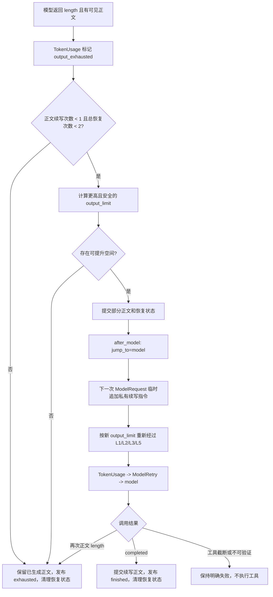
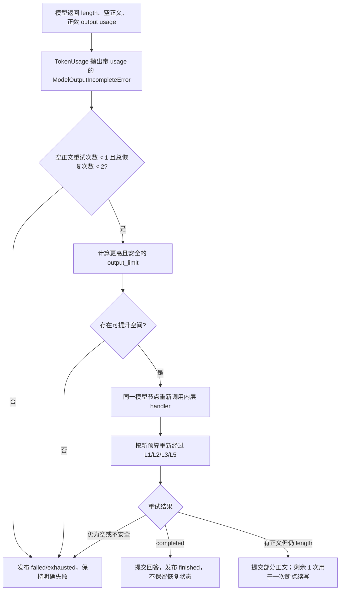

# 响应式输出恢复实施方案

## 1. 背景与目标

DocMind 已实现 L1/L2/L3/L5 多级上下文压缩，并由 `TokenUsageMiddleware` 统一判断输入溢出、正文输出耗尽、工具调用截断和不可验证截断。当前缺口是：模型已经返回明确的 `finish_reason=length` 且存在可见正文时，系统会提交不完整正文，但不会自动提高本次用户请求后续调用的输出上限并继续生成。

本次只实施第一阶段“响应式输出恢复”：

- 正常调用保持 Provider 当前默认输出策略，不主动设置常态小输出上限。
- 仅在 Provider 明确返回 `length/max_tokens` 后响应式提高输出上限。
- 可见正文被截断时，保留已生成正文，再进行一次断点续写。
- 空正文但 Provider 返回正数输出 usage 时，提高输出上限后原请求重试一次。
- 提高输出上限后重新经过 L1/L2/L3/L5 准入，输入空间不足时先压缩。
- 恢复动作有严格次数上限，不与模型异常重试形成乘积。

## 2. 范围与非目标

### 2.1 本次范围

1. 新增 `OutputContinuationMiddleware`，统一处理正文续写和空正文重试。
2. 主 Agent 与 SubAgent 使用相同中间件顺序和恢复规则。
3. 私有续写指令只进入下一次模型请求，不进入业务消息、用户消息台账和最终 checkpoint。
4. 上下文压缩器、API round 投影和客户端消息流识别并隔离私有续写消息。
5. 发布不含正文的 `output_recovery` 诊断事件。
6. 增加单元测试和真实 LangGraph 中间件栈测试。

### 2.2 本次明确不实施

- 不主动给所有普通请求设置较小的 `max_tokens`。
- 不自动修复或重试截断的工具调用。
- 不对缺少 usage 的 `length_unverified` 猜测恢复。
- 不拼接或改写两段模型正文；前端继续按模型消息流自然展示。
- 不新增管理员配置项。
- 不实施 Context Collapse 或新的压缩级别。

以上内容作为第二阶段候选，必须以第一阶段真实运行数据证明有必要后再单独设计。

## 3. 设计原则

1. **复用现有事实来源**：截断分类继续由 `TokenUsageMiddleware` 完成，恢复层不重复猜测 Provider 行为。
2. **先调整预算，再走完整准入**：恢复层位于压缩器外层，下一次调用必须重新经过 L1/L2/L3/L5。
3. **私有控制消息不污染历史**：内部续写指令仅追加到当次 `ModelRequest.messages`，不通过消息 reducer 写入 checkpoint。
4. **失败应明确**：截断工具调用、不可验证截断和无法获得更大安全输出空间均停止恢复，不做隐式回退。
5. **有界恢复**：单个用户请求最多两次恢复动作，正文断点续写最多一次，空正文原请求重试最多一次。

## 4. 中间件顺序

模型调用相关中间件固定为：

```text
OutputContinuationMiddleware
  -> ContextCompactionMiddleware
    -> TokenUsageMiddleware
      -> ModelRetryMiddleware
        -> model
```

LangChain 的第一个 `wrap_model_call` 中间件位于最外层。恢复层提高输出上限并再次调用内层 `handler()` 时，会重新进入压缩、Token 校准和普通模型异常重试。`ModelRetryMiddleware` 仍只处理其既有异常；明确的输出耗尽不交给它重试。

## 5. 状态模型

只新增一个紧凑 checkpoint 字段：

```python
class OutputRecoveryState(TypedDict):
    attempts: int
    continuations: int
    output_limit: int
    active: bool
```

- `attempts`：当前用户请求已消耗的恢复动作总数，最大为 2。
- `continuations`：正文断点续写次数，最大为 1。
- `output_limit`：下一次模型调用使用的输出上限。
- `active`：下一次调用是否属于正文续写。

状态生命周期：

```text
无恢复状态
  -> 正文 length：写入 active=true，after_model 跳回 model
  -> 下一次请求临时注入续写消息并应用 output_limit
  -> completed / 已达上限：清空恢复状态

无恢复状态
  -> 空正文 output_exhausted：同一 model 节点提高上限重试
  -> completed：不保留恢复状态
  -> 正文 length：记录已用 1 次，允许再进行 1 次正文续写
  -> 再次空正文 / 其他不安全结果：明确失败
```

新用户请求到来时若 checkpoint 中存在上次异常中断留下的恢复状态，以“最新真实 HumanMessage 晚于待续写 AIMessage”为边界清理旧状态，绝不把旧续写意图带入新请求。

## 6. 输出上限计算

恢复层只在明确截断后计算目标上限：

```text
current_limit = max(
    request.model_settings 中的显式上限,
    模型实例可识别的默认上限,
    本次 provider_output_tokens,
    min_output_reserve
)

desired = round_up(current_limit * 2, 1024)
stage_cap = clamp(context_window / 4, 8192, 16384)
hard_ceiling =
    context_window
    - context_safety_tokens
    - fixed_context_overhead
    - minimum_current_input_receipt

target = min(desired, stage_cap, hard_ceiling)
```

说明：

- `min_output_reserve` 是无法识别 Provider 默认上限时的保守基线，不会在正常请求中主动绑定到模型。
- `provider_output_tokens` 防止本地推理服务把 reasoning token 计入输出后，计算出比已消耗额度还小的目标。
- 8K~16K 是第一阶段单次恢复的安全护栏，不是常态模型上限；32K 模型通常受四分之一窗口约束，128K/256K 模型最多提升到 16K。
- `hard_ceiling` 防止 system、工具 schema 和最小用户输入回执已占满窗口时仍发出注定失败的请求。
- 若 `target <= current_limit`，说明没有可验证的提升空间，停止自动恢复。
- 最终能否调用模型仍由 `ContextCompactionMiddleware` 基于新 `prompt_budget` 决定；必要时依次执行 L1/L2/L3/L5。

## 7. 两条恢复流程

### 7.1 可见正文截断



### 7.2 空正文输出耗尽



## 8. 私有续写消息隔离

私有续写消息使用统一标记，例如：

```python
INTERNAL_OUTPUT_CONTINUATION_KEY = "_yuxi_output_continuation"
```

统一函数 `is_internal_output_continuation(message)` 供以下边界复用：

1. `OutputContinuationMiddleware`：创建和识别临时续写消息。
2. `ContextCompactionMiddleware`：
   - 查找最新真实 HumanMessage 时跳过该消息；
   - L5 摘要输入、用户锚点和九维摘要不包含该消息；
   - 压缩 plan 提交 survivors 时剔除该消息。
3. `context_projection.py`：L5 的最新 Human 边界跳过该消息。
4. `BaseAgent` 流过滤：作为最后一道边界，不向客户端发送带该标记的消息。

该消息不通过 `Command(update={"messages": ...})` 写入状态。只有当内层压缩器基于临时请求构建 plan 时，它才可能短暂出现在 plan 的 survivors 中，因此压缩提交处必须再次剔除。这样正常路径和异常路径都不会在最终 checkpoint 留下内部指令。

续写文本保持短、确定且不冒充用户需求，例如：

```text
继续上一条回答，从截断处直接续写。不要道歉，不要复述已经输出的内容，不要改变用户原始任务。
```

## 9. 结果与命令合并

当前锁定的 LangChain 会在 `wrap_model_call` 组合边界把内层 `ExtendedModelResponse` 解包为 `ModelResponse`，同时按 inner-first 顺序单独累积各层 command；外层恢复器不能通过 handler 返回值读取 `TokenUsageMiddleware` 的 command。实现因此遵循以下边界：

1. 可见正文截断由 Token 模块公开的 `visible_output_exhaustion()` 统一判定，恢复层不自行解释工具调用或空正文。
2. 空正文由 `TokenUsageMiddleware` 抛出的 `ModelOutputIncompleteError.token_usage` 提供分类和实测 usage。
3. 恢复层只返回自己拥有的 `output_recovery` command；`token_usage`、`messages=Overwrite`、摘要和 Skill 状态由 LangChain 自动按中间件层级共同提交。
4. 直接调用中间件时若 handler 显式返回 `ExtendedModelResponse`，恢复层仍保留其 update，并对同名 `output_recovery` 冲突立即报错。
5. 恢复层不改写内层 `messages`、`token_usage`、摘要或 Skill 状态。

空正文在同一节点重试时，第一次异常携带的 usage 只用于计算恢复上限；最终成功响应的 `token_usage` 由第二次调用提交。若第二次变成可见正文截断，则把已消耗次数写入恢复状态，供下一次 `after_model` 判断总上限。

## 10. 事件与可观测性

发布 `type=output_recovery` custom event，仅包含有界诊断字段：

```text
status=started | finished | exhausted | failed
mode=continuation | empty_retry
attempt
previous_output_tokens
target_output_tokens
prompt_budget
```

事件不包含用户正文、模型正文、工具参数或工具结果。`agent_run_service` 的精简 SSE 只保留上述白名单字段。第一阶段前端可忽略此事件，LangSmith/运行事件和验收脚本仍可查看恢复是否发生。

## 11. 失败边界

| 场景 | 第一阶段行为 |
| --- | --- |
| 正常完成或 tool_calls 完整 | 不改变输出上限，不触发恢复 |
| `length` 且有正文 | 最多自动续写一次 |
| `length`、空正文、有正数 output usage | 提高上限后原请求重试一次 |
| `tool_call_truncated` | 明确失败，不执行工具，不自动重试 |
| `length_unverified` | 明确失败，不猜测输入或输出原因 |
| 提升输出上限后输入超预算 | 先走 L1/L2/L3/L5；仍无法准入则明确失败 |
| 没有更大安全输出空间 | 不发送注定失败的请求，结束恢复 |
| 恢复后的模型调用发生普通网络/限流错误 | 仍由内层 `ModelRetryMiddleware` 按原规则处理 |

## 12. 实施步骤

1. 新增失败测试，覆盖分类复用、上限计算、次数限制、命令合并和同步/异步一致性。
2. 实现 `OutputContinuationMiddleware` 及统一私有消息标记函数。
3. 修改压缩和投影边界，确保私有消息不改变当前用户请求边界、不进入摘要或 checkpoint。
4. 按固定顺序接入主 Agent 与 SubAgent。
5. 增加流过滤和精简 SSE 字段白名单。
6. 更新中间件正式文档和 changelog。
7. 运行相关单元测试、真实 LangGraph 栈测试、完整非 slow unit 和 Ruff。
8. 若本地单元与栈测试通过，再根据环境可用性在 `docmind-dev` 使用真实 32K Qwen 做 API 验收。

## 13. 验收标准

### 13.1 单元与组合验收

- [ ] 普通 completed 响应不增加任何 `max_tokens`/`max_completion_tokens`。
- [ ] 正文 `length` 只续写一次，第一次正文和续写正文均保留。
- [ ] 空正文且 output usage 为正时只重试一次。
- [ ] 空正文重试后变成正文 `length` 时，总恢复次数最多为 2。
- [ ] 截断工具调用只调用模型一次，ToolNode 零执行。
- [ ] `length_unverified` 不重试。
- [ ] 目标输出上限按 1K 对齐，并受窗口四分之一、8K~16K 和固定开销硬上限共同约束。
- [ ] 提高输出上限导致 prompt budget 缩小时，真实中间件栈会先触发压缩再调用模型。
- [ ] 私有续写消息不成为最新真实用户消息，不进入 L5 摘要，不留在最终 checkpoint。
- [ ] 内层 `token_usage`、`messages=Overwrite`、摘要和其他状态更新不被覆盖。
- [ ] 主 Agent 与 SubAgent 中间件顺序一致。
- [ ] 同步和异步入口行为一致。
- [ ] `output_recovery` SSE 不包含正文，只保留白名单诊断字段。

### 13.2 真实 API 验收

- [ ] 使用隔离会话发送可稳定触发正文截断的请求，观察到一次 `continuation started` 和一次 `finished/exhausted`。
- [ ] 第二次模型调用的输出上限高于第一次，且未超过阶段护栏和硬上限。
- [ ] 若提高预留导致输入超预算，`context_compaction` 事件先于恢复后的模型调用完成。
- [ ] chat-iframe 可看到自然连续的回答，不显示内部续写指令。
- [ ] 会话回看和 checkpoint 中不存在私有续写 HumanMessage。
- [ ] 新用户轮次不继承上一轮恢复计数或续写意图。

## 14. 最终审核结论

本方案可实施，且值得作为独立第一阶段落地：它复用现有截断分类、预算准入和多级压缩，不改变正常请求行为，也不引入前端工具调用撤销协议。主要风险集中在私有消息隔离和 `ExtendedModelResponse` 状态合并，两者都有明确的单一实现边界和可自动化验收标准。

本阶段不应同时实施常态小输出上限或截断工具调用重试。前者需要真实请求分布证明收益，后者涉及流式 tool-call 片段清理和副作用边界，复杂度明显更高，应在第一阶段运行数据稳定后再决定。
