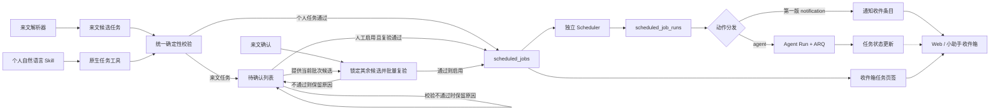
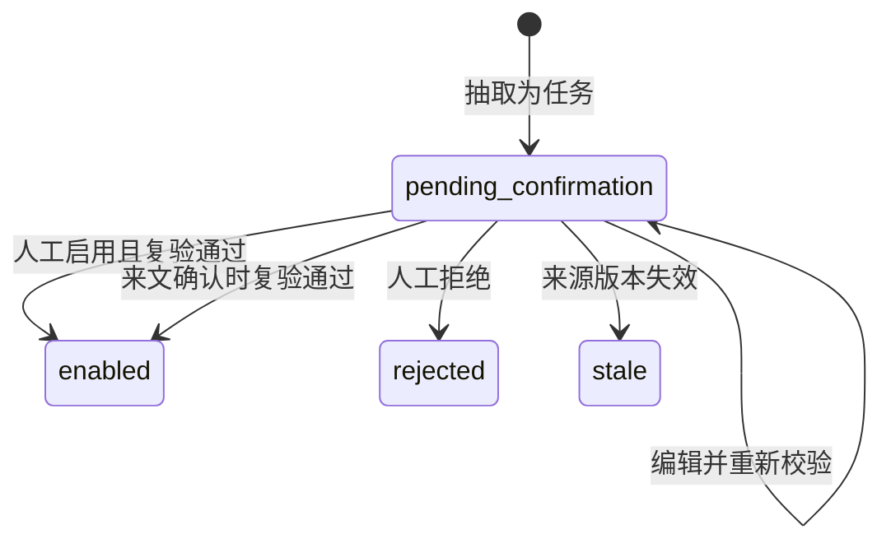
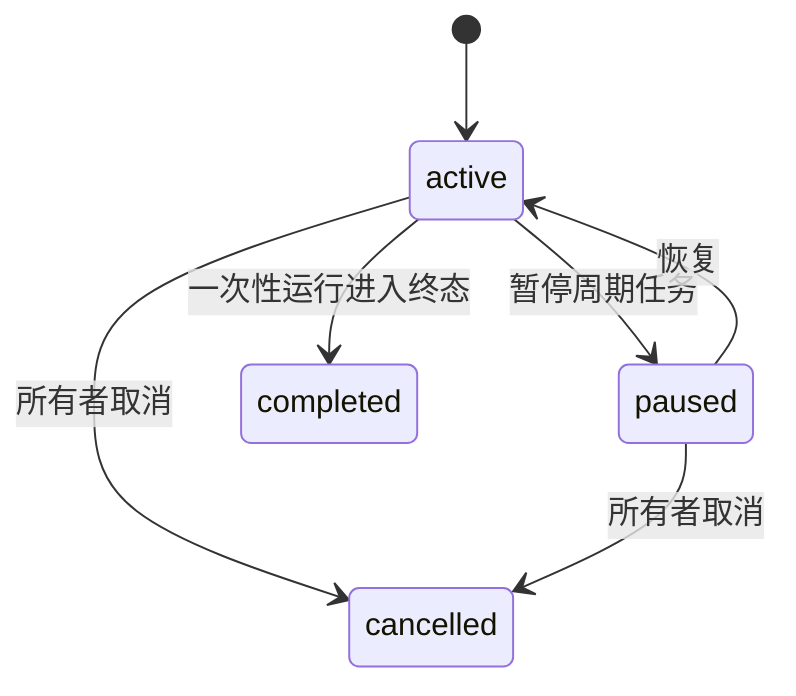
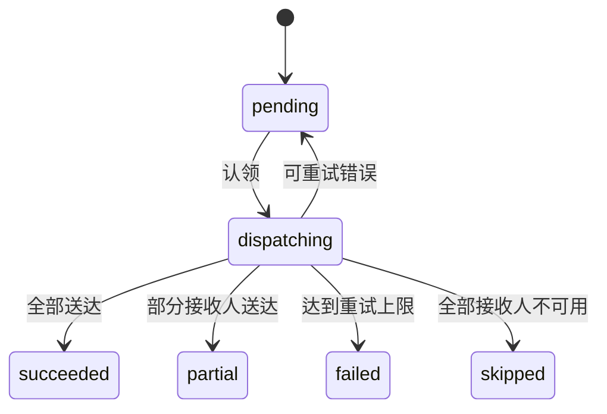

# 来文与个人定时任务模块调研及实施方案

| 元信息 | 内容 |
| --- | --- |
| 初稿日期 | 2026-08-05 |
| 最后复核 | 2026-08-10 |
| 状态 | 阶段 0 至阶段 5 已完成代码实施、本地验证及真实 Docker Compose/PostgreSQL 浏览器端到端验收 |
| 目标版本 | DocMind 定时任务第一版通知闭环、第二版 Agent 自动执行与阶段 5 结果展示闭环 |
| 主要来源 | 来文任务抽取、个人自然语言指令 |
| 当前动作 | `notification` 到点提醒；`agent` 到点执行 |

## 1. 目标与结论

建设一个独立于来文解析器、个人 Agent 和现有后台技术任务的定时任务模块。上游只负责生产符合约定的数据结构，定时任务模块统一负责确定性校验、持久化、调度、运行审计和通知送达。

当前版本必须形成以下闭环：

1. 支持一次性时间、固定间隔和 Cron 三类调度。
2. 来文抽取出的任务统一先进入“定时任务 → 待确认”；校验通过后可人工点击“启用”，来文确认时自动启用该来文中其余校验通过的任务。
3. 不完整或校验失败的来文任务保留在待确认列表，展示原因；修正并重新校验通过后才能启用，且不阻塞来文本身的确认。
4. 个人通过自然语言创建通知或 Agent 执行型任务；结构明确时直接创建，缺少必要信息或存在歧义时复用 `ask_user_question` 询问。
5. Web 主站和 `chat-iframe` 小助手都能查看个人任务和统一收件箱；待确认候选不得进入收件箱，小助手必须提供邮箱入口及未读红点。
6. PostgreSQL 是调度事实来源，独立 Scheduler 服务支持重启恢复和多实例互斥。
7. 通知到点只生成站内提醒；Agent 执行型任务到点新建独立会话并投递 Agent Run，两类动作不得相互降级。
8. Agent 终态结果必须在 Web 和小助手中可发现、可打开、可追溯；完整消息和产物以该次运行的 Conversation 为事实来源。

核心不变量：

- 来文解析器和个人自然语言 Agent 都只是“任务结构生产者”，不能直接写调度表。
- 模型和 Skill 负责理解语言；权限、人员、时间、状态与持久化校验必须由后端固定代码完成。
- 任务定义、某次计划运行、用户收件箱条目是三个不同概念，不能合成一张表。
- 收件箱不是审核入口：只有已启用任务、已触发通知及其系统状态更新可以出现，候选任务只能在“待确认”中处理。
- 已启用任务不得被新的抽取结果静默覆盖。
- 当前登录用户 UID 从认证运行时取得，绝不接受模型或前端替用户指定所有者。

## 2. 版本范围

### 2.1 第一版范围

- 动作类型只有 `notification`，即到点生成站内通知。
- 调度类型包括 `at`、`interval`、`cron`，均达到分钟级精度。
- 来文任务支持候选生成、待确认、编辑、启用和拒绝；来文确认时批量启用其余校验通过的候选。
- 个人任务支持自然语言创建、列表查看、编辑、取消；周期任务还支持暂停和恢复。
- 自己创建的通知触发后也进入自己的收件箱。
- 别人分配给自己的通知只能阅读，不能修改或删除原任务。
- 支持未读数量、单条已读和全部已读。
- 支持服务停机后的有限补发、运行去重、失败重试和审计。

### 2.2 第二版范围（已实施）

- 新增 `agent` 动作结构。
- 到点后新建独立会话，通过现有 Agent Run 和 ARQ Worker 执行任务。
- 收件箱展示排队、执行中、成功、失败、取消等状态；进入终态时重新标记为未读。
- 明确目标 Agent、超时、权限和执行输入快照；工具、知识库、MCP 与 Skills 始终读取该 Agent 执行时的管理员配置，不保存为任务覆写。

第二版 Agent 自动执行、最终回复投影、统一会话发现、结果导航和绑定 Agent 续聊已经按阶段 5 实施。当前创建契约必须显式指定 `notification` 或 `agent`：前者只提醒，后者必须进入独立会话、Agent Run 和 ARQ 执行链路；不得因缺少动作判别字段而默认创建通知。

### 2.3 第一版非目标

- 不支持短信、电子邮件、企业微信等外部渠道。
- 不实现中国法定节假日及调休工作日历；“工作日”仅表示周一至周五。
- 不把现有 `Tasker` 后台技术任务中心改造成业务定时任务中心。
- 不引入通用工作流编排引擎。
- 不使用 API 进程内定时器作为生产调度器。
- 不自动清理历史；个人任务经所有者确认后可物理删除任务域数据，关联 Conversation、消息和产物独立保留。
- 第一版不跨抽取运行做语义去重；通过来文任务批次冻结和候选到任务的唯一关联防止重复启用，见第 13.1 节。

## 3. 当前项目能力与缺口

### 3.1 可复用能力

| 能力 | 当前实现 | 本模块用途 |
| --- | --- | --- |
| 来文业务抽取 | `document_extraction` 已输出任务类明细和原文证据 | 作为来文候选任务来源 |
| 认证用户 | `users` 已有唯一 `uid`、唯一 `username`、角色和部门 | 第一版人员目录数据源 |
| 人机反问 | 已有 `ask_user_question` 中断及 Web/小助手恢复链路 | 补齐个人自然语言任务信息 |
| Agent 异步执行 | `AgentRunService` + Redis/ARQ Worker | 第二版复用执行传输和运行链路 |
| 基础设施 | PostgreSQL、Redis、Docker Compose | 调度持久化和服务部署 |
| 双前端 | `web` 与 `chat-iframe` | 任务管理和统一收件箱 |

### 3.2 必须补齐的缺口

1. 当前 `TaskItem` 只有 `task_name`、`department`、`role`、`deadline`、`period_type` 和 `source_quote` 等抽取字段，不能直接表达确定的触发规则和接收人。
2. `deadline` 是原文字符串。它可作为时间证据，但不能不经解析、确认和校验就驱动调度。
3. 当前没有面向业务用户的持久化调度定义、运行记录、收件箱和未读状态。
4. 当前 `Tasker` 使用进程内队列，不具备本模块所需的长期可编辑调度语义。
5. 外部小助手用户会被转换为本地用户；未登录过的外部人员可能尚不存在，外部组织人员身份也没有独立持久化。
6. 当前抽取 `item_id` 依赖 `run_id`，重新抽取同一内容会变化，不能直接承担跨抽取幂等键职责。
7. 当前来文服务支持分类纠正和失败重试，均可能重新执行抽取；批次冻结检查必须接入这两条现有路径，不能只在“启用”接口中处理。

### 3.3 Agent 结果展示闭环审计（2026-08-10）

现有实现已能在到期时创建独立 Conversation、Agent Run 并投递 ARQ，但“执行成功”不等于“用户可看到结果”。本轮审计确认以下缺口：

1. `scheduled_job_runs.conversation_id` 保存的是 Conversation 数值主键字符串，而 Web 深链接和小助手选中会话需要公开 `thread_id`，现有运行历史无法直接导航。
2. 终态任务事件只返回“已完成”等状态文案，没有最终回复摘要、产物数量和“查看结果”所需的运行定位字段。
3. Web 任务运行历史只显示 `agent_run_id`；小助手收件箱卡片点击只标记已读，两端都没有打开完整 Conversation 的闭环。
4. iframe 普通会话列表同时按宿主 `agent_id` 和 `conversation_scope_key` 过滤；定时执行会话可能使用其他 Agent 且不带页面 scope，因此不保证出现在小助手会话列表。
5. iframe 继续对话时默认使用宿主配置 Agent，而 Agent Run 已明确禁止同一 thread 切换 Agent；打开其他 Agent 的定时会话后继续发送会冲突。
6. 任务收件箱按 `scheduled_job_id` 聚合已读；周期任务存在多次未读运行时，直接打开最新结果不应静默消除其他运行的未读语义。

阶段 5 只修复上述闭环，不重做调度器、Dispatcher 或 Agent Run，不引入会话分组、双页签、“打开后才进入侧栏”等额外可见性状态。

## 4. 开源项目调研与采用边界

调研的目的不是复制完整框架，而是优先复用成熟库和已经验证的边界案例。引用代码前必须再次核对项目版本、许可证和目标文件的许可证声明。

| 项目 | 许可证/状态 | 可参考内容 | 明确不采用内容 |
| --- | --- | --- | --- |
| [Nanobot `types.py`](https://github.com/HKUDS/nanobot/blob/main/nanobot/cron/types.py)、[`service.py`](https://github.com/HKUDS/nanobot/blob/main/nanobot/cron/service.py) | MIT | `at/every/cron` 分类、`croniter + ZoneInfo`、调度/载荷/状态分离、最近唤醒、有限运行历史、时区和持久化测试 | JSON 文件事实源、单进程串行执行、按当前时间重算 interval 导致的漂移 |
| [OpenAgent 通知模型](https://github.com/the-open-agent/openagent/blob/master/object/notification.go) | Apache-2.0 | 按接收人查询、未读数量、单条/全部已读、失败认领恢复思路 | README 中未落地的用户 Cron 能力；BPMN Delay 不能替代用户调度器 |
| [Open Agent Platform PR #312](https://github.com/langchain-ai/open-agent-platform/pull/312) | MIT；项目于 2026-02 归档；PR 未合并 | CRUD 界面、Agent 与 owner 绑定、认证边界 | 不把未合并 PR 或已归档项目作为运行基础 |
| [Codex Scheduled tasks](https://developers.openai.com/codex/automations) | 官方产品文档；实现未开源 | 独立任务每次运行创建新 Chat，`Scheduled` 同时承担任务管理、近期运行和未读结果收件箱 | 只采用“运行结果有独立会话事实来源”的产品语义，不反推私有实现 |
| [Claude Code Desktop scheduled tasks](https://code.claude.com/docs/en/desktop-scheduled-tasks) | Anthropic 官方产品文档 | 每次创建新 Session，侧栏 `Scheduled` 负责发现，Routines 详情负责定义和完整历史，Session 承载消息、工具、产物和权限请求 | 不复制任何受限实现，不在本阶段引入持久等待人工授权状态 |
| [OpenCode GitHub](https://opencode.ai/docs/github/) | 官方集成文档 | GitHub `schedule` 把结果落到 Actions 日志和 PR，证明完整结果必须有稳定工件入口 | OpenCode 核心没有可直接复用的原生定时前端，不把 CI 日志当作 DocMind 会话产品方案 |
| [Pi schedule-prompt](https://github.com/tintinweb/pi-schedule-prompt) | Pi 社区扩展，非核心原生调度 | 后台子 Agent 的开始、终态和结果片段回写父会话，说明即使轻量实现也需要可发现的结果入口 | 不采用仅会话打开时运行、项目 JSON 事实源或只显示终端结果片段的限制 |
| [APScheduler 3.x](https://apscheduler.readthedocs.io/en/3.x/userguide.html) | 3.11.3 为 MIT 稳定版 | 对照触发器、持久化和错过执行语义 | 3.x JobStore 官方不允许多个 Scheduler 共享；v4 多调度器设计尚非稳定版，因此第一版不引入整个运行时 |

采用结论：

- 时间计算优先使用 `croniter` 和 Python 标准库 `zoneinfo.ZoneInfo`，不手写 Cron 解析器和时区算法。
- 参考 Nanobot 的数据分层与边界测试，但 DocMind 使用 PostgreSQL 和数据库互斥。
- 参考 Codex/Claude 的双层语义：定时中心管任务定义和运行历史，独立 Conversation 管完整结果，收件箱只管发现、摘要和未读。
- 保留现有 ARQ 作为第二版执行传输，不再引入 Celery 或另一套任务队列。
- DocMind 自己编写的代码只负责领域状态、数据库认领、权限和动作适配，不重复实现成熟时间库已有能力。

## 5. 总体架构



### 5.1 模块职责

| 模块 | 职责 | 不承担的职责 |
| --- | --- | --- |
| 来源适配器 | 把来文或自然语言转换为统一草稿 | 不自行绕过服务层写调度表 |
| 领域服务 | 校验、权限、人员快照、状态变更、持久化 | 不依赖前端完成安全校验 |
| Scheduler | 计算到期项、创建唯一运行、推进下次时间 | 不执行模型推理 |
| Dispatcher | 按动作类型分发运行并记录结果 | 不重新解释自然语言 |
| 人员目录 | 按名称、范围查询稳定 UID | 不把模型猜测当作身份 |
| 收件箱 | 展示已启用任务、已触发通知和状态更新，并维护事件已读状态 | 不处理候选任务，不复制并维护另一套运行真值 |

### 5.2 部署拓扑

- 在 Docker Compose 增加服务 `scheduler` 和 `dispatcher`；两者与后端共用镜像、源码挂载和 PostgreSQL，入口分别为 `uv run --no-sync --no-dev python -m yuxi.scheduled_jobs.scheduler` 和 `uv run --no-sync --no-dev python -m yuxi.scheduled_jobs.dispatcher`。不设置固定 `container_name`，由 Compose 自动生成实例名，原因是固定容器名会阻止 `--scale` 横向扩展，与多实例互斥验收目标冲突。
- API 只负责 CRUD、校验和查询，不在每个 API 副本内启动定时循环。
- PostgreSQL 是任务定义、运行和收件箱的唯一事实来源。
- Redis/ARQ 承担 `agent` 动作的 Agent Run 投递，不作为长期调度真值。
- Scheduler 默认单副本，Dispatcher 默认单副本；两者都必须通过行锁、租约和唯一约束允许安全扩容，通知压力增加时只扩 Dispatcher。

## 6. 统一任务结构

来源首先生成带类型的草稿，再由领域服务转换为持久化模型。以下结构是第一版实现契约，不再由开发人员自行增减必填语义；实际代码使用 Pydantic 判别联合类型，统一设置 `extra="forbid"`，并保持后端 Schema、API 和前端类型命名一致。

```text
ScheduledJobDraft
├── name
├── schedule: AtSchedule | IntervalSchedule | CronSchedule
├── action: NotificationAction | AgentAction
├── recipient_uids
└── timezone
```

领域服务另接收不暴露给模型的可信上下文：

```text
TaskCreationContext
├── owner_uid
├── created_by_uid
├── source_type: "incoming" | "personal"
├── source_candidate_id: str | null
├── source_snapshot
├── create_request_key: str | null
└── create_request_hash: str | null
```

来文候选适配器可以在 `ScheduledJobDraft.recipient_uids` 中放入复验后的人员快照；个人 Agent 工具和 `POST /api/scheduled-jobs` 的公开请求 Schema 不包含 `recipient_uids`、所有者或来源字段，领域服务固定接收人为当前认证用户。这样保持统一领域结构，同时不把可信身份字段交给模型或客户端。

`source_snapshot` 使用按 `source_type` 判别的固定结构：来文保存 `incoming_id`、`source_document_id`、可空的 `title`、`document_number`、`incoming_date` 和最长 1000 字符的 `evidence_summary`，展示名称依次取 `title`、`source_document_id`、`incoming_id`；个人任务保存 `entry_point`（`web_agent`、`chat_iframe` 或 `http_api`）以及可空的 `thread_id`，不保存整段对话或认证信息。

```text
AtSchedule
├── kind = "at"
└── run_at

IntervalSchedule
├── kind = "interval"
├── interval_seconds
└── anchor_at

CronSchedule
├── kind = "cron"
└── cron_expression

NotificationAction
├── type = "notification"
├── title
└── content
```

来文抽取模型输出独立的来源结构，允许保留不完整信息，但不得伪造成合法调度结构：

```text
IncomingTaskDraft
├── task_name: str
├── notification_title: str
├── notification_content: str
├── raw_time_expression: str | null
├── schedule: AtSchedule | IntervalSchedule | CronSchedule | null
├── raw_recipient_expression: str | null
├── recipient_scope: "named" | "all" | "unknown"
├── recipient_names: list[str]
├── timezone: str | null
├── source_quote: str
├── source_file_id: str
└── source_location: str | null
```

字段规则：

- `task_name`、通知标题最长 100 个字符；通知正文最长 4000 个字符；超限属于阻断错误，不静默截断。
- `raw_time_expression`、`raw_recipient_expression` 和 `source_quote` 最长 4000 个字符，`source_file_id` 最长 512 个字符，`source_location` 最长 500 个字符；超限记录结构化抽取错误，不能把无限原文塞入候选 JSON。
- `schedule = null` 表示时间信息不完整或无法唯一解释；原始表达仍保存在 `raw_time_expression`。
- `recipient_scope = named` 时 `recipient_names` 必须非空；`all` 和 `unknown` 时必须为空。
- 只有原文明确出现“全体人员”“所有人员”等同义表达时才输出 `all`。
- 当前 `TaskItem.department`、`role` 继续作为来文业务信息，但不自动当作人员。岗位、角色或部门不能唯一指向姓名时输出 `unknown`。
- `source_quote`、`source_file_id` 必填；模型不得补写原文不存在的人名、时间或“全体”范围。
- 现有 `TaskItem` 以兼容方式增加上述可选字段；旧展示字段继续保留，候选适配器只读取新结构字段驱动调度。

设计要求：

- `schedule` 和 `action` 分离，同一套调度引擎不理解通知正文或 Agent 提示词。
- `timezone` 只存在于 `ScheduledJobDraft` 顶层，三种 Schedule 统一引用该值；Cron 结构内部不再重复保存时区。
- 第一版创建接口只接受 `NotificationAction`；不得因数据库预留了动作字段就开放 Agent 执行。
- 独立 `AgentAction` Schema 只包含受控 `agent_slug`、执行指令和超时；不复用通知结构硬塞字段，也不允许携带 Skills、工具、知识库、MCP 或其他运行能力配置。
- 原始 `deadline`、接收人文本和原文片段放在来源证据中；规范化后的触发规则和 UID 才能进入调度定义。
- `ScheduledJobDraft.name` 最长 100 个字符；所有字符串在边界去除首尾空白，空字符串按缺失处理。

## 7. 调度语义

### 7.1 时间和时区

- API 接收带 UTC offset 的 ISO 8601 时间，或接收本地时间加顶层 IANA `timezone`；规范化后的 `ScheduledJobDraft.timezone` 必填。
- 同时提供 UTC offset 和 IANA 时区时，offset 必须与该日期在该时区的实际偏移一致，否则返回 `400 timezone_offset_mismatch`，不能任选一个覆盖另一个。
- 默认时区是 `Asia/Shanghai`，但仍要在任务上持久化，不依赖服务器本地时区。
- 数据库中的 `run_at`、`anchor_at`、`next_run_at`、`scheduled_for` 等执行时间统一保存为 UTC。
- API 时间统一返回带 `Z` 或明确 offset 的 ISO 8601 字符串，不返回无时区时间。
- UI 按任务时区展示规则，并同时显示下一次触发时间。
- 第一版精度为分钟，秒和微秒规范化为 `00`。

### 7.2 三种调度类型

| 类型 | 语义 | 必填字段 | 完成规则 |
| --- | --- | --- | --- |
| `at` | 在指定日期时间触发一次 | `run_at` | 该次运行进入终态后任务进入 `completed` |
| `interval` | 从固定锚点按间隔重复 | `anchor_at`、`interval_seconds` | 一直运行到用户暂停或取消 |
| `cron` | 按本地日历规则重复 | 五段 `cron_expression`、`timezone` | 一直运行到用户暂停或取消 |

约束：

- Cron 只支持标准五段表达式：分、时、日、月、星期，不接受秒字段。
- 任意周期的最小间隔是 1 分钟。
- `interval` 必须根据 `anchor_at + n * interval` 计算，不能从实际完成时间向后累加，避免运行漂移。
- `cron` 使用 `croniter` 计算，使用 `ZoneInfo` 解释本地时间。
- “每个工作日”在第一版转换为周一至周五，不处理节假日和调休。
- 夏令时不存在的本地分钟跳过；本地时间回拨产生的重复分钟只触发一次，以较早 UTC 偏移对应的时点为准。相关行为必须有自动化测试。

### 7.3 触发时间与截止时间

调度器的核心字段是“触发时间或触发规则”。例如“今天 8:17 提醒我提交材料”应直接解析为 8:17 的一次性触发时间。

“截止时间”不是所有任务都必须额外保存的调度字段。第一版按以下确定规则处理：

- 原文给出完整日期和时刻，即使使用“在……前完成”等截止措辞，也把该边界时刻作为触发时间，同时产生“触发时间即截止时间”的非阻断警告。
- 只有日期没有时刻时不补 `00:00`、`09:00` 或 `23:59`，视为信息不完整。
- 不从截止时间自动提前若干小时或若干天生成提醒。
- 原文确有截止语义时可把原始表达作为来源元数据展示，但不再增加第二套可执行时间字段。

### 7.4 自然语言时间解释基准

模型收到明确的 `reference_at` 和 `timezone` 后负责把自然语言整理为调度草稿；后端使用 `ZoneInfo`、`croniter` 和固定规则复验，不另写一套自由文本时间解析器。

个人指令规则：

- `reference_at` 是服务端收到本次用户消息的时间，时区取用户设置；第一版没有用户设置时为 `Asia/Shanghai`。
- “今天 8:17”解析为当天 8:17；若已经过去，调用 `ask_user_question`，不能自动改成明天。
- 只有“8:17”时按今天处理，若已过去同样反问。
- 只有日期没有时刻、周期没有首次触发或锚点、表达存在两个合理解释时必须反问。

来文规则：

- `reference_at` 使用 `document_metadata.incoming_date` 当天 00:00 和任务时区；缺少合法来文日期时，相对时间不能自动启用。
- “今天”“明天”“本月底”等相对表达以该来文日期为基准，不以抽取或上传执行时间为基准。
- 只有时刻时使用来文日期；只有月日没有年份时使用来文日期所在年份，但结果早于来文日期时视为不明确，不能自动顺延到下一年。
- 解析结果在启用时已经过期则保留候选并提示人工修改，不执行停机补发逻辑。

周期映射规则：

- “每隔 N 分钟/小时/天”转换为 `interval`，但必须有明确 `anchor_at`。
- “每周几、每月几号、工作日几点”等日历规则转换为五段 Cron，日期或时刻缺失则不完整。
- Cron 的日和星期字段同时受限时采用 `croniter` 默认的 OR 语义；Skill 和 UI 应避免生成同时限制二者的表达式，防止用户误解。
- “工作日”固定为周一至周五，不推断法定节假日。

### 7.5 暂停、恢复与修改

- 暂停只适用于周期任务；暂停期间不生成运行。
- 恢复周期任务时从当前时间计算下一个未来时点，不补发暂停期间的时点。
- 修改任务使用乐观版本号，避免两个页面静默覆盖彼此修改。
- 来文候选在启用前可以切换 `schedule_kind`；任务启用后不允许改变调度类型或动作类型，只能修改当前类型内部的规则、通知内容和接收人。需要从一次性改为周期性或在周期类型之间切换时，取消原任务并新建，避免产生无法解释的历史运行。
- 修改调度规则后重新计算 `next_run_at`；已经生成的运行和收件箱历史不回写。
- 一次性任务一旦已经生成 `scheduled_job_runs` 就不可再修改或取消；“是否已生成运行”由后端返回，不能根据前端倒计时判断。
- 周期任务在 `active` 或 `paused` 状态均可编辑，即使已经存在历史运行或当前运行；暂停、取消或编辑只影响操作提交后尚未生成的未来运行，已经生成的运行继续使用动作和接收人快照完成分发。暂停状态编辑后仍保持 `next_run_at = null`，恢复时再按新规则计算未来时点。
- “取消”只停止未来触发；“删除”只负责清理列表历史，两者不得复用同一个状态动作。
- 个人任务在没有 `pending`、`dispatching`、`queued`、`running` 运行时可由所有者确认后删除；存在在途运行时明确拒绝，提示先取消并等待运行进入终态后重试。
- 来文任务是共享业务记录，接收人和上传人均不能物理删除。管理员或超级管理员可管理其调度生命周期；任务进入终态后，管理员点击“删除”只对当前管理员隐藏。

## 8. 来文任务流程

### 8.1 抽取输出

来文抽取需要在现有 `TaskItem` 基础上补充或派生以下信息：

- 通知标题和内容。
- 原始时间表达及规范化调度草稿。
- 原始人员名称，或明确的“全体人员”范围，或 `unknown`。
- 原文证据、来源文件和定位信息。
- 模型对字段是否明确的结构化结果；不得只依赖自由文本置信度。

抽取结果不是最终任务。来源适配器将其转换为候选记录，调用同一领域校验器。

### 8.2 候选生成与校验

每次成功抽取都必须经过“构建来文任务批次”步骤，不能先把来文标记为 `ready`、再异步补建候选。为避免在模型调用期间持有数据库锁，处理顺序固定为：

1. 在短事务中锁定来文，创建或更新批次为 `building`，来文保持 `extracting`；已冻结批次直接拒绝重处理。
2. 读取本次成功的 `extraction_run_id`；把旧运行候选标记为 `stale`。
3. 将本次抽取的所有任务明细转换为候选并执行统一领域校验。
4. 模型调用在事务外完成；随后在同一短事务中保存全部候选、把批次改为 `ready`，最后把来文改为 `ready`。
5. 若本次没有任务，也创建 `candidate_count = 0` 的 `ready` 批次，明确表达“已检查但没有任务”。

候选构建出现代码、数据库或结构转换错误时，批次进入 `failed`，来文进入可重试的 `failed`，保存结构化错误；不得把技术失败当成“没有任务”。`building` 或 `failed` 批次必须拒绝确认来文和人工启用；`ready` 和 `frozen` 批次都可以处理当前已有候选，二者区别只在于能否更换抽取运行或增减候选成员。

只要识别为任务，就显示在“定时任务 → 待确认”。此时只产生候选记录，不创建 `scheduled_jobs`，也不进入收件箱。候选校验规则为：

1. 标题和通知内容非空，并有原文证据。
2. 调度类型和所有必填字段明确且合法。
3. 一次性时间尚未过期，或周期规则存在下一次未来运行。
4. 时区明确或已按系统默认值规范化。
5. 人员名称全部唯一解析为有效本地 UID，或者明确的“全体人员”范围成功展开为非空 UID 快照。
6. 原始来文上传账号有权把通知发送给该人员范围。

校验通过的候选显示“启用”按钮；校验不通过的候选显示具体阻断原因，按钮保持禁用。管理员可编辑时间、周期、通知内容和接收人，每次修改都调用同一后端校验器，不能只依赖前端判断。

### 8.3 两种启用入口

候选只能通过以下入口转换为活动调度任务，两个入口必须调用同一事务服务并在写入前复验时间、人员、权限和候选状态：

- **人工启用**：来文抽取完成后，管理员可在“待确认”中对任一校验通过的候选点击“启用”，无需等待来文确认。服务锁定批次和候选；第一次成功启用同时冻结批次成员。
- **来文确认自动启用**：人工确认来文时，系统锁定来文和 `ready` 或 `frozen` 批次，按候选 ID 稳定排序处理当前批次中状态为 `pending_confirmation` 的候选；复验通过的自动启用，校验不通过的更新错误并继续留在“待确认”，已启用、已拒绝和失效候选跳过。若批次尚未冻结，本次确认负责冻结。

无效候选不阻塞来文确认，也不得因为批量操作而绕过校验。启用成功后，候选与 `scheduled_jobs` 建立唯一关联；重复点击、接口重试或再次确认来文均返回已有结果，不重复创建，也不覆盖已启用任务。

来文确认、批次冻结、候选复验、有效任务创建、无效候选错误更新和来文 `review_status = confirmed` 必须共用一个 `AsyncSession` 和一个数据库事务：

- 字段不完整、时间过期、人员不存在等预期校验错误写回候选，不抛出事务级异常。
- 数据库不可用、代码异常、唯一约束之外的意外错误会回滚整个确认，来文保持未确认，前端提示重试。
- 唯一约束命中已经启用的候选时查询并返回原任务，视为幂等成功。
- 第一版不使用“先确认、再发异步事件补建任务”的最终一致方案，因为来文和任务位于同一 PostgreSQL，可用单事务获得更清晰的结果。

### 8.4 待确认状态与来源变化

以下情况保留为 `pending_confirmation`，不创建活动调度任务：

- 时间缺失、含糊、格式非法或一次性时间已过期。
- 接收人缺失、无法找到、出现多个候选或权限不足。
- 无法判断“全体人员”还是未指定人员。
- 通知标题、内容或证据缺失。
- 周期描述不能唯一转换为 `interval` 或 `cron`。
- 任何阻断性领域校验失败。

管理员可以继续编辑后启用，或拒绝候选并保留原因和审计信息。第一版不尝试跨抽取运行匹配“语义上相同”的任务：来文任务批次在首次人工启用或来文确认时冻结到一个 `extraction_run_id`；已启用任务只能通过管理员来文任务接口管理，不能进入个人任务所有者接口。

批次冻结后，来文分类纠正和重新处理接口直接返回 `409 incoming_task_batch_frozen`，不再生成新的抽取运行。冻结不禁止编辑、启用或拒绝冻结时已经存在的候选。批次仍为 `ready` 且尚未冻结时可以重试或纠正；开始重处理时批次回到 `building`，旧候选变为 `stale`，成功后再形成新的 `ready` 候选集合。

### 8.5 来文删除与归档

定时任务必须保留可审计来源，不能允许现有来文物理删除逻辑级联清掉已启用任务的证据。规则固定如下：

- 草稿来文且不存在已启用任务及候选审计引用时，可以物理删除；删除服务在同一事务显式删除候选、批次和抽取结果。现有外键统一使用 `RESTRICT`，避免审计记录被数据库级级联静默抹除。
- 来文已经确认，或任一候选已经启用时，禁止物理删除，返回 `409 incoming_has_audit_reference`；界面只提供“归档”。
- 归档只设置 `archived_at`、`archived_by`，默认列表隐藏但详情和任务来源链接仍可访问。
- 来文任务启用时，在任务中保存来文 ID、标题、文号、来文日期和来源证据摘要快照。即使以后展示名称变化，历史通知和运行仍使用各自快照。
- 来文外键删除策略统一使用 `RESTRICT`；服务层在删除前检查启用任务和审计引用，并对可删除草稿按依赖逆序显式清理，确保错误可读且审计不可被静默删除。

## 9. 个人自然语言流程

### 9.1 采用 Skill + 原生工具

个人自然语言入口使用 Skill 组织对话流程，使用后端原生工具完成真实操作：

- Skill 负责识别创建、查询、修改、暂停、恢复和取消意图，并把自然语言整理成严格工具参数。
- 当必要字段明确且唯一时，直接调用创建工具。
- 当时间、周期或通知内容缺失、互相冲突或存在多个合理解释时，调用现有 `ask_user_question`。
- 人员固定为当前登录用户，模型无需也不得传入 `owner_uid` 或任意接收人 UID。
- Skill 脚本不访问数据库，不实现权限判断，不自行计算最终 `next_run_at`。

确定性职责放在领域服务和原生工具中，包括：

- Pydantic 结构校验。
- 当前用户和权限取得。
- IANA 时区、Cron、间隔和过期校验。
- PostgreSQL 持久化和状态迁移。
- 面向用户的统一错误码与可修正提示。

这样既能发挥模型理解中文时间表达的能力，又不会把数据正确性依赖于本地模型是否稳定遵循 Skill 文本。

### 9.2 对话行为

- “今天 8:17 提醒我交材料”：字段明确，直接创建一次性通知并回显具体日期、时区和内容。
- “每周提醒我写周报”：缺少星期和时间，通过 `ask_user_question` 补齐后创建。
- “每隔两小时提醒我休息”：若当前时刻是否作为锚点不明确，应询问首次触发时间，不静默猜测。
- “取消我的周报提醒”：若唯一命中可直接取消；多个同名任务时列出候选并询问。
- 创建成功后必须返回任务名称、调度摘要、下一次触发时间和任务 ID，便于后续管理。

### 9.3 小助手与 Web 管理

个人通过 Web 主站 Agent 或小助手自然语言创建的任务，与来文任务进入同一 `scheduled_jobs` 表。用户可在小助手通过工具查询、暂停、恢复和取消，也可在 Web 任务列表完成相同操作；两端不得维护独立任务副本。第一版定时任务页面不另做手工新建表单。

## 10. 人员目录与解析

### 10.1 统一接口

定义 `PersonnelDirectory` 领域边界，第一版实现 `LocalUserPersonnelDirectory`：

```text
find_by_name(name, scope) -> resolved | ambiguous | not_found
list_active_users(scope) -> users
get_by_uids(uids) -> users
```

第一版按来文中的姓名查询本地 `users.username`，不要求原文出现人员 ID。匹配规则：

- 仅把规范化后的姓名精确匹配作为自动确认依据，不用模糊相似度自动选人。
- 只返回 `is_deleted = 0` 的有效用户。
- `resolved` 必须得到唯一 UID；多个候选为 `ambiguous`，无结果为 `not_found`。当前本地 `username` 有唯一约束，第一版不会实际产生多个本地候选，但接口保留 `ambiguous` 以兼容后续组织目录适配器。
- 原始姓名、解析状态、候选和最终 UID 都要保留，便于人工修正与审计。

未来客户组织架构接口通过新的 Adapter 接入，不改变上层调度和候选任务接口。

### 10.2 “全体人员”范围

- 超级管理员：展开为当前系统全部有效用户。
- 部门管理员：展开为其所属部门全部有效用户。
- 普通用户：无权通过来文创建面向全体的通知。
- 创建任务时将人员范围解析为具体 UID 并保存快照。后续新增用户不会自动加入既有任务，避免任务含义随组织变化。
- 同时保存 `recipient_scope` 和范围说明，用于 UI 展示和审计，但运行时以 UID 快照为准。

### 10.3 当前限制

外部小助手用户首次换取令牌时才会创建本地用户，显示名冲突时还可能追加 UID 后缀。因此第一版本地姓名查询可能找不到尚未登录的人员，也不能可靠还原客户组织身份。这种情况必须进入待确认并说明原因，不能用相似姓名替代。客户人员接口接入前应在 UI 明确展示“本地账号目录”数据来源。

## 11. 数据模型

以下模型、字段语义和约束是第一版数据库实施契约。开发按现有 SQLAlchemy 声明风格落地，不得在实现阶段删减幂等、审计、租约或状态字段；若物理字段名必须因数据库保留字调整，API 和领域命名仍保持本节定义。

### 11.1 `incoming_task_batches`

每个来文只允许一个任务启用批次，用于固定第一版处理边界，而不是推断不同抽取运行之间的语义等价关系。

| 字段 | 说明 |
| --- | --- |
| `id` | 批次主键 |
| `incoming_id` | 来文 ID，建立唯一约束 |
| `extraction_run_id` | 本批次选用的抽取运行；仅在首次构建尚未得到运行或构建失败时可空 |
| `status` | `building`、`ready`、`failed`、`frozen`；`frozen` 表示成员冻结，不表示候选处理结束 |
| `candidate_count` | 当前运行生成的候选数量，包括零任务批次 |
| `build_error_code` / `build_error_message` | 候选构建技术错误；业务校验错误保存在候选中 |
| `version` | 乐观并发版本号 |
| `frozen_at` / `frozen_by_uid` | 首次人工启用或来文确认时冻结 |
| 审计字段 | 创建和更新时间 |

抽取完成后可在批次尚未冻结且没有候选被启用时选择最新成功运行；若此时分类纠正或重试产生新运行，旧运行候选标记为 `stale`，界面只展示当前选定运行的候选。首次人工启用或确认来文会把批次状态改为 `frozen`；此后重处理和分类纠正直接拒绝，但冻结时已有的 `pending_confirmation` 候选仍可编辑、启用或拒绝。

### 11.2 `scheduled_job_candidates`

保存来文产生的任务候选及其转换结果。所有候选都先落此表，不因首次校验通过而跳过待确认阶段。

| 字段 | 说明 |
| --- | --- |
| `id` | 候选主键 |
| `batch_id` / `extraction_item_id` | 来文任务批次及批次内抽取明细；建立联合唯一约束 |
| `incoming_id` / `extraction_run_id` | 冗余来源追踪字段，必须与批次一致 |
| `owner_uid` | 原始来文上传账号；正常候选必须固定为该账号，历史来文缺少账号时允许为 `null`，仅用于保留不可启用的待确认候选 |
| `name` / `notification_title` / `notification_content` | 通知草稿；标题和正文均允许为空，以保留字段不完整但需要人工补全的候选 |
| `schedule_data` | 带类型的调度草稿 JSON |
| `timezone` | IANA 时区 |
| `recipient_scope` | `named`、`all`、`unknown` |
| `raw_recipient_names` | 原文姓名列表 |
| `recipient_resolution` | `resolved`、`ambiguous`、`not_found`、`missing` 及详情 |
| `resolved_recipient_uids` | 当前解析出的 UID；启用时仍需重新校验 |
| `evidence` | 原文片段、文件和位置 |
| `validation_errors` / `validation_warnings` | 最近一次校验结果 |
| `status` | `pending_confirmation`、`enabled`、`rejected`、`stale` |
| 审计字段 | 创建、更新、启用、拒绝用户与时间 |

候选状态与最终任务状态分离，避免用一个 `status` 同时表达“是否确认”和“是否仍在调度”。

### 11.3 `scheduled_jobs`

| 字段 | 说明 |
| --- | --- |
| `id` | 任务主键 |
| `owner_uid` | 个人任务所有者；`source_type=personal` 时必填，来文任务为空且不得用于授权 |
| `source_type` | 第一版只允许 `incoming`、`personal` |
| `source_candidate_id` | 来文任务唯一引用候选 ID；个人任务为空，建立部分唯一约束 |
| `create_request_key` / `create_request_hash` | 可信运行时生成的创建请求键及规范化请求 SHA-256 摘要，防止工具或 HTTP 重试重复创建并识别同键换内容 |
| `source_snapshot` | 第 6 节定义的来文或个人来源快照 |
| `name` | 用户可读名称 |
| `schedule_kind` | `at`、`interval`、`cron` |
| `run_at` | 一次性 UTC 时间 |
| `anchor_at` / `interval_seconds` | 固定间隔锚点和秒数 |
| `cron_expression` / `timezone` | 五段 Cron 和 IANA 时区 |
| `next_run_at` | 下次 UTC 触发时间；活动任务查询索引 |
| `action_type` | 第一版只能是 `notification` |
| `action_data` | 已通过对应 Action Schema 校验的载荷 |
| `status` | `active`、`paused`、`completed`、`cancelled` |
| `version` | 乐观并发版本号 |
| `last_run_at` | 最近一次生成运行的时间 |
| `created_by_uid` | 实际创建操作者，用于审计 |
| 审计字段 | 创建、更新、暂停、取消时间及原因 |

不再增加与 `status` 重复的 `enabled` 布尔字段。不同 `schedule_kind` 的专属字段通过 Schema 和数据库约束保证互斥。

仅由 `scheduled_jobs.source_candidate_id` 单向引用候选，避免候选表和任务表形成循环外键。启用服务通过该唯一字段查询并返回已有任务，候选无需重复保存任务 ID。第一版不维护跨抽取来源同步状态；批次冻结后不会自动产生来源变更同步。

### 11.4 `scheduled_job_recipients`

| 字段 | 说明 |
| --- | --- |
| `scheduled_job_id` / `recipient_uid` | 联合唯一，保存任务人员快照 |
| `recipient_name_snapshot` | 创建时名称，便于账号变化后的审计 |
| `source_name` | 来文中的原始人员名称，可空 |
| `created_at` | 快照时间 |

### 11.5 `scheduled_job_runs`

| 字段 | 说明 |
| --- | --- |
| `id` | 运行主键 |
| `scheduled_job_id` / `scheduled_for` | 任务与计划时点，建立联合唯一约束 |
| `status` | `pending`、`dispatching`、`queued`、`running`、`succeeded`、`partial`、`failed`、`cancelled`、`skipped` |
| `attempt_count` / `next_attempt_at` | 分发重试控制 |
| `lease_owner` / `lease_expires_at` | Dispatcher 崩溃恢复认领信息 |
| `action_type` / `action_snapshot` | 触发时动作快照，防止后续编辑改写历史 |
| `recipient_snapshot` | 触发时接收人 JSONB 快照，至少包含每人的 `uid` 和名称；不得只保存对可变任务接收人表的引用 |
| `result_data` / `error_code` / `error_message` | 结构化结果和可诊断错误；Agent 终态固定保存 `agent_status`、`final_message_id`、`result_preview` 和 `artifact_count`，不复制完整消息 |
| `started_at` / `finished_at` / `created_at` / `updated_at` | 实际执行时间、创建时间和状态更新时间 |
| `agent_run_id` / `conversation_id` | `agent` 动作内部关联字段，`conversation_id` 保留 Conversation 数值主键字符串；`notification` 动作为空 |
| `conversation_thread_id` | 前端导航和对话 API 使用的稳定公开 ID；Agent 会话创建时与上述两个关联同事务写入 |

新运行以 `attempt_count = 0`、`status = pending`、`next_attempt_at = database_now()` 创建。每次认领递增尝试次数，首次认领设置 `started_at`；终态必须设置 `finished_at`、清空租约和 `next_attempt_at`。因此 `next_attempt_at` 在物理表中允许为空，只对 `pending` / `dispatching` 保留实际时间，不能错误声明为 `NOT NULL`。数据库 `CHECK` 固定“只有 `dispatching` 可以保存完整租约、其他状态的租约字段必须为空”，认领服务在同一事务内使用 PostgreSQL `now()` 判断租约是否过期。调整原因：`CHECK` 中使用随时间变化的 `now()` 不能在时间流逝后自动重新校验既有行，无法可靠地表达“未过期”这一动态事实；该事实必须由认领查询和行锁保证。

### 11.6 `inbox_items`

| 字段 | 说明 |
| --- | --- |
| `id` | 收件箱条目主键 |
| `recipient_uid` / `scheduled_job_id` | 条目所属用户和调度任务 |
| `scheduled_job_run_id` | 通知或运行状态更新关联的运行，可空 |
| `category` | `notification` 或 `task`，对应两个收件箱页签 |
| `item_type` | `notification_delivered` 或任务状态事件类型 |
| `event_key` | 可信后端生成的事件键；与接收人联合唯一，防止重复未读事件 |
| `title` / `content_snapshot` | 可直接展示的通知快照 |
| `is_read` / `read_at` | 接收人自己的已读状态 |
| `hidden_at` | 接收人点击“删除”后的隐藏时间；只影响当前用户查询，后续周期事件仍可重新出现 |
| `created_at` / `updated_at` | 送达和更新顺序 |

`notification` 条目在通知实际触发并送达时为接收人生成；通知动作发生部分送达、跳过或最终失败时，也在该任务所有者的通知页签生成异常条目。`task` 条目只记录 `agent` 动作的排队、执行和终态更新。任务定义和当前状态仍从 `scheduled_jobs`、`scheduled_job_runs` 取得，不能把收件条目当作运行真值。任务存在本身不产生未读；用户自己执行暂停、恢复或取消也不产生未读，正常通知触发不能同时在两个页签重复出现。

`event_key` 格式固定为：通知送达使用 `notification:{scheduled_job_run_id}`，通知动作的所有者异常更新沿用 `task:{scheduled_job_run_id}:{run_status}`，Agent 状态使用 `task:{scheduled_job_run_id}:{run_status}`；分类由 `category` 和动作类型决定，事件键只承担同一用户、同一运行、同一状态的幂等约束。

### 11.7 `scheduled_job_audit_logs`

仅在任务表保存最后修改时间不足以审计人工修正、启用和状态变化，因此增加不可变审计表：

| 字段 | 说明 |
| --- | --- |
| `id` | 审计主键 |
| `scheduled_job_id` / `candidate_id` | 至少一个非空 |
| `actor_uid` | 操作者；系统动作使用固定值 `system` |
| `action` | `create`、`edit`、`enable`、`pause`、`resume`、`cancel`、`reject` 等 |
| `before_data` / `after_data` | 只保存必要业务字段快照，不保存密码、令牌或完整敏感原文 |
| `reason` | 用户原因或系统错误码，可空 |
| `created_at` | 审计时间 |

### 11.7.1 `scheduled_job_user_states`

来文任务是共享定义，管理历史中的“删除”必须按用户保存可见状态，不能修改任务全局生命周期：

| 字段 | 说明 |
| --- | --- |
| `scheduled_job_id` / `user_uid` | 联合主键，表示某个用户对某条共享来文任务的本地状态 |
| `hidden_at` | 当前用户隐藏该终态来文任务的时间 |
| `created_at` / `updated_at` | 状态创建和更新时间 |

默认管理列表排除当前用户已经隐藏的来文任务；其他管理员未点击“删除”时仍然可见。该表不授予来文访问权和管理权，权限仍由管理员认证边界及未来来文组织/人员可见范围共同决定。

### 11.8 现有来文表扩展

`incoming_documents` 增加 `archived_at`、`archived_by`。默认查询排除已归档来文，显式 `include_archived=true` 才返回；归档不改变原确认状态、抽取结果或任务来源。

### 11.9 数据库约束与索引

开发迁移按以下约束实施，不把关键幂等仅留在 Service：

- 主键使用应用生成的字符串 ID，前缀分别为 `sjb_`（批次）、`sjc_`（候选）、`sj_`（任务）、`sjr_`（运行）、`ibi_`（收件条目）、`sja_`（审计）；接收人和服务心跳使用本节定义的联合主键。时间列统一 `TIMESTAMPTZ`，结构字段使用 PostgreSQL `JSONB`。
- SQLAlchemy 执行时间字段使用 `DateTime(timezone=True)`，数据库默认值和调度比较使用 PostgreSQL `now()`；新模块不得把 naive datetime 与这些字段直接比较。
- `incoming_task_batches(incoming_id)` 唯一。
- `scheduled_job_candidates(batch_id, extraction_item_id)` 唯一，并建立 `(status, updated_at DESC)` 查询索引。
- `scheduled_jobs(source_candidate_id) WHERE source_candidate_id IS NOT NULL` 唯一。
- `scheduled_jobs(owner_uid, create_request_key) WHERE create_request_key IS NOT NULL` 唯一。
- `scheduled_jobs(status, next_run_at, id) WHERE status = 'active' AND next_run_at IS NOT NULL` 是 Scheduler 到期索引；另建 `(owner_uid, status, updated_at DESC)` 页面索引。
- `scheduled_job_recipients(scheduled_job_id, recipient_uid)` 唯一，并建 `recipient_uid` 反向索引。
- `scheduled_jobs.owner_uid` 只约束个人任务且允许来文任务为空；`scheduled_job_recipients.recipient_uid`、`inbox_items.recipient_uid` 和 `scheduled_job_user_states.user_uid` 引用 `users.uid`。
- 个人任务删除由领域服务在持有任务行锁后按依赖顺序显式删除收件事件、运行、接收人、任务审计和任务定义；数据库外键继续使用 `RESTRICT`，防止绕过领域服务意外级联。
- `scheduled_job_runs(scheduled_job_id, scheduled_for)` 唯一；`conversation_thread_id` 在非空时唯一；Dispatcher 使用 `(status, next_attempt_at, id)` 和 `(status, lease_expires_at, id)` 索引；Agent 终态对账使用 `(status, updated_at, id) WHERE action_type = 'agent' AND status IN ('queued', 'running')` 部分索引。
- `inbox_items(recipient_uid, event_key)` 唯一；默认列表和未读统计排除 `hidden_at IS NOT NULL`，列表使用 `(recipient_uid, category, hidden_at, is_read, created_at DESC, id DESC)`，任务聚合使用 `(recipient_uid, scheduled_job_id, category, hidden_at, is_read)`。
- `scheduled_job_user_states(scheduled_job_id, user_uid)` 唯一；只用于共享来文任务的用户级隐藏，不承载任务状态或授权。
- 会话列表为 `extra_metadata->>'source' = 'scheduled_job'` 建立面向当前用户和更新时间的 PostgreSQL 部分表达式索引，避免 iframe 合并定时会话时全表扫描；不为此引入新的会话类型表。
- 状态、`source_type`、`schedule_kind`、`action_type`、`category` 使用数据库 `CHECK` 约束；三种调度专属字段用 `CHECK` 保证互斥。
- `scheduled_job_audit_logs` 使用 `CHECK (scheduled_job_id IS NOT NULL OR candidate_id IS NOT NULL)`；审计行不得成为无来源孤立记录。
- 来文任务的 `source_candidate_id` 使用 `ON DELETE RESTRICT`；审计和运行表禁止业务接口物理删除。

迁移必须同时提供降级脚本，并用真实 PostgreSQL 验证部分索引、`SKIP LOCKED` 和约束冲突行为；SQLite 只用于不涉及这些能力的单元测试。

阶段 5 迁移按以下顺序执行并保持可重复：

1. 先增加允许为空的 `conversation_thread_id` 和索引，再通过 `scheduled_job_runs.conversation_id = conversations.id::text` 且 UID/Agent 来源一致的关联回填 `conversations.thread_id`；不能只做字符串格式转换。
2. 回填前检查非空 `conversation_thread_id` 重复和跨所有者关联，命中任一异常立即中止迁移并输出运行 ID，不能依靠唯一索引随机失败或保留错误导航。
3. 对能关联 Conversation 的历史终态 Agent 运行调用与在线链路相同的确定性投影代码，补齐 `final_message_id`、`result_preview` 和 `artifact_count`，并保留 `result_data` 中已有的 `agent_run_id`、`conversation_id`、`agent_status` 等键。
4. 历史回填不新建或重新置未读收件事件，避免发布后把全部旧结果推成新消息；现有事件继续通过运行关联读取新投影。无法关联 Conversation 的历史运行保留原状态和错误信息，结果入口为空并记录迁移告警。
5. 数据检查与回填完成后创建 `conversation_thread_id IS NOT NULL` 的唯一索引和定时会话部分表达式索引。降级只移除新增索引/列，不删除 Conversation、运行、消息或产物。

### 11.10 `scheduled_service_heartbeats`

Scheduler 和 Dispatcher 每 10 秒写入实例心跳，供 Docker 健康检查和运维页面判断循环是否存活：

| 字段 | 说明 |
| --- | --- |
| `service_type` / `instance_id` | 联合主键；类型为 `scheduler` 或 `dispatcher` |
| `last_seen_at` | PostgreSQL 当前时间 |
| `last_error_code` | 最近循环错误，可空 |

健康检查要求本实例心跳不早于 30 秒，并能执行一次数据库查询；不能只判断 Python 进程仍存在。

## 12. 状态机

### 12.1 候选任务



候选无论首次校验结果如何都先进入 `pending_confirmation`。`enabled` 必须能反向查询到唯一 `scheduled_jobs.source_candidate_id`；已经启用的候选不能再次转换，也不能被后续抽取覆盖。

### 12.2 定时任务



任务状态只表示调度生命周期，不复制运行结果：

- 一次性运行无论 `succeeded`、`partial`、`failed` 还是 `skipped`，终结后任务都进入 `completed`；历史页必须同时展示最近运行结果，不能把 `completed` 一律显示成“通知成功”。
- 周期任务单次运行失败后仍保持 `active` 并继续未来周期，同时给所有者生成任务异常更新；第一版不因连续失败自动暂停。
- 第一版不提供运行级人工重试按钮。一次性失败后用户可查看原因并重新创建任务，避免同一 `scheduled_for` 的幂等语义被手工重试破坏。

### 12.3 调度运行



## 13. 校验、幂等、并发与恢复

### 13.1 来文任务批次与启用幂等

当前抽取 `item_id` 包含 `run_id`，同一内容重新抽取会得到不同 ID。第一版接受这一事实，不把跨抽取语义去重作为来文任务上线的前置条件，而是缩小允许创建任务的边界：

1. 每个 `incoming_id` 只允许一个 `incoming_task_batches`，绑定一个选定的 `extraction_run_id`。
2. 批次内按 `(batch_id, extraction_item_id)` 唯一保存候选。
3. 首次人工启用任一候选或确认来文时冻结批次，之后不能换绑抽取运行或自动增加候选，但可以继续处理冻结时已有候选。
4. 来文任务通过唯一的 `source_candidate_id` 单向引用候选；候选状态为 `enabled` 时必须存在这一关联。
5. 启用服务在同一数据库事务中锁定候选、重新校验、创建任务并回写关联；重复请求返回已有任务。
6. 后续重新处理、分类纠正和新抽取结果不得创建或覆盖调度任务；若未来确实需要重抽同步，再单独设计带人工比较的版本策略。

所有来文任务写操作使用统一锁顺序：需要修改来文时先锁来文行，然后锁批次，再按候选 ID 升序锁定候选；单候选编辑、启用或拒绝也必须先锁批次再锁候选，禁止反向取锁。这样人工操作、来文确认、重处理和删除在并发时只形成等待，不形成循环死锁。

该方案保证“同一批候选不能重复启用”和“已启用任务不被静默覆盖”。它不宣称能识别不同抽取运行中语义相同的任务；来文上传层避免重复上传属于上游约束，不能替代本模块事务内的重复启用防护。

### 13.2 阻断错误与警告

阻断错误必须禁止创建或启用：

- 时区无效、Cron 无效、周期小于 1 分钟、调度字段互相冲突。
- 一次性时间不晚于当前时间；新建周期规则无法算出未来时点。
- 标题或通知内容为空。
- 接收人为空、不存在、已删除、名称有歧义或超出所有者权限。
- “全体人员”展开结果为空或操作者无对应范围权限。
- 来文缺失可审计来源证据。

`field_errors[].code` 使用固定集合：通用字段为 `required`、`too_long`；时间为 `invalid_timezone`、`timezone_offset_mismatch`、`invalid_schedule`、`interval_too_short`、`run_at_expired`、`no_future_run`；人员为 `recipient_missing`、`recipient_not_found`、`recipient_ambiguous`、`recipient_forbidden`、`empty_recipient_scope`；来文证据为 `source_evidence_missing`。一个字段可以返回多个错误，前端按字段分组展示但不改写错误码。

非阻断警告用于界面和审计，第一版阈值和错误码固定如下：接收人超过 100 人产生 `large_recipient_group`，interval 小于 5 分钟或 Cron 推算相邻两次少于 5 分钟产生 `frequent_schedule`，把完整截止时刻直接作为触发时刻产生 `deadline_used_as_trigger`，原文明示的通知时间与截止时间不同则产生 `deadline_differs_from_trigger`。警告不得被吞掉，但也不能与阻断错误混用导致行为不确定；一分钟仍是合法最小周期。

恢复补发只适用于已经合法启用、因系统停机而错过的任务；不能用补发规则绕过“新建一次性时间已过期”的校验。

每个创建、编辑或启用事务只读取一次 PostgreSQL `now()` 作为 `validation_now`，并把它传给该事务内全部时间校验和 `next_run_at` 计算；一次性时间必须严格晚于该值。个人自然语言的 `reference_at` 仍用于解释“今天”等表达，不能替代最终合法性校验。

个人工具和 HTTP API 创建还要使用独立的请求幂等机制，并对 `(owner_uid, create_request_key)` 建立唯一约束：

- Agent 工具使用框架注入的 `InjectedToolCallId`，与运行时 `thread_id` 共同生成请求键；这两个值不暴露为模型参数。`ask_user_question` 恢复后重放同一工具调用时返回原任务。
- HTTP 客户端为一次用户提交生成 UUID，并通过 `Idempotency-Key` 请求头传递；同一次提交因超时而重试时必须复用原值，只有用户明确再次创建才生成新值。第一版 Web 不提供手工新建表单，但该接口及其未来客户端都遵守此规则。
- 后端校验键非空且长度不超过 128，只把它当作当前用户范围内的去重标识，不从中取得身份或权限。后端对去除幂等键和审计字段、接收人 UID 去重排序、JSON 键稳定排序后的规范化创建请求计算 SHA-256，并保存为 `create_request_hash`；重复键且摘要一致时返回原任务，摘要不同则返回 `409 idempotency_key_reused`，不能静默返回不相干任务。

该请求键不用于来文候选启用；来文启用由 `source_candidate_id` 唯一约束保证幂等。

### 13.3 Scheduler 认领

Scheduler 是持续循环，不依赖 API 请求唤醒：

1. 每 `SCHEDULE_POLL_SECONDS` 秒查询 `status = active AND next_run_at <= database_now()`，时间判断统一使用 PostgreSQL `now()`，避免多个容器时钟偏差。
2. 在短事务中按 `next_run_at, id` 排序，使用 `SELECT ... FOR UPDATE SKIP LOCKED`，每批最多 `SCHEDULE_BATCH_SIZE` 条。
3. 插入 `scheduled_job_runs`，由 `(scheduled_job_id, scheduled_for)` 唯一约束兜底去重。包含运行插入和 `next_run_at` 推进的事务成功提交，才是“本次触发已经发生”的线性化点；未提交的插入不算触发。
4. 同一事务内推进 `next_run_at`；一次性任务清空 `next_run_at`，但保持 `active`，直到该次运行进入终态后才进入 `completed`。
5. 周期任务已经错过多个时点时，`scheduled_for` 取不晚于当前时间的最近一次，并把 `next_run_at` 直接推进到未来。
6. 事务提交后不直接调用单次内存回调；独立 Dispatcher 循环会扫描持久化 `pending`，保证 Scheduler 在提交后崩溃也不会丢运行。

数据库唯一约束是最终防线，内存中的 `in_flight` 集合不能替代数据库幂等。

### 13.4 Dispatcher 认领、重试与幂等

1. 每 `DISPATCH_POLL_SECONDS` 秒扫描 `pending AND next_attempt_at <= now()`，以及租约已过期的 `dispatching`；按 `next_attempt_at, id` 排序并使用 `FOR UPDATE SKIP LOCKED` 分批认领。单实例使用 `DISPATCH_CONCURRENCY` 个并发槽，只认领 `min(DISPATCH_BATCH_SIZE, 当前空闲槽位)` 条，不能让已持有租约的运行在内存队列中等待。
2. 认领时把 `attempt_count` 加一，写入 `lease_owner`、`lease_expires_at`、`status = dispatching` 并提交短事务。过期租约可由其他实例直接重新认领，不依赖原进程清理。
3. 通知动作按 `(recipient_uid, scheduled_job_run_id, category)` 唯一插入收件箱。重试同一运行只补齐缺失接收人，不重复生成条目。
4. 单个运行的收件箱插入、接收人结果汇总和运行终态更新在一个事务完成；事务开始时重新锁定运行行，只有 `lease_owner` 仍是本实例且租约未过期才允许提交。租约已经被接管时旧实例整次回滚，不能覆盖新实例结果。
5. 可重试错误使动作事务整体回滚，再由独立短事务校验当前租约并把运行改回 `pending`、设置 `next_attempt_at`。最多尝试 `DISPATCH_MAX_ATTEMPTS = 5` 次，四次重试的退避秒数固定为 `5、30、120、300`；第五次失败进入 `failed`。实例崩溃未能回写失败时，租约恢复逻辑根据已有 `attempt_count` 执行同样判断。
6. 接收人在任务创建后被删除时跳过该接收人并记录原因；其他接收人仍送达，运行标记 `partial`。全部接收人都不可用时为 `skipped`。
7. 运行进入终态后，同一事务更新一次性任务为 `completed`；`failed`、`skipped` 或 `partial` 按第 15.4 节规则给任务所有者生成唯一异常更新。
8. Agent Worker 在 Agent Run 状态提交后调用定时结果同步作为快路径。Dispatcher 每 10 秒以固定批量查询 `action_type = agent AND status IN (queued, running)` 且 Agent Run 当前状态与调度镜像不一致的候选，按调度运行 `updated_at, id` 从旧到新处理：状态已经变为 `running` 时补写 `running`，已经终态时调用与快路径相同的第 15.8 节结果投影事务。候选查询使用上述部分索引，每条同步在独立事务中锁定对应调度运行和任务；并发 Dispatcher 即使命中同一候选，也只有取得锁且仍非终态的一方能写入，收件事件键继续保证幂等。仍在正常排队或执行且状态一致的长任务不进入对账批次。投影失败会使整笔镜像更新回滚，下一轮仍能命中；成功后状态一致或已终态，自然退出对账集合。这样 Worker 在两次提交之间退出或同步数据库暂时失败时仍能恢复，不另建第二套状态转换逻辑。

只把数据库连接中断、序列化失败、死锁、动作超时和明确标记的临时基础设施错误视为可重试。动作快照结构非法、未知 `action_type`、违反领域不变量或未分类程序异常直接进入 `failed`，记录稳定错误码并触发告警，不用重复执行掩盖缺陷。单个运行失败不得终止 Dispatcher 主循环；数据库整体不可用时循环记录错误并按轮询间隔重试，健康检查因无法查询数据库而失败。

### 13.5 用户操作与调度竞争

- 编辑、暂停、恢复和取消都锁定任务行并校验 `version`。
- 批次、候选和任务的 `version` 从 1 开始。定义字段、校验结果、候选状态或任务生命周期状态发生用户可见变化时增加；Scheduler 只推进周期任务的 `next_run_at`、`last_run_at` 时不增加任务版本，也不改用户可见的 `updated_at`，一次性任务进入 `completed` 时两者都更新。写接口用请求版本与锁定后的当前版本比较，不一致返回 `409 version_conflict` 和最新对象摘要。
- 若 Scheduler 已先插入本次运行，用户操作不撤销该运行，只影响未来时点；Dispatcher 始终使用运行快照。
- 若用户操作先取得锁并提交，Scheduler 按新状态或新 `next_run_at` 决定是否生成运行。
- 周期任务暂停时清空 `next_run_at` 并保留规则；恢复时从数据库当前时间计算第一个未来时点。
- 取消任务清空 `next_run_at`，不删除已有运行和收件箱条目。
- 一次性任务存在运行后，编辑和取消返回 `409 job_already_triggered`；周期任务已有运行不阻止编辑未来规则。

### 13.6 停机恢复和错过运行

- 一次性任务：停机期间错过时，恢复后补发一次，`scheduled_for` 保留原计划时间。
- 周期任务：把停机期间所有错过时点合并为最近一次，只生成一条运行，然后把 `next_run_at` 推进到未来。
- 暂停期间的时点不属于停机错过，不补发。
- 恢复计算不得逐分钟无界遍历历史；interval 使用锚点算术，Cron 使用 `croniter` 求最近过去时点和下一未来时点。
- 恢复与正常轮询使用同一认领事务和唯一约束，避免启动流程产生第二套竞争逻辑。

## 14. 服务、API 与 Agent 工具

### 14.1 后端边界

按现有 `server / services / repositories / storage` 边界实施，文件落点固定为：

- `backend/package/yuxi/storage/postgres/models_scheduled_jobs.py`：新表模型，复用业务 `Base`；由 `PostgresManager` 显式导入并注册迁移。
- `backend/package/yuxi/scheduled_jobs/schemas.py`：判别联合类型、请求响应结构和稳定错误码。
- `backend/package/yuxi/scheduled_jobs/time_rules.py`：只封装 `croniter + ZoneInfo`、interval 锚点算术和错过运行计算。
- `backend/package/yuxi/repositories/scheduled_job_repository.py`：批次、候选、任务、接收人、运行和审计的事务内查询。
- `backend/package/yuxi/repositories/inbox_repository.py`：收件事件、聚合未读和游标查询。
- `backend/package/yuxi/services/scheduled_job_service.py`：个人任务 CRUD、状态迁移和统一校验。
- `backend/package/yuxi/services/scheduled_job_result_service.py`：只编排 Agent 终态的消息/产物投影、运行回写和终态收件事件；由 Worker 现有定时运行状态同步入口调用，避免 Repository 反向承担跨聚合业务编排。
- `backend/package/yuxi/services/incoming_task_candidate_service.py`：候选构建、人工启用和来文确认批量启用。
- `backend/package/yuxi/services/inbox_service.py`、`personnel_directory_service.py`：收件箱及人员目录用例。
- `backend/package/yuxi/services/user_lifecycle_service.py`：承接现有用户软删除流程，并在同一事务取消该用户拥有的活动任务；`auth_router.delete_user` 改为调用此服务，不再在路由内提前提交用户变更。
- `backend/package/yuxi/scheduled_jobs/scheduler.py`、`dispatcher.py`、`action_handlers.py`：两个独立循环和动作处理器。
- `backend/server/routers/scheduled_job_router.py`、`inbox_router.py`、`personnel_router.py`：薄 HTTP 路由，并在路由汇总文件注册。
- `backend/package/yuxi/agents/toolkits/scheduled_tasks/tools.py`：五个 Agent 工具，包括可执行 Agent 查询。
- `backend/package/yuxi/agents/skills/buildin/scheduled-task/SKILL.md`：个人自然语言流程，并在内置 Skill 清单注册。
- `backend/scripts/scheduled_jobs_downgrade.sql`：与幂等升级 DDL 配套的人工降级脚本，只处理本模块对象和来文新增归档列；脚本在表非空或存在已归档来文时默认中止，生产执行前必须先备份或导出，不允许静默丢失任务与审计数据。

事务所有权规则：普通单表查询可使用 Repository 便利方法；跨表写用例由 Service 打开唯一 `AsyncSession`，Repository 必须提供接收 `db: AsyncSession` 的方法且不得自行 `commit`。个人任务创建、候选启用、来文确认、用户删除联动取消和 Dispatcher 终态写入都属于跨表写用例。

`ScheduledActionHandler` 只定义“能否处理某种动作”和“如何分发某次已持久化运行”。调度循环不使用 `if/else` 拼接具体业务载荷，当前已分别注册 `notification` 和 `agent` 处理器。

### 14.2 HTTP API

新增路由统一挂在 `/api`，使用当前认证用户，不允许请求体传 `owner_uid`。列表统一使用不透明游标，默认 `limit = 20`、最大 `100`，响应为 `{items, next_cursor}`。接口确定如下：

| 能力 | 确定接口 |
| --- | --- |
| 候选列表/详情 | `GET /api/scheduled-job-candidates?status=&incoming_id=&cursor=&limit=`、`GET /api/scheduled-job-candidates/{candidate_id}` |
| 编辑/启用/拒绝候选 | `PATCH /api/scheduled-job-candidates/{candidate_id}`、`POST /api/scheduled-job-candidates/{candidate_id}/enable`（`{version}`）、`POST /api/scheduled-job-candidates/{candidate_id}/reject`（`{version, reason}`，原因必填） |
| 来文确认联动 | 现有 `POST /api/incoming-documents/{incoming_id}/confirm` 在同一事务调用批量启用服务，返回 `enabled_count`、`skipped_count`、`invalid_count`、`invalid_candidate_ids` |
| 来文归档 | `POST /api/incoming-documents/{incoming_id}/archive`；现有删除接口按第 8.5 节拒绝有审计引用的来文 |
| 任务列表/详情/创建 | `GET /api/scheduled-jobs?view={view}&cursor=&limit=`（`view` 取 `ongoing`、`paused` 或 `history`）、`GET /api/scheduled-jobs/{job_id}`、`POST /api/scheduled-jobs`；创建必须携带 `Idempotency-Key` 请求头 |
| 调度预览 | `POST /api/scheduled-jobs/schedule-preview`，接收 `schedule` 和 `timezone`，返回规范化规则、`next_run_at` 及最多三次 UTC/本地时间；不写数据库，并在 FastAPI 中先于 `/{job_id}` 动态路由注册 |
| 编辑任务 | `PATCH /api/scheduled-jobs/{job_id}`，请求必须带 `version` |
| 暂停/恢复/取消 | `POST /api/scheduled-jobs/{job_id}/status`，请求字段 `action` 取 `pause`、`resume` 或 `cancel`，并携带 `version` 和可选 `reason` |
| 运行历史 | `GET /api/scheduled-jobs/{job_id}/runs?cursor=&limit=`；Agent 运行额外返回 `conversation_thread_id`、`result_preview`、`artifact_count` 和 `final_message_id` |
| 人员查询 | `GET /api/personnel?query=&scope=&cursor=&limit=`；仅返回当前操作者可选范围 |
| 通知收件箱 | `GET /api/inbox/notifications?cursor=&limit=` |
| 任务收件箱 | `GET /api/inbox/tasks?cursor=&limit=`；返回任务、最近更新、`latest_run`、`latest_unread_run`、`unread_update_count`、`unread_run_count` 和 `sort_at`，两个 run 字段使用与运行历史相同的结果摘要契约；卡片优先展示 `latest_unread_run`，否则展示 `latest_run` |
| 未读数量 | `GET /api/inbox/unread-count` 返回 `notification_unread_count`、`task_unread_count`、`total_unread_count` |
| 通知已读 | `POST /api/inbox/notifications/{item_id}/read` |
| 任务更新已读 | `POST /api/inbox/tasks/{job_id}/read`，一次标记该任务当前全部未读状态更新 |
| 单次运行结果已读 | `POST /api/inbox/tasks/{job_id}/runs/{run_id}/read`，标记该运行当前全部任务状态事件，不影响其他运行；“全部已读”和任务级已读能力保留 |
| 当前页签全部已读 | `POST /api/inbox/read-all`，请求字段 `category` 取 `notification` 或 `task` |
| 统一会话列表 | 现有 `GET /api/chat/threads` 增加 `include_scheduled_runs=false`；开启时平铺返回“当前 Agent + 当前 scope 的普通会话”与“当前用户所有 scope/Agent 的定时执行会话”，每条增加 `thread_kind=regular|scheduled_run` |
| 单会话定位 | 新增 `GET /api/chat/thread/{thread_id}`，只返回当前用户可见的 `ThreadResponse`；用于“查看结果”定位到不在当前分页的会话 |

现有来文列表和详情响应增加 `archived_at`、`candidate_count`、`enabled_job_count`、`can_delete`、`can_archive`；能力字段由后端按第 8.5 节和当前权限计算，前端不自行推断。列表增加 `include_archived=false` 查询参数，默认不返回归档记录。

变更请求字段固定如下：候选 `PATCH` 只允许修改 `name`、`action`、`schedule`、`timezone`、人员选择和 `version`，启用前允许切换调度类型；个人任务 `POST` 接收第 6 节的名称、调度、动作和时区，接收人固定为当前用户；Agent 动作请求的 `agent_slug` 允许缺省，但领域服务必须在创建事务内解析当时的默认顶层 Agent 并将具体 slug 写入 `action_data`；触发时不得再次解析默认值。任务 `PATCH` 只允许修改 `name`、当前调度类型内部字段、当前动作的可编辑字段、`timezone` 和 `version`，仅 `source_type = incoming` 的任务所有者可以额外修改人员选择。`owner_uid`、`source_type`、`schedule_kind`、`action_type`、来源证据、来源快照、候选状态、任务状态、运行结果和审计字段全部只读；状态只能走专用启用、拒绝或状态接口，不能通过通用 `PATCH` 绕过状态机。

所有查询和变更都在后端按认证 UID 加权限条件；不能先查全量再依赖前端过滤。

写接口成功返回更新后的对象及新 `version`。错误统一为：

```json
{
  "code": "job_already_triggered",
  "message": "任务已经触发，不能再取消",
  "field_errors": [],
  "warnings": []
}
```

- Pydantic 结构错误返回 `422`；认证失败 `401`；权限不足 `403`；资源不存在 `404`。
- 任务、候选或收件条目不在当前用户可见范围时统一返回 `404`，避免通过 ID 探测对象；用户能看见对象但对某个动作没有权限时才返回 `403`。
- 状态冲突、版本冲突、批次冻结和审计引用冲突返回 `409`；固定使用 `invalid_state_transition`、`version_conflict`、`job_already_triggered`、`incoming_task_batch_frozen`、`incoming_has_audit_reference`、`idempotency_key_reused`、`scheduled_run_conversation_protected`，并配中文 `message`。
- 领域校验不通过返回 `400`，`field_errors` 包含字段、错误码和中文说明；前端不得解析自由文本判断按钮状态。
- 游标用 URL-safe Base64 编码版本、接口类别、筛选视图、排序键和 ID，对前端不透明但不承担权限；同一排序时间使用 ID 兜底。格式非法或用于其他页签时返回 `400 invalid_cursor`；数据未变化时翻页不得重复或遗漏。已读、状态变化或新增事件会改变排序，前端收到本地变更或检测到刷新条件后必须丢弃旧游标并从第一页刷新，第一版不承诺跨 HTTP 请求的数据库快照分页。

### 14.3 Agent 原生工具

为照顾本地小模型，当前提供五个职责清晰的原生工具，并仅在定时任务 Skill 激活时加载：

- `create_personal_scheduled_task`
- `list_scheduled_task_agents`：用户明确要求选择非默认 Agent 时查询可见顶层 Agent；不暴露能力覆写字段。
- `list_personal_scheduled_tasks`：列表和详情查询。
- `set_personal_scheduled_task_status`：只接受 `pause` 和 `resume`。
- `cancel_personal_scheduled_task`：独立承担不可逆取消语义。

工具数量不能继续合并成一个带大量条件分支的万能工具。五个工具返回稳定任务 ID、结构化结果和可读摘要；参数不包含 `owner_uid`，创建个人任务时接收人由运行时固定为当前用户。创建工具通过 `Annotated[str, InjectedToolCallId]` 接收框架注入的调用 ID，并结合 `ToolRuntime` 中的 `thread_id` 生成幂等键；工具调用领域服务，不重复实现校验。

Agent 动作的“默认 Agent”只是创建输入便利性，不是执行时回退。用户显式给出 `agent_slug` 时校验该 Agent 对当前用户可见且不是 SubAgent；未给出时在创建事务中解析系统默认顶层 Agent。两条路径最终都必须将具体 slug 写入任务和运行快照；默认 Agent 以后发生变更不影响已有任务。若系统没有可用默认 Agent，创建必须失败并返回可诊断错误，不得在触发时临时选择其他 Agent。

### 14.4 Skill 安装与默认可用性

个人定时任务能力纳入既有 Agent Skill 配置边界，由管理员决定哪些 Agent 可使用该能力：

- 新增内置 Skill `scheduled-task`，在 `BUILTIN_SKILLS` 注册并依赖上述五个工具及 `ask_user_question`。
- 管理员在 Agent 的 `skills` 配置中显式选择 `scheduled-task` 后，该 Agent 才能读取并激活此能力；顶层 Agent 和子 Agent 均遵循各自保存的配置，不在运行时覆写。
- Skill 未被读取激活前，五个专用工具继续由现有 `SkillsMiddleware` 对模型隐藏；激活后才加入模型工具列表。
- 内置 Skill 对全部有效用户可读，不开放编辑和删除；管理员可按 Agent 配置启用或关闭。LITE 模式同样可用，因为它只依赖 PostgreSQL 和内置工具。

## 15. Web 与小助手设计

### 15.1 Web 导航与入口

- 左侧主导航新增一级菜单“定时任务”，放在“来文管理”之后；没有来文管理权限的普通用户自然显示在“Agent 管理”之后。
- “定时任务”是独立业务模块，不嵌入来文管理，也不复用现有后台 `Tasker` 任务中心。
- Web 底部用户区增加 `Mail` 邮箱图标，放在现有管理员可见“任务中心”图标左侧。邮箱有任一类别未读时显示红点。
- 邮箱不放在输入框附件按钮旁：附件是当前会话输入动作，收件箱是跨会话的全局入口，放在一起会混淆作用域，并且移动端空间不足。

### 15.2 定时任务页面

页面顶部显示标题“定时任务”和一段简短简介。有来文处理权限的管理员显示四个页签：

```text
定时任务
简短简介

[进行中] [待确认] [已暂停] [历史]
```

普通用户没有候选查看权限，隐藏“待确认”而不是显示一个必然报错的空页，只显示“进行中 / 已暂停 / 历史”；其他页签定义、排序和任务所有权规则完全相同。

页签定义和排序：

- **进行中**：已经启用且尚未结束的任务，包括等待未来触发、通知正在分发，以及第二版 Agent 正在排队或执行。按 `next_run_at` 升序；没有下一时点但运行尚未终结的一次性任务按计划时间排序。
- **待确认**：仅显示状态为 `pending_confirmation` 的来文候选，包括 `待启用` 和 `校验不通过`，按 `updated_at DESC, id DESC` 排序。它们还不是调度任务，绝不出现在收件箱。
- **已暂停**：已暂停的周期任务，按更新时间降序。
- **历史**：已完成或已取消任务，按完成或取消时间降序，只读展示。

列表每条至少显示任务名称、来源（`个人任务` 或 `来文任务`）、调度摘要、时区、接收人摘要、下一次时间和状态。来文任务还显示来文名称及可访问的来文详情链接。

操作规则：

- 待确认候选：查看、编辑、启用、拒绝；校验不通过时展示具体原因并禁用“启用”，非阻断警告单独展示但不禁用。拒绝时必须填写原因并二次确认，成功后从待确认移除，但仍可在来文详情和审计记录中查询，不归入已启用任务的“历史”页签。人员只能通过人员目录选择器修改。
- 进行中任务：查看、编辑、取消；周期任务额外支持暂停。
- 已暂停任务：查看、编辑、恢复、取消。
- 历史任务：只允许查看任务和运行历史。

“启用”是候选进入调度系统的唯一按钮文案，不使用“投影”或“确认并启用”。点击时后端必须重新校验，前端按钮状态不是安全边界。一次性任务生成运行后仍留在“进行中”，只有运行进入终态才移到“历史”。

### 15.3 Web 与小助手统一收件箱

Web 和 `chat-iframe` 都使用从右侧展开的抽屉，信息结构和业务语义一致，只根据可用宽度调整布局：

```text
收件箱
[通知 ·] [任务 ·]
```

严格准入规则：

- **通知**：只显示已经触发并实际送达给当前用户的通知，包括别人分配给我的来文通知和我自己的定时通知。未到触发时间的任务不会提前出现在此页签。
- **任务**：只显示当前用户拥有、已经校验并启用的调度任务，以及系统为这些任务产生的状态更新。包括 `active`、`paused`、`completed`、`cancelled` 全部状态并分页保留历史；第一版可查看通知任务及其调度结果，第二版增加 Agent 排队、执行、成功、失败和取消结果。
- `pending_confirmation`、校验不通过、已拒绝和失效候选均不得进入任何收件箱页签。收件箱不承担编辑候选或启用任务的职责。

两个页签都按以下规则排序：未读在前，未读内部按事件送达或更新时间倒序；已读排在未读之后，也按同一时间倒序。任务行只要聚合到至少一条未读状态更新就视为未读，没有状态更新的已启用任务视为已读，并按任务更新时间参与排序。每条显示来源；来文任务或通知同时显示来文名称。通知支持查看和单条已读；任务在用户有所有者权限时支持查看、暂停、恢复和取消。接收人收到别人创建的通知时只能阅读，不能操作对方的任务。

“全部已读”只作用于当前页签。打开收件箱抽屉或任务定义详情不自动标记任务更新已读：打开通知详情只标记该通知；点击某次运行的“查看结果”只在结果成功打开后标记该次运行的事件已读。任务级已读接口只由明确的“该任务全部已读”操作调用。周期任务之后产生的新运行和新状态仍为未读，不能因查看过任务定义而被提前清除。

### 15.4 未读红点与刷新

- `通知`页签存在未读的已触发通知时显示未读数值徽标。
- `任务`页签存在未读的系统任务状态更新时显示未读数值徽标；仅仅存在进行中的任务不产生未读，用户自己发起的编辑、暂停、恢复或取消也不产生未读更新。
- 小助手时钟入口和“收件箱”一级页签显示总未读数，“通知 / 任务”二级页签分别显示分类未读数；两个分类都无未读时立即消失。徽标使用高对比度深红底白字，不能依赖未定义的主题变量降级为透明背景。
- 第一版通知触发只在“通知”页签产生一条未读，不能同时在“任务”页签再制造重复红点。
- 第一版最终分发失败、跳过等系统异常可在“任务”页签产生给所有者的未读更新，用于解释为什么预期通知没有正常送达。
- 第二版 Agent 进入需要用户关注的关键状态或终态时，在“任务”页签产生不可重复的未读更新。

未读接口统一返回 `notification_unread_count`、`task_unread_count` 和 `total_unread_count`：通知计数为未读通知条目数，任务计数为至少有一条未读状态更新的不同 `scheduled_job_id` 数，总数为二者之和。登录或令牌就绪后立即刷新；页面可见时每 30 秒轮询；窗口重新获得焦点、页面从隐藏恢复及已读操作成功后立即刷新。计数变化且收件箱已打开时，丢弃当前页签旧游标并刷新第一页，确保红点和列表同步。页面不可见时停止轮询；刷新失败保留上一次计数和列表，不错误清零。第一版无需为红点单独引入 WebSocket。

### 15.5 小助手布局

- 小助手头部在标题和窗口控制按钮之间使用单一 `Clock3` 时钟入口；不新增第二个按钮，不放到附件按钮旁，也不挤入会话输入工具。
- 时钟入口打开占满内容区的“定时中心”。一级页签为“我的定时 / 收件箱”：“我的定时”按进行中、已暂停和历史管理当前认证用户创建的通知或 Agent 任务；“收件箱”按通知、任务展示已发生事件，并与 Web 共用 API、权限和已读状态。
- 未读事件到达后，在标题下方显示用户级通知轮播，不绑定当前会话。轮播区域不贴满窗口，在小助手内左右各保留 `12px` 外边距和 `8px` 内容安全距离。轮播最多取最新 5 条未读并按时间正序组成一条轨道，每条以通知/任务图标和中性分隔点区分，文本只展示正文，不重复编号、标题、类型或右侧总数。轨道按实际内容宽度以约 `40px/s` 的恒定速度滚动并复制整组内容实现无缝循环；内容未溢出时静态完整展示，不制造无意义动画。悬停或键盘聚焦时暂停，系统要求减少动态效果时停止动画。30 秒轮询得到的新批次在当前完整循环结束后替换，不能重置或上翻尚未读完的正文；无未读或用户点击已读时立即移除。每个正文片段保持独立点击，点击后只标记该事件已读并打开匹配的收件箱分类。
- 小助手现有左侧菜单继续只承载会话历史，不新增“定时任务”分组或第二套任务列表；但 Agent 定时执行产生的 Conversation 本身属于会话历史，按第 15.7 节规则与普通会话平铺展示。切换会话不能清空用户级轮播，切换认证用户或租户时必须清空旧快照并防止过期请求回写。
- 小助手最小化启动器通过现有宿主通信边界使用 `postMessage` 同步 `total_unread_count`，使外部未读提示与定时中心状态一致。
- 用户仍可通过自然语言工具查询、修改、暂停、恢复和取消自己创建的任务。
- 编辑个人任务时使用成熟的 `@vuepic/vue-datepicker` 日期时间控件和中文 24 小时制界面，单次/首次触发使用日期时间选择器，按日/周重复使用时间选择器。控件模型仍保存任务时区下的本地墙钟字符串，不能通过浏览器时区再次转换；例如后端 `2026-08-08T01:30:00Z + Asia/Shanghai` 必须显示为 `2026-08-08 09:30`，保存时仍提交 `2026-08-08T09:30` 与任务时区。
- 取消任务使用居中的模态确认框，包含警示图标、居中标题和说明，以及等宽等高的“暂不取消 / 确认取消”操作；确认操作使用实心错误色，避免底部偏移和不对称按钮造成误操作。

### 15.6 前端文件与交互状态

Web 实施位置固定为：

- `web/src/router/index.js`：新增 `/scheduled-jobs`，只要求登录，不要求管理员；普通用户仍可查看自己的任务。
- `web/src/layouts/AppLayout.vue`：管理员的“定时任务”紧随“来文管理”，普通用户紧随“智能体管理”；`UserInfoComponent` 动作槽对所有用户渲染邮箱，管理员任务中心按钮排在邮箱右侧。
- `web/src/apis/scheduled_job_api.js`、`scheduled_job_candidate_api.js`、`inbox_api.js`：集中封装第 14.2 节接口，并从 `web/src/apis/index.js` 导出；候选人员选择复用已有 `auth_api.js` 的 `GET /api/auth/users/access-options`，该接口已按管理员部门范围返回可选账户，因此不新增仅为定时任务服务的重复人员目录 HTTP 接口。
- `web/src/apis/incoming_document_api.js`、`web/src/views/IncomingDocumentsView.vue`：接入归档接口；确认成功展示自动启用、跳过和无效候选数量；已确认或有审计引用时把删除入口替换为归档；冻结后的分类纠正或重试显示后端结构化原因。
- `web/src/stores/scheduledJobs.js`、`inbox.js`：分别管理四页签游标和收件箱分类未读；页面组件不直接拼 URL。
- `web/src/views/ScheduledJobsView.vue`：标题下固定简介“集中查看和管理个人及来文产生的定时通知。”，组合四个任务页签。
- `web/src/components/scheduled-jobs/`：实现任务列表、候选编辑抽屉、任务详情和运行历史；不把页面区块套成多层卡片。
- `web/src/components/inbox/InboxDrawer.vue`：Web 右侧收件箱抽屉，桌面宽度 `480px`、最大 `100vw`。
- `web/src/apis/agent_api.js`、`web/src/stores/chatThreads.js`、`web/src/components/ConversationNavSection.vue`：分别接入统一列表/单线程定位、缓存插入与选中置顶、`MessageSquare / Clock3` 图标；`InboxDrawer.vue` 和运行历史组件只发出统一的“打开 thread”动作，不各自复制导航逻辑。

`chat-iframe` 实施位置固定为：

- `chat-iframe/src/App.vue`：在标题与窗口控制区之间放时钟入口和总未读数，并持有跨会话的轮播、未读快照与 30 秒可见轮询。
- `chat-iframe/src/apis/inbox.ts`、`scheduled-jobs.ts`：复用同一后端契约和刷新规则。
- `chat-iframe/src/components/ScheduledCenterDrawer.vue`：占满小助手内容区宽度，组合“我的定时 / 收件箱”、任务管理、分类未读、成熟日期时间控件和取消确认框，不覆盖窗口控制按钮。
- `chat-iframe/src/apis/chat.ts`、`stores/chat.ts`、`components/ChatSidebar.vue`：分别接入统一列表/单线程定位、按 ID 补入与选中、类型图标；`stores/chat.ts.send()` 在已有线程上从 `currentThread.agent_id` 取得 Agent，仅创建新普通会话时使用宿主默认 Agent。`ScheduledCenterDrawer.vue` 成功定位后复用现有 `selectThread()` 加载消息。
- `chat-iframe/src/composables/useIframeBridge.ts` 与 `public/docmind-chat-iframe-parent.js`：新增 `UNREAD_COUNT_CHANGED` 消息，载荷只含 `total_unread_count`；继续复用现有来源窗口和 origin 校验。父页面据此给最小化启动器显示红点。

所有任务和收件列表必须实现以下状态：

- 首次加载使用固定高度骨架，避免抽屉跳动；加载更多保持已有列表。
- 空态分别显示“暂无进行中的任务”“暂无待确认任务”“暂无通知”等对应文案。
- 请求失败保留已有数据，显示重试按钮；未读数量刷新失败不清零。
- 每页 20 条，滚动到底加载下一游标；筛选或页签切换取消过期请求，防止旧响应覆盖新页签。
- 已读、编辑、启用、拒绝或状态操作成功后，受影响页签丢弃旧游标并从第一页刷新；不得沿用排序已经变化的游标继续加载。
- “进行中”任务页可见时每 30 秒刷新第一页，窗口聚焦或从隐藏恢复时立即刷新；其他任务页签在进入页签和操作成功后刷新，不做后台轮询。
- 候选和任务编辑按 `at / interval / cron` 使用分段控件切换：`at` 使用日期时间选择器，`interval` 使用首次触发日期时间、正整数步长和分钟/小时/天单位，`cron` 使用五段表达式输入和 IANA 时区选择器；三类都展示后端返回的最多三次触发预览。来文候选和已启用来文任务使用人员目录多选器；个人任务只读显示当前用户，不能改接收人。前端不自行实现 Cron 解析，保存和预览都以后端 `field_errors`、`warnings` 和时间计算结果为准。
- 所有按钮在请求期间只禁用当前行，防止重复提交但不阻塞其他任务操作。

### 15.7 Agent 结果展示的信息架构与闭环

Agent 定时执行不再设计独立的“结果详情”数据孤岛。三个入口分别承担不同职责，并共享同一个 `ScheduledJobRun -> Conversation` 关联：

| 入口 | 主要职责 | 展示内容 | 事实来源 |
| --- | --- | --- | --- |
| 定时任务页 / 小助手“我的定时” | 管理任务定义和查看运行历史 | 规则、状态、下一次时间、历次运行摘要 | `scheduled_jobs`、`scheduled_job_runs` |
| Web / 小助手收件箱“任务” | 发现无人值守执行结果并处理未读 | 状态、完成时间、最终回复摘要、产物数量、“查看结果” | `inbox_items` 加 `scheduled_job_runs` 结果投影 |
| Web / 小助手会话列表与会话页 | 阅读完整结果、查看产物和继续聊天 | 完整消息流、工具过程、产物、后续对话 | Conversation、Message、Artifact |

完整链路固定如下：


以下规则是闭环的不变量：

- `notification` 动作只产生通知及投递结果，绝不创建 Conversation，也不进入会话列表。
- `agent` 动作每次运行创建一个独立 Conversation；周期任务执行两次就有两个可独立追溯的 Conversation，不把多次运行追加到同一线程。
- Conversation 是完整消息和产物的唯一事实来源。运行表只保存列表所需的稳定投影，不复制完整回复、工具轨迹或产物正文。
- Conversation 创建时在元数据中保存 `source=scheduled_job`、`scheduled_job_id`、`scheduled_job_run_id`，并在运行表保存公开 `conversation_thread_id`；两端均可从任一入口追溯到同一次运行。
- 不增加“某次运行是否已经进入会话列表”的状态。只要 Agent 运行的 Conversation 已创建且当前用户有权查看，它就天然属于会话列表；点击“查看结果”只负责定位和已读，不改变可见性。

### 15.8 终态结果投影算法

结果投影在 Agent Run 已进入终态、该次运行的消息和产物已经提交之后执行。终态回写服务锁定对应 `ScheduledJobRun`，校验 Conversation 关联后，以幂等方式写入 `result_data`；同一终态回调重放只能覆盖为同一结果，不能重复创建收件事件。Worker 即时调用失败时由第 13.4 节 Dispatcher 对账补偿，不能只记录日志后永久丢失结果。

`result_preview` 使用确定性算法生成，不调用模型二次总结，避免额外成本、延迟和摘要幻觉：

1. 通过现有结构化消息读取能力，按消息顺序找到最后一条用户可见、非空的 assistant 消息；排除 system、human、tool、reasoning 和内部事件，不直接用正则解析消息 JSON。
2. 按内容块原顺序提取可见文本，使用换行连接；统一 `CRLF/CR` 为 `LF`，去除首尾空白，再把连续空白折叠为单个空格，得到用于列表的纯文本。
3. 最多保留 300 个 Unicode 字符；发生截断时追加 `…`。该投影只用于快速扫描，完整格式和引用仍在 Conversation 中查看。
4. `artifact_count` 从该 Agent Run 的 assistant 消息 `extra_metadata.presented_artifacts` 读取路径。该字段由既有 `delivered_artifact_paths` 交付协议生成并已经过虚拟路径规范化；投影只做字符串去空和稳定去重，不扫描工作目录，不解析 assistant 文本猜测附件，也不把同一路径的重复事件重复计数。

`final_message_id` 保存第 1 步命中的消息 ID；未命中时为 `null`。摘要和产物统计必须在同一次投影事务中写入，避免列表短暂出现“有摘要但产物数仍旧”之类的撕裂状态。

固定降级文案如下，前端不得再自行拼一套：

| 终态 | 没有可投影最终消息时的 `result_preview` |
| --- | --- |
| `succeeded` | `任务已完成，未生成可展示的最终回复` |
| `failed` | `任务执行失败，请查看详情` |
| `cancelled` | `任务执行已取消` |

失败的稳定 `error_code` 和可公开错误说明继续作为独立字段返回；不能把堆栈、模型原始异常或敏感工具参数拼进摘要。`queued`、`running` 尚无最终结果时 `result_preview = null`，界面只显示状态和开始时间。终态收件事件必须在结果投影成功写入后生成，使 Web 和小助手第一次读到终态事件时就能同时取得摘要、产物数量和结果入口。

### 15.9 统一平铺会话列表

Web 和 `chat-iframe` 都复用现有会话列表，不增加“普通会话 / 定时执行”页签，不按任务分组，第一版也不增加类型筛选。客户端只调用一次 `GET /api/chat/threads?...&include_scheduled_runs=true`；后端在现有普通会话查询基础上合并定时执行会话，而不是让前端再请求一份任务运行列表后自行拼接。

服务端查询规则固定为：

- 普通会话沿用调用端当前的 Agent、`conversation_scope_key`、认证用户和其他既有过滤条件。
- 定时执行会话忽略当前嵌入页面的 scope 和当前宿主 Agent，只按当前认证用户及 `source=scheduled_job` 过滤，因此用户在任意嵌入页面都能发现自己的来文或个人定时执行结果。
- 普通和定时条件先合并为同一个可见性谓词，再同时用于现有“全部持久置顶项”和“按 `limit + offset` 分页的非置顶项”两类有界查询；这是一次 HTTP 请求，不增加任务列表请求。非置顶项继续按更新时间和稳定 ID 排序，定时会话条件使用第 11.9 节部分表达式索引。不得先给普通会话和定时会话分别分页再在应用层拼接，否则会破坏统一排序和 offset 语义。
- 服务端为每条记录返回 `thread_kind`。普通会话固定为 `regular`，`source=scheduled_job` 的 Conversation 固定为 `scheduled_run`；前端不根据标题猜测类型。
- 普通会话沿用现有 `MessageSquare` 图标，定时执行使用 Lucide `Clock3` 图标；标题、更新时间、选中态和布局复用现有会话项。定时会话允许重命名和置顶，但隐藏删除操作，并由后端拒绝通用删除接口，不能让运行历史留下失效结果入口。
- 当前选中会话继续复用父分支既有滚动定位逻辑：保持接口返回的列表顺序不变，重新打开左侧列表时仅滚动到当前会话，使其成为顶部第一条可见项，不得按选中状态重排数组。若当前线程不在已加载页，客户端先用单会话定位接口补入列表，再执行同一滚动定位；该行为不改变服务端 `limit + offset` 排序，也不写入新的业务状态。

高频周期任务确实会产生较多 Conversation，但这不是第一版改变数据模型的理由：每次运行独立可审计比合并线程更重要。先通过现有 `limit + offset` 分页控制加载量；只有真实使用数据证明检索困难时，再基于已经返回的 `thread_kind` 增加筛选，不能提前引入分组、折叠和额外状态。

### 15.10 双端结果展示与“查看结果”

Web 和小助手的任务收件箱卡片统一展示运行状态、完成时间、`result_preview`、`artifact_count` 和“查看结果”。存在多次未读运行时，卡片优先展示最新未读运行并显示“另有 N 次未读运行”；用户可在任务详情的运行历史中逐条打开，清完后才回到最新运行。任务定义详情的运行历史使用同一行展示契约；完整回复不在卡片或弹窗中复制展开。

点击“查看结果”严格执行以下状态流程：

1. 只有终态卡片同时带有 `scheduled_job_id`、`scheduled_job_run_id` 和 `conversation_thread_id` 时才显示“查看结果”。尚在 `queued/running` 或缺少 `conversation_thread_id` 时不显示该按钮，只显示当前状态或可诊断错误。
2. 客户端先检查会话列表缓存。已经存在则直接选中；不存在时调用 `GET /api/chat/thread/{thread_id}`，由后端按当前认证用户校验可见性后返回单条会话。
3. 单条会话返回成功后，将其按当前选中会话规则插入列表顶部并选中。Web 导航到既有 `/agent/{thread_id}`；小助手关闭定时中心并切换现有聊天内容区，不打开第二套结果弹窗。
4. Conversation 的消息和产物成功加载后，调用 `POST /api/inbox/tasks/{job_id}/runs/{run_id}/read`。只有这一步成功打开结果才标记该运行已读；定位或加载失败时保留未读并显示重试，不能造成“结果没看到但红点消失”。
5. 已读请求成功后刷新未读计数和当前收件箱第一页。任务级“全部已读”能力仍保留，但一次查看结果不能顺带清除同一周期任务的其他未读运行。

上述流程对已在列表内和不在当前分页的线程行为一致。单会话接口不是第二份列表接口，只承担用户明确点击结果或恢复深链接时的按 ID 定位，因此不会让正常打开左侧列表变成两次请求。

### 15.11 Conversation 绑定 Agent 与续聊

任务创建时必须把具体 `agent_slug` 固化到任务意图和运行快照：用户显式指定时校验可见顶层 Agent；未指定时在创建事务内解析当时的默认顶层 Agent并持久化。默认 Agent 后续变化不影响已有任务，触发时也不得重新选择默认 Agent。

Agent Handler 创建 Conversation 和 Agent Run 时都显式传入该次运行快照中的 Agent。用户从结果页继续聊天时，Web 和小助手必须使用 `currentThread.agent_id` 发起后续 Run，不能继续使用当前路由、宿主页面或 iframe 初始化配置里的 Agent。后端继续保留“请求 Agent 必须与 Conversation 绑定 Agent 一致”的校验，防止客户端错误导致跨 Agent 续聊。

若历史 Conversation 绑定的 Agent 后续被删除或当前用户失去可见权限，后续 Run 必须明确失败并保留既有历史，绝不自动改用默认 Agent。第一版不额外增加 Agent 可用性预检字段或专用只读界面；双端沿用现有 Agent 加载/运行错误提示。这样可以保持执行语义和审计一致，避免同一任务在不知情的情况下换 Agent。

### 15.12 权限与明确不做项

- 会话列表、单会话定位、运行历史和收件箱都以当前认证 UID 在服务端过滤。知道 `thread_id`、`job_id` 或 `run_id` 不能越权读取；不可见统一返回 `404`。
- 定时执行 Conversation 仅对任务所有者可见。来文任务的审核管理员不会因此获得所有者的 Agent 对话权限；通知接收人也不会因收到通知而获得任务执行会话权限。
- `conversation_thread_id` 必须反向属于请求中的 `scheduled_job_run_id` 和 `scheduled_job_id`，按运行标记已读时同时校验三者所属用户，禁止用混合 ID 清除其他事件。
- 个人 `thread_kind=scheduled_run` Conversation 可通过通用会话删除接口独立删除；删除任务不自动删除 Conversation，删除 Conversation 也不删除任务。来文来源的定时 Conversation 继续受保护，但当前禁止新建来文 Agent 任务，因此该规则只用于兼容历史数据。
- 第一版不增加会话分组、双页签、类型筛选、运行折叠和“查看后才进入列表”的可见状态，也不把完整回复复制到 `scheduled_job_runs` 或 `inbox_items`。这些能力没有当前数据证明其复杂度合理。

## 16. 权限模型

| 操作 | 个人任务所有者 | 来文通知接收人 | 管理员/超级管理员 | 其他用户 |
| --- | --- | --- | --- | --- |
| 上传来文 | 允许 | 允许 | 允许 | 允许；使用 `get_required_user` |
| 管理来文及来文候选 | 拒绝 | 拒绝 | 允许；使用 `get_admin_user` | 拒绝 |
| 查看/编辑/暂停/恢复/取消个人任务 | 允许 | 不适用 | 仅自己的个人任务 | 拒绝 |
| 删除个人任务 | 无在途运行时允许物理删除 | 不适用 | 仅自己的个人任务 | 拒绝 |
| 暂停/恢复/取消来文任务 | 拒绝 | 拒绝 | 允许 | 拒绝 |
| 删除来文管理历史 | 拒绝 | 拒绝 | 终态时仅对当前管理员隐藏 | 拒绝 |
| 查看来文通知 | 收到时允许 | 收到时允许 | 收到时允许 | 仅限自己的收件事件 |
| 删除来文通知 | 仅隐藏自己的条目 | 仅隐藏自己的条目 | 仅隐藏自己的条目 | 拒绝 |
| 删除个人来源收件记录 | 允许删除自己的条目 | 不适用 | 仅自己的条目 | 拒绝 |
| 查看/续聊个人 Agent 结果会话 | 绑定 Agent 仍可见时允许 | 拒绝 | 仅自己的个人任务 | 拒绝 |
| 删除个人 Agent 结果会话 | 允许，与任务删除独立 | 拒绝 | 仅自己的会话 | 拒绝 |

- 来文上传继续使用 `get_required_user`，用于普通用户在小助手中补传早期材料；上传者只记录为来源操作者，不取得已启用来文任务的所有权或管理权。
- 来文、来文候选和已启用来文任务的管理当前统一使用 `get_admin_user`，允许 `admin` 和 `superadmin`。未来扩大管理人员范围时替换该依赖或接入权限策略，不改变任务服务和数据模型。
- 来文属于哪些组织或个人、哪些人可以访问，是独立于管理角色的业务可见范围；本阶段不实现该范围，后续可在上传时指定并由管理员调整。
- 新建来文任务只允许 `notification`；`source_type=incoming + action_type=agent` 在领域和数据库边界拒绝。现有 Agent 执行代码仅为历史兼容，不作为新建入口。
- 管理员身份不授予修改其他用户个人任务的权限；个人 API 必须同时过滤 `source_type=personal` 和 `owner_uid`。
- 所有权、部门和“全体人员”范围均在服务端计算。
- 第一版人员搜索和通知范围复用现有账号可见边界：超级管理员可选全部有效用户，部门管理员只能选择本部门有效用户，普通用户只能为自己创建个人通知。
- 任务编辑时重新校验接收人权限，避免操作者角色变化后扩大通知范围。
- 个人任务的接收人始终固定为所有者本人，编辑接口不能改变；来文任务的接收人只能由管理员来文管理入口调整。
- 有权处理来文任务的管理员既可在“待确认”处理候选，也可在来文任务列表管理已启用任务；候选权限不会使候选出现在管理员或接收人的收件箱。
- 任务所有者账号被软删除时，在同一用户删除业务用例中取消其所有 `active`、`paused` 任务，原因记为 `owner_deleted`；已经生成的运行继续完成。第一版不自动转移所有权。
- 接收人账号被软删除时不修改任务快照，触发时按第 13.4 节跳过并审计。

## 17. 可观测性与运维

### 17.1 日志和指标

结构化日志至少包含 `scheduled_job_id`、`scheduled_job_run_id`、`scheduled_for`、`action_type`、`attempt_count` 和错误码，不记录完整敏感通知正文。

第一版必须采集以下指标：

- 活动任务数、待确认候选数、最早 `next_run_at`。
- 调度延迟 `claimed_at - scheduled_for`。
- `pending` 和过期 `dispatching` 运行数。
- 成功、部分成功、失败和跳过运行数。
- 通知/任务两类收件条目生成数量、分类未读查询耗时。
- 人员解析的 `not_found`、`ambiguous` 比例。
- Agent 终态同步延迟、待对账的 `queued/running` 调度运行数、结果投影失败数与恢复成功数。

### 17.2 生命周期与容量

- 不做后台自动清理。个人任务和个人来源收件记录由用户主动确认后物理删除；来文共享任务及来文来源收件记录只按当前用户隐藏。
- 收件箱支持单条“删除”和按分类“清空已读”；“清空已读”严格排除未读记录，不删除或隐藏关联 Conversation。
- 服务心跳不是业务审计：Scheduler 和 Dispatcher 每小时删除早于 7 天的失效心跳行；删除条件只使用数据库时间，不影响当前实例心跳。
- 借鉴 Nanobot 的有限历史展示：API 默认分页，任务详情只首屏展示最近运行，不能一次拉取全量。
- Scheduler 使用批量认领和索引，不对每个任务创建独立内存 Timer。
- 上线前根据用户数和最短周期压测同一分钟集中触发；容量不足时优先扩 Dispatcher，不改变调度事实源。

### 17.3 配置、依赖与健康检查

实现修订（2026-08-06）：健康检查采用独立模块 `yuxi.scheduled_jobs.healthcheck` 并显式传入 `scheduler` 或 `dispatcher`，而非给主循环入口增加 `--health-check` 分支。探针通过 `asyncpg` 建立一个带超时的短连接并在检查后显式关闭，只查询本实例心跳；不得初始化应用级 SQLAlchemy/psycopg 连接池，否则高频 Docker 探针会耗尽 PostgreSQL 连接数。这样健康探针不会复用或误触发持续调度循环，职责与停止语义也保持隔离。

第一版配置及默认值固定如下，可通过环境变量覆盖：

| 配置 | 默认值 | 说明 |
| --- | --- | --- |
| `SCHEDULE_POLL_SECONDS` | `5` | Scheduler 扫描间隔 |
| `SCHEDULE_BATCH_SIZE` | `100` | 单次认领任务数 |
| `DISPATCH_POLL_SECONDS` | `2` | Dispatcher 扫描间隔 |
| `DISPATCH_BATCH_SIZE` | `100` | 单次认领运行数 |
| `DISPATCH_CONCURRENCY` | `10` | 单实例同时处理的运行数；实际认领不超过当前空闲槽位 |
| `DISPATCH_LEASE_SECONDS` | `60` | 分发租约 |
| `DISPATCH_ACTION_TIMEOUT_SECONDS` | `30` | 单次通知动作事务超时；超时整体回滚并按临时错误重试 |
| `DISPATCH_MAX_ATTEMPTS` | `5` | 最大分发尝试次数 |
| `SCHEDULE_DEFAULT_TIMEZONE` | `Asia/Shanghai` | 没有用户设置时的默认时区 |
| `SCHEDULE_INSTANCE_ID` | 容器 hostname | 租约和心跳实例标识；显式配置时在同一服务类型内必须唯一 |

- 在 `backend/package/pyproject.toml` 直接声明 `croniter>=6.2.2,<7`，不能依赖锁文件中的传递依赖。
- 启动时校验所有数值配置为正数，`DISPATCH_LEASE_SECONDS` 必须严格大于 `DISPATCH_ACTION_TIMEOUT_SECONDS`；非法配置使服务启动失败。
- Compose 健康检查分别调用 `uv run --no-sync --no-dev python -m yuxi.scheduled_jobs.healthcheck scheduler` 和 `uv run --no-sync --no-dev python -m yuxi.scheduled_jobs.healthcheck dispatcher`，验证数据库连通且本实例心跳不早于 30 秒。
- 服务收到终止信号后停止认领新记录，等待当前短事务完成；未完成的 `dispatching` 依靠租约恢复。
- `scheduler` 和 `dispatcher` 设置 `stop_grace_period: 45s`，保证默认 30 秒动作超时仍可在容器停止时完成或回滚当前短事务；Compose 默认 10 秒宽限期不足以满足该生命周期语义。
- 当前项目使用 SQLAlchemy `create_all` 加显式幂等 DDL；本模块按同一模式注册模型，并在 `PostgresManager` 中增加独立、可重复执行的调度迁移函数。发布说明附人工回滚 SQL，不在本次引入 Alembic。

## 18. 测试策略

测试放在 `backend/test` 对应的 `unit/scheduled_jobs`、`integration/scheduled_jobs`、`api`、`e2e` 层；API 文件使用现有 `test_*.py` 规则命名。涉及部分唯一索引、`TIMESTAMPTZ`、`SKIP LOCKED`、事务回滚和租约的用例必须使用真实 PostgreSQL；不得用 SQLite 通过来代替。前端按项目规范完成组件测试、类型检查和真实 Docker Compose 端到端测试。

### 18.1 时间计算单元测试

- `at` 正常时间、过期时间、秒归零、UTC 持久化和任务时区展示。
- 个人“今天 8:17”“只有 8:17”分别覆盖未来和已过去场景；过去时必须反问，不能自动改成明天。
- 来文相对时间以 `incoming_date` 为基准；缺少合法来文日期时不能解析“今天”“明天”等表达。
- 只有日期没有时刻必须判为不完整；完整截止时刻作为触发时刻并产生警告，不能自动提前通知。
- interval 缺少锚点时阻断；有锚点时使用算术推进，长时间停机后不漂移且不逐周期遍历。
- 五段 Cron 合法/非法、秒字段拒绝、最小一分钟、月末、闰年以及日与星期同时受限的 OR 语义。
- `Asia/Shanghai` 默认时区和至少一个有夏令时的 IANA 时区；缺失分钟跳过，重复分钟只执行一次。
- 周一至周五规则不误称中国法定工作日。
- 固定同一 `validation_now` 时，调度预览与实际创建得到相同的规范化规则和 `next_run_at`。

### 18.2 领域与权限测试

- 个人工具只能给当前认证用户创建，伪造 UID 无效。
- 超级管理员和部门管理员的“全体人员”快照范围正确。
- 人员不存在、已删除、歧义和越权均阻断。
- 零任务抽取形成 `candidate_count = 0` 的 `ready` 批次；候选构建技术失败形成 `failed` 批次和可重试来文，重试成功后才能确认。
- 来文任务全部先生成候选；人工启用和来文确认批量启用都只转换复验通过的候选。
- 校验失败候选不阻塞来文确认，保留原因且“启用”不可用；修正通过后可启用。
- 重复点击启用、重复确认来文和接口重试只返回同一 `scheduled_job_id`。
- 来文确认过程中模拟任务写入异常，确认状态、批次冻结、候选状态、任务和审计全部回滚；预期的候选校验错误则正常提交确认结果。
- 批次冻结后重处理或分类纠正不能补建候选、重复创建或覆盖已启用任务。
- 批次冻结后仍可编辑、启用或拒绝冻结时已有的其他候选；在先人工启用一个候选后确认来文，其余有效候选仍能自动启用。
- 未冻结重处理把旧候选变为 `stale` 并只展示新运行；冻结后的接口返回 `409 incoming_task_batch_frozen`。
- 已确认来文或已有启用任务时物理删除返回 `409 incoming_has_audit_reference`，归档后来源详情和任务快照仍可查；无审计引用草稿可级联删除。
- 所有者可编辑/暂停/恢复/取消，接收人只读。
- 用户软删除与其活动任务取消在同一事务；已生成运行继续，接收人删除只影响实际分发结果。
- 任务状态转换、乐观版本冲突和审计前后快照正确。
- HTTP API `Idempotency-Key` 重试和 Agent 同一工具调用重放返回原任务；同一键携带不同主体返回 `409 idempotency_key_reused`。
- Agent 动作显式指定可见顶层 Agent 时正常创建，指定 SubAgent 或不可见 Agent 时拒绝；未指定时在创建事务中固化当时的默认 Agent，没有默认 Agent 时创建失败。默认 Agent 后续变化不改写已有任务和运行快照。
- 定时执行 Conversation、运行和任务所有者严格一致；来文审核管理员、通知接收人及其他用户即使知道 `thread_id` 也不能读取。

### 18.3 调度并发与恢复测试

- 两个 Scheduler 同时扫描只生成一个 `(job_id, scheduled_for)` 运行。
- Scheduler 在事务提交前崩溃不留下运行且不推进任务；提交后崩溃时 Dispatcher 仍能发现持久化运行。
- 分别让用户编辑、暂停或取消先提交和让 Scheduler 先提交，验证只有尚未生成的未来运行受影响，已生成运行始终使用快照。
- Dispatcher 在认领后崩溃可由租约恢复；通知事务提交后进程退出不会重复生成收件箱条目；旧实例在租约被接管后不能晚提交覆盖新结果。
- Agent Run 终态提交后、定时运行同步前模拟 Worker 退出，Dispatcher 对账必须补齐调度终态、结果投影和唯一收件事件；快路径与对账并发时结果和事件仍各一份。
- Dispatcher 认领数不超过当前空闲并发槽位，运行不会持有租约排队等待。
- 可重试错误按 `5、30、120、300` 秒退避，最多五次；达到上限进入 `failed` 并只产生一次所有者异常更新。
- 一次性错过只补一次；周期错过多次只补最近一次。
- 暂停期间不补发，恢复后从未来时点继续。
- 接收人触发前停用时得到 `partial` 或 `skipped` 且原因可查。
- 一次性运行无论成功、部分成功、失败或跳过，终态后任务都为 `completed` 且页面保留真实结果。
- 周期任务单次失败后仍为 `active`，能生成下一周期运行；第一版不存在运行级人工重试入口。

### 18.4 API、Agent 与分页测试

- 所有列表使用游标和 ID 兜底排序；静态数据下相同时间和重复请求不导致重复或遗漏，发生新增或状态变化后客户端丢弃旧游标并从第一页刷新。
- 所有写接口验证认证、所有权、`version`、稳定错误码和中文说明；前端不依赖自由文本识别错误类型。
- 通知收件箱只返回已经送达当前用户的通知；任务收件箱只返回当前用户拥有的已启用任务及状态更新。
- 打开任务详情不自动标记更新已读；显式“该任务全部已读”只清除当时更新，随后产生的新更新仍保持未读。
- Agent 运行历史和任务收件箱返回相同的 `conversation_thread_id`、`result_preview`、`artifact_count`、`final_message_id` 契约；成功、失败、取消和无最终回复的投影符合第 15.8 节，重复终态回调不重复生成事件。
- 结果摘要取最后一条用户可见 assistant 消息并确定性截断，不包含 reasoning、tool 或内部事件；产物按规范化路径去重，完整消息和产物正文不复制到运行表。
- `GET /api/chat/threads?include_scheduled_runs=true` 在既有置顶与 `limit + offset` 分页语义中返回当前普通会话及当前用户跨 scope/Agent 的定时会话；关闭参数时保持现有行为。`GET /api/chat/thread/{thread_id}` 对可见线程返回单条记录，对越权或不存在统一返回 `404`。
- 通用会话删除接口拒绝 `thread_kind=scheduled_run` 并返回 `409 scheduled_run_conversation_protected`；重命名和置顶不改变运行关联，取消任务后历史结果仍可打开。
- 按运行已读只清除目标 `run_id` 的事件；同一周期任务的其他未读运行保持未读，混用其他任务的 `job_id/run_id/thread_id` 必须拒绝。
- 管理员配置了 `scheduled-task` 的 Agent 可读取该 Skill，读取前专用工具隐藏，激活后可见；未配置的顶层 Agent 或子 Agent 均不会获得该 Skill 或工具。
- 本地模型覆盖明确创建、缺字段反问、多任务歧义确认、查询、编辑、暂停、恢复和取消；工具参数中不能出现所有者或任意接收人 UID。

### 18.5 前端与端到端测试

- Web 与小助手看到同一已启用任务、通知和已读状态；待确认候选在两个收件箱中均不可见。
- 通知/任务页签、收件箱、时钟入口和小助手启动器的数值徽标在 30 秒可见轮询、单条已读、当前页签全部已读后正确更新；轮播只展示正文并发生可测量的水平位移。
- 自己执行任务操作不产生未读；一次通知触发不在两个页签重复产生红点。
- 页面恢复、窗口聚焦和 30 秒可见轮询能刷新数量，失败时不错误清零。
- 有来文权限用户的定时任务四页签、普通用户的三个任务页签，以及收件箱两页签的归类、排序及权限符合约定。
- 首次加载、空态、失败重试、加载下一游标和快速切换页签均正确；过期请求不能覆盖当前页签。
- `ask_user_question` 补齐信息后能够恢复原会话并只创建一次任务。
- `UNREAD_COUNT_CHANGED` 只发送总未读数；iframe 和宿主都拒绝错误 source 或 origin 的伪造消息。
- 服务重启后真实 Docker Compose 环境完成补发。
- 普通会话显示 `MessageSquare`，定时执行会话显示 `Clock3`；两类会话平铺在同一列表并复用选中置顶。重新打开侧栏时选中线程仍置顶，不在当前分页时可经单线程接口补入且不破坏后续 offset 加载和去重。
- `chat-iframe` 在不同嵌入页面和 scope 下都能看到当前用户的定时执行会话，普通会话仍只显示当前 Agent 和 scope；Web 与小助手看到的运行摘要、产物数和完整 Conversation 一致。
- 点击“查看结果”成功加载 Conversation 后才逐运行标记已读；定位失败、消息加载失败或越权时保留未读。Web 跳转既有 `/agent/{thread_id}`，小助手关闭定时中心并切换现有聊天区。
- 从定时会话继续聊天时请求使用 `currentThread.agent_id`，即使宿主 iframe 配置为另一个 Agent 也不会冲突；绑定 Agent 不可用时历史只读且不能自动改用默认 Agent。
- 同一周期 Agent 任务连续两次运行生成两个独立 Conversation 和两个独立结果入口；通知任务运行不创建 Conversation、不出现在会话列表。
- 第一版没有会话分组、普通/定时双页签或类型筛选，长列表继续通过既有 `limit + offset` 分页，460px iframe 与 Web 桌面宽度下图标、标题和操作无重叠。

当前测试矩阵必须覆盖新会话 Agent 执行、ARQ 重试、终态重新未读和最小工具权限；不得用空实现伪造这些能力。

## 19. 分阶段实施

### 阶段 0：技术前置

- [x] 在 `backend/package/pyproject.toml` 声明 `croniter>=6.2.2,<7`，更新锁文件并记录许可证与借鉴来源。
- [x] 实现第 6、11、12 节 Schema、SQLAlchemy 模型、幂等 DDL、索引、约束和人工降级 SQL。
- [x] 用真实 PostgreSQL 验证部分唯一索引、`TIMESTAMPTZ`、`SKIP LOCKED` 和约束错误映射（2026-08-06：`docmind-dev` Docker Compose 验收通过）。
- [x] 建立第 18 节测试目录和公共夹具，先写时间、状态与数据库约束测试。

### 阶段 1：第一版调度核心

- [x] 新增任务、接收人、运行表及 Repository/Service。
- [x] 实现三类 Schedule Schema 和统一确定性校验。
- [x] 实现通知 Action Handler、收件箱事件幂等、聚合已读和游标查询（2026-08-06：真实 PostgreSQL 收件箱分页、所有者隔离、任务未读聚合和 Dispatcher 异常事件验收通过）。
- [x] 实现独立 Scheduler、Dispatcher、认领事务、租约、退避、有限补发和心跳。
- [x] 在 Compose 增加 `scheduler`、`dispatcher` 服务、共享配置和健康检查。
- [x] 完成时间矩阵、双实例并发、操作竞争、崩溃恢复和最大重试测试。

阶段 1 已增加个人任务 HTTP 边界：创建请求强制 `Idempotency-Key`，列表按 `view` 使用不透明游标分页，状态迁移统一使用 `POST /api/scheduled-jobs/{job_id}/status`。实现初稿曾拆分为三个状态路径并暴露临时 `status` 筛选参数；该形式与第 14.2 节既定接口不一致，且尚未有消费者，因此在合入前收敛为本节契约，避免同时维护两套公开接口。取消原因会写入任务与审计记录。

2026-08-06 复核来文现有实现后，阶段 2 对候选草稿和事务边界作出三项修订：候选显式保存可空的通知标题和正文，以保留待人工补全的抽取结果；模型调用始终位于事务外，仅以短事务完成批次状态推进和候选落库；来文外键保持 `RESTRICT`，可删除草稿由服务按依赖逆序显式清理，避免候选审计被级联删除。上述调整来自现有 PostgreSQL 外键与抽取运行已分阶段提交的事实，不改变既定的候选确认、幂等启用和审计目标。

同日实现候选构建时进一步确认：历史来文可能没有 `created_by`，而候选流程仍必须保留该抽取事实并展示“来源上传账号不存在或已删除”的阻断原因。因此 `scheduled_job_candidates.owner_uid` 调整为可空 `RESTRICT` 外键；它不是可由客户端补写的所有者字段，候选启用时仍要求解析为有效上传账号并使用该账号的人员权限范围。此前若保持非空约束，只能把整批候选错误标为构建失败，既丢失待人工处理的条目，也与第 8.4 节的待确认语义冲突。

2026-08-06 在 `docmind-dev` 的真实 Docker Compose 环境完成阶段 2 当前实现验收：候选路由与 Schema 单元测试 8 项、来文处理相关单元测试 44 项、候选 PostgreSQL 集成测试 2 项以及 Scheduler/Dispatcher 并发集成测试 4 项全部通过；变更文件 Ruff 检查通过，API 容器热重载后保持 `healthy`。集成测试显式按外键顺序写入抽取运行与结果，并在每个用例后关闭连接池，以避免 asyncpg 跨 pytest 事件循环复用造成假失败。

2026-08-06 完成并在 `docmind-dev` 真实 Docker Compose 环境验收来文归档与安全删除：来文管理默认排除 `archived_at` 非空记录，并通过 `include_archived` 显式查看；详情和列表由后端批量返回候选数、已启用任务数及删除/归档能力字段。物理删除先检查已确认状态、候选审计引用和候选已启用任务，任一命中固定返回 `409 incoming_has_audit_reference`；仅无引用草稿按候选、批次、抽取运行、附件和来文的外键依赖逆序删除。该实现验证了原第 8.5 节“外键均为 `RESTRICT`、由服务显式清理”的修订：既避免审计级联丢失，也仍允许清理从未进入审核的草稿。验收结果为来文相关单元测试 51 项、候选 PostgreSQL 集成测试 4 项与本轮 Ruff 检查全部通过。

2026-08-06 完成用户软删除与定时任务生命周期联动：删除用例在同一 `AsyncSession` 中锁定并取消用户拥有的 `active`、`paused` 任务，原因固定为 `owner_deleted`，同时写入不可变任务审计、停用 API Key 和标记用户不可登录。已生成的运行、收件箱和审计历史不删除，Dispatcher 仍按运行快照完成在途投递。该边界复用现有 SQLAlchemy 事务和任务状态模型，未另建用户删除队列或补偿机制；远端 Compose 单元测试 7 项通过。

2026-08-06 完成阶段 2 剩余实现并通过本轮 Compose 验收：来文 Repository 新增接收调用方 `AsyncSession` 且不自行提交的锁定读取和更新方法，来文确认的前置检查、批次冻结、候选复验、任务和审计统一在一个事务内完成；新增真实 PostgreSQL 回滚用例，强制审计写入异常并断言来文、批次、候选、任务和审计均恢复到确认前状态。个人自然语言入口新增内置 `scheduled-task` Skill；当前最终契约为五个门控工具，创建幂等键固定由认证 UID、线程 ID 和框架注入 `InjectedToolCallId` 推导。经复核，先前运行时自动注入并对子 Agent 强制排除该 Skill 的实现会绕过管理员的 Agent 配置，现已移除；所有 Agent 均仅按其持久化 `skills` 配置获得该能力。为避免前端重复解释 Cron，本轮还增加了无写入的 `schedule-preview` 接口，统一复用后端 `croniter + zoneinfo` 和 PostgreSQL 当前时间生成最多三次 UTC/本地预览；远端 Compose 目标回归 28 项和 Ruff 检查均通过。

2026-08-06 完成阶段 3 的任务管理界面第一轮交付：Web 已提供进行中、待确认、已暂停和历史页签，候选支持编辑、后端调度预览、目录人员多选、启用及带理由的二次确认拒绝；个人未触发任务支持编辑和运行历史查看。候选人员选择原计划拟新增 `personnel_api.js`，经实现复核后改为复用既有 `GET /api/auth/users/access-options`：该接口已经按超级管理员全局、部门管理员本部门的现有权限边界过滤账户，后端候选服务仍会再次复验，因此新建平行人员目录接口只会复制权限逻辑而不增加能力。远端 `docker compose build web` 和已部署服务的 `/scheduled-jobs` 路由请求均通过。

2026-08-06 补齐阶段 3 的分页与收件箱交付：候选、Web 收件箱和小助手收件箱均按 20 条使用后端不透明游标加载更多，刷新失败时保留既有结果；小助手新增当前页签“全部已读”。`UNREAD_COUNT_CHANGED` 沿用 iframe 端父窗口/origin 与宿主端 iframe window/origin 的双向校验，不接受伪造消息。远端 Compose 验收中，定时任务、候选、收件箱和 Skill 目标 pytest 共 57 项通过，Ruff 通过，Web 与 chat-iframe 的生产构建均通过且服务已启动。

2026-08-06 新增真实 HTTP API 生命周期验收，并据此修正写接口的事务实现：认证依赖为读取当前用户会先在请求 `AsyncSession` 上执行查询，SQLAlchemy 随即自动开启事务，因此同一会话中的 `async with db.begin()` 会稳定抛出“事务已开始”。定时任务、候选审核和收件箱的写接口改为复用该唯一会话，服务成功后显式 `commit`，领域异常后显式 `rollback`；这保留跨表操作的原子性，且不再依赖不成立的嵌套事务前提。E2E 临时用户显式绑定随机临时部门、按声明的 `Asia/Shanghai` 时区生成带偏移时间，并按任务、操作日志、用户、部门的外键顺序清理。远端 Compose 中路由单元测试 18 项、真实 HTTP E2E 1 项和本轮 Ruff 均通过；E2E 覆盖预览、创建、同键重放、同键异载荷冲突、列表、编辑、未读计数和取消。

### 阶段 2：第一版来源接入

- [x] 扩充来文任务抽取结构，实现 `building / ready / failed / frozen` 批次、零任务批次及候选落库失败标记。
- [x] 实现本地 `PersonnelDirectory`、全体范围和候选编辑复验。
- [x] 实现候选人工“启用”和来文确认批量启用；无效候选保留原因且不阻塞来文确认。
- [x] 改造现有来文 Repository，使来文确认、批次冻结、候选复验、任务与审计写入共用调用方会话；验证整体回滚（2026-08-06：远端 Compose PostgreSQL 回滚用例通过）。
- [x] 将分类纠正、重试、删除接入冻结与审计引用检查，实现来文归档和来源快照（2026-08-06：真实 PostgreSQL 删除保护、归档过滤和审计引用验收通过）。
- [x] 将现有用户删除路由收敛到用户生命周期服务，在同一事务取消所有者活动任务（2026-08-06：远端 Compose 单元测试 7 项通过）。
- [x] 新增内置 `scheduled-task` Skill、当前五个原生工具及 Agent 工具调用幂等键（2026-08-06：远端 Compose 回归与 Ruff 通过；Skill 仅按管理员保存的 Agent 配置生效；Agent 查询工具为后续契约补充）。
- [x] 验证本地模型明确创建定时任务（2026-08-06：`qwen3.6:35b` 在新会话读取管理员显式配置的 `scheduled-task` 后，以一次工具调用成功创建任务）。
- [x] 验证本地模型在歧义反问和工具恢复场景的稳定性（2026-08-07：真实 iframe 中 `qwen3.6:35b` 先反问每周几和几点，回答后仅创建一次任务，并可在同一会话取消）。

### 阶段 3：第一版界面与交付

- [x] 实现第 14.2 节全部 HTTP API、结构化错误、`Idempotency-Key` 和游标契约（2026-08-06：目标 pytest 57 项、路由单元 18 项、真实 HTTP E2E 1 项与 Ruff 通过）。
- [x] Web 新增独立“定时任务”导航、四个任务页签、候选编辑及底部邮箱入口（2026-08-06：远端 Web 生产构建和路由部署通过）。
- [x] Web 与小助手实现统一右侧收件箱、通知/任务页签、分类红点和已读操作（2026-08-06：小助手生产构建通过）。
- [x] 小助手与宿主实现经过 source/origin 校验的 `UNREAD_COUNT_CHANGED`，最小化启动器同步红点（2026-08-06：双端校验逻辑复核通过）。
- [x] 小助手以单一时钟入口提供“定时中心”：默认“我的定时”展示当前认证用户的进行中、已暂停和历史通知/Agent 定义，并支持编辑、暂停、恢复和取消；“收件箱”只展示已发生的通知投递、通知异常和 Agent 执行状态，红点只统计后者的未读事件（2026-08-07：chat-iframe 生产重建通过，真实 iframe 验证默认页签与收件箱布局；相关 Compose 后端测试 7 项通过）。
- [x] 优化双端定时任务的信息层级：小助手恢复左对齐一级页签，两组二级页签复用同一布局和视觉状态；“全部已读”仅在当前分类存在未读事件时显示，空列表按进行中、暂停、历史、通知和任务状态提供对应图形与文案。小助手与 Web 任务卡片均直接展示通知正文或 Agent 指令、动作摘要、可读调度规则及下一次/最近触发时间；常见 Cron 转换为中文周期描述，复杂表达式保留原值。时区仍作为调度计算和编辑配置存在，但不进入日常列表、卡片及详情展示（2026-08-07：chat-iframe 159 项测试、类型检查、ESLint 与生产构建通过，Web 调度描述单元测试和生产构建通过；真实 460px iframe、Web 历史列表/详情、空状态、无横向溢出及稳定加载后的控制台错误检查均通过）。
- [x] 完成小助手通知感知与管理交互收尾：用户级轮播只展示正文并连续水平循环；时钟入口、收件箱及分类页签使用高对比度数值徽标；个人任务编辑改用中文 24 小时制 `@vuepic/vue-datepicker`，取消确认改为居中等宽操作弹窗（2026-08-07：真实 15:03 单次通知在不刷新页面的情况下经可见轮询出现，轮播 1.1 秒内从 `-57.96px` 移至 `-106.46px`；时钟徽标实测约 `19px`、收件箱/通知徽标 `20px`，均为 `rgb(207, 19, 34)` 深红底白字；打开通知后三级计数同步归零。日期控件实测 `09:30` 墙钟值正确、无清空按钮，取消弹窗在 460px iframe 内居中且按钮等宽。chat-iframe 171 项测试中 168 通过、3 跳过，类型检查、ESLint、生产构建和远端 Compose 重建通过；验收任务自然完成并已读，无活动任务遗留）。
- [x] 修复多条未读轮播在正文完成前纵向切换的问题：最多 5 条正文组成单一连续轨道，以通知/任务图标和分隔点区分并保持独立点击，移除编号和右侧数量；按轨道实测宽度计算恒定速度，新轮询批次仅在完整循环结束后替换（2026-08-07：chat-iframe 174 项测试中 171 通过、3 跳过，类型检查、ESLint、本地与远程生产构建通过；真实 460px iframe 中轮播左右各留 12px，两条正文内容组宽 701px、动画 17.52 秒，1.1 秒前后纵向位置保持 50px，无缝副本、类别图标和分隔点正确，编号与右侧数量节点均为 0，页面无横向溢出，API 健康且无新增控制台错误）。
- [x] 修复小助手定时中心的列表与编辑反馈：收件箱按钮卡片使用高于通用按钮重置规则的边框选择器，与“我的定时”保持一致；页面级错误提示不再参与列表的互斥渲染，保存失败改在编辑弹窗内展示。更新接口成功后立即以响应数据更新当前卡片、关闭弹窗并显示成功提示，再独立刷新三类列表；后续刷新失败只提示用户重试，不会把已成功保存误报为失败或隐藏已有列表（2026-08-07：chat-iframe 173 项测试中 170 通过、3 跳过，类型检查、ESLint 和生产构建通过；按用户要求暂不同步远程，真实 Compose 与浏览器验收待后续通知）。
- [x] 修正个人任务的编辑边界：一次性任务仅在尚未生成运行时可编辑；进行中或已暂停的周期任务即使已有历史运行仍可修改未来规则，暂停编辑不会重新启用任务，已生成运行继续使用不可变快照。同步修正通知动作异常事件的集成测试分类断言（2026-08-07：服务、路由、运行时和动作处理单元测试 18 项、真实 PostgreSQL Scheduler/Dispatcher 集成测试 5 项、真实 HTTP E2E 2 项及 Ruff 全部通过）。
- [x] 强化小助手任务卡片的信息层级：保持既有卡片排布，将调度类型拆为独立浅主色标签，并把具体周期或日期作为紧邻的加粗规则；通知任务隐藏与任务名称、正文重复度高的通知标题，Agent 任务保留目标 Agent。我的定时与收件箱正文统一提升为 14px、中等字重、深色正文和两行截断，避免类型元数据盖过实际内容（2026-08-07：chat-iframe 174 项测试中 171 通过、3 跳过，类型检查、ESLint 和生产构建通过；远程 Compose 生产重建成功，`chat-iframe-dev` 持续运行，`/chat-iframe/` 返回 HTTP 200 且镜像产物包含新调度标签，界面效果留给用户验收）。
- [x] 验证候选只存在于“待确认”，不泄漏到任一收件箱页签（2026-08-07：真实 HTTP E2E 以管理员和普通用户身份分别验证候选审核权限，以及通知、任务和未读接口均不返回候选）。
- [x] 完成双端加载、空态、失败、分页、权限、排序和同步端到端测试（2026-08-06：候选、Web 收件箱和小助手收件箱的 20 条游标分页、失败保留、分类与已读同步已在 Compose 环境验证）。
- [x] 运行格式化、Lint、后端测试、前端检查及真实 Compose 端到端测试，更新用户文档、架构文档和 changelog（2026-08-07：阶段 0 至阶段 3 及 Agent 执行基础相关回归 67 项、Ruff、Web 与 chat-iframe 生产构建及第一版通知/管理闭环通过；本方案、Skill 与 changelog 已同步）。

### 阶段 4：第二版 Agent 自动执行（必须实现）

#### 第二版执行契约（2026-08-06 补充）

`agent` 动作只接受 `agent_slug`、`instruction` 和受控的 `timeout_seconds`。创建或编辑时，后端以当前登录用户复用 `AgentRepository` 的可见性检查，拒绝 SubAgent、不可见 Agent，以及由前端或模型提交的工具、知识库、所有者和运行配置字段。调度运行快照只保存目标 Agent、指令和超时，用于保证该次运行的任务意图可追溯；它不保存、复制或覆写 Agent 能力。实际执行通过既有 Agent Run 在执行时读取目标 Agent 当时由管理员保存的配置，装配工具、知识库、MCP 和全部 Skills。

个人自然语言创建继续复用既有 `create_personal_scheduled_task` 工具及其调用幂等键，而不是新增可绕过原有身份边界的平行工具。领域层的严格联合 Schema 继续同时接受通知和 Agent 动作；`scheduled-task` Skill 明确要求缺少执行指令、必要时间或超时信息时使用 `ask_user_question`，且绝不允许模型提交能力覆写字段。目标 Agent 允许缺省：创建服务在事务内固化当时的默认顶层 Agent；只有用户明确要求选择其他 Agent 时才调用查询工具并在必要时反问。

2026-08-06 在 `docmind-dev` 的 `qwen3.6:35b` 浏览器验收发现，模型对 `request -> schedule -> action` 的嵌套判别联合参数会反复猜测字段层级，Skill 中增加 JSON 示例后仍不稳定。为降低本地模型的工具调用难度，`create_personal_scheduled_task` 仅将模型可见参数扁平化为 `schedule_kind` 与对应时间字段、`action_type` 与对应动作字段；工具内部重新构造 `PersonalScheduledJobRequest` 并复用原有 `extra="forbid"` 联合 Schema 校验。因此 HTTP API、权限、幂等、动作白名单和数据模型均未放宽。新会话读取管理员显式配置的 `scheduled-task` 后，模型以一次工具调用成功创建了定时任务。

2026-08-07 补充本地模型的歧义防线：此前 `qwen3.6:35b` 曾把“每周提醒我写周报”自行解释为固定时刻。仅依赖 Skill 提示不能阻止模型将猜测后的 Cron 载荷提交到创建工具，因此工具边界改为读取当前会话的用户原文；当模型尝试创建 `cron` 或 `interval` 周期任务而原文没有可识别的钟点时，工具直接调用既有 `ask_user_question` 追问具体时间，并在本次调用中不进入持久化服务。此规则只收紧自然语言 Agent 工具路径，完整 HTTP 载荷接口与调度 Schema 保持不变；带明确钟点的周期任务仍正常创建。该调整以单元测试覆盖，浏览器端的真实模型反问与恢复流程仍保留在验收矩阵中。

2026-08-07 真实 iframe 验收发现，模型自身的 `ask_user_question` 回答以 `ToolMessage` 回放，不会改写最初的 `HumanMessage`。上下文本身并未丢失：模型收到结构化回答后会继续调用创建工具；重复反问来自创建工具只检查 `HumanMessage` 的错误读取方式。初版修正曾通过问题文案关键词识别相关 `ToolMessage`，该方式会受语言和措辞影响，也可能误用历史回答，因此不作为最终实现。随后尝试以固定 `question_id=scheduled_task_time` 关联回答，但真实本地模型会省略可选 ID，通用反问工具按既有协议生成 `q-1`，仍会导致重复追问。最终实现以最新 `HumanMessage` 为请求边界，只接受紧邻创建调用的 `ask_user_question` 非空回答映射，或创建工具自身发起标准反问后返回的结构化结果；问题 ID、文案和回答语言均不参与判定。若回答之后已执行其他工具、来自旧轮次、为拒绝值、非结构化或为空，则不能放行。回答的业务语义仍由看到完整上下文的模型解释，工具边界只验证用户参与的结构化来源；此调整不改变 LangGraph 中断协议和 HTTP API，回归测试覆盖自动生成问题 ID、跨语言文案、旧回答、后续工具隔离及两类恢复来源。

2026-08-07 修正通知与执行型任务的创建边界：`create_personal_scheduled_task.action_type` 改为必填，漏传时直接拒绝，禁止静默默认成 `notification`。Skill 明确将“提醒/通知”归为到点提示，将“整理/生成/查询并汇总/执行”归为必须进入 Agent Run 的执行型任务。经 2026-08-10 复核，用户未指定目标 Agent 时不再先列举并反问，而由创建服务固化当时的默认顶层 Agent；仅当用户明确想选择非默认 Agent 时调用 `list_scheduled_task_agents`。该查询不返回或接受工具、知识库、Skills、MCP、所有者等能力覆写字段。

这一区分是本轮对原方案“配置快照”表述的校正，而非功能缩减：调度任务只冻结任务意图，不能拥有 Agent 配置快照，更不能成为绕过管理员后续配置的运行时覆写入口。`scheduled-task` 与其他 Skill 完全等价，只在管理员将其配置到目标 Agent 后才生效；管理员新增、移除或调整任一 Skill 后，下一次定时 Agent 执行按新配置生效。调度任务不注入、移除或替换任何 Skill，子 Agent 也同样遵循各自保存的配置。

2026-08-06 代码复核发现创建/编辑路径曾在 `action_data` 额外持久化 `agent_config_snapshot`，其中包含 Skills、工具和知识库。这一字段虽未参与 Dispatcher 执行，却会错误表达“任务绑定 Agent 能力快照”，并可能使后续维护误将其重新作为覆写来源。现已删除该持久化字段，仅保留 `agent_slug`、`instruction` 和 `timeout_seconds` 三项任务意图；创建与执行时仍分别校验目标 Agent 可见性和顶层 Agent 约束，执行时由既有 Agent Run 按管理员当前保存的完整配置装配所有能力。

到点后，Dispatcher 在单次数据库提交中创建独立 Conversation、Agent Run 并写入与 `ScheduledJobRun` 的关联；提交成功后才投递 ARQ。调度运行依次展示 `queued`、`running` 和终态 `succeeded`、`failed`、`cancelled`；Agent Run 的状态变化会回写该运行。初始排队事件仅用于展示，终态事件以不同事件键再次写入任务收件箱并标记未读，保证用户不会错过无人值守执行结果。若 Agent 请求人工追问或审批，运行记为失败而不是停留在不可恢复的交互状态。

2026-08-06 的完整调度回归发现，第二版新增的 PostgreSQL `CHECK` 约束不能使用数据库不支持的 `ADD CONSTRAINT IF NOT EXISTS`。迁移改为紧邻的 `DROP CONSTRAINT IF EXISTS` 与 `ADD CONSTRAINT` 成对替换；测试不再以字符串误判该合法模式，而是在真实 PostgreSQL 上连续执行两次迁移验证幂等性。

经代码复核，原方案提到的 `action_handlers.py` 在仓库中不存在。第二版将新增受控动作处理器注册表，而不是继续在 Dispatcher 中追加 `if/else`；这样 `notification` 和 `agent` 各自拥有独立事务逻辑，后续动作扩展也不改变调度认领协议。

- [x] 定义 `AgentAction` 和安全授权模型（2026-08-06：严格 Schema 仅允许目标 Agent、指令和超时；能力仅由管理员保存的当前 Agent 配置决定）。
- [x] 实现新会话创建、Agent Run/ARQ 投递和运行关联（2026-08-06：远端 Compose 定向回归通过）。
- [x] 实现超时、取消、重试、工具权限和运行状态摘要（2026-08-06：运行状态回写、超时及取消路径定向回归通过；最终回复投影和结果入口归入阶段 5）。
- [x] 小助手与 Web 收件箱展示执行过程及终态状态，并在终态重新标记未读（2026-08-06：双端生产构建与浏览器验收通过；完整结果展示闭环归入阶段 5）。
- [x] 完成无人值守执行的安全审查和端到端测试（2026-08-06：目标 Agent 的能力只读取管理员当时保存的配置；浏览器创建、取消及配置恢复验收通过）。

### 阶段 5：Agent 结果展示闭环（代码已实施）

- [x] 按第 11.9 节顺序增加 `scheduled_job_runs.conversation_thread_id`、终态 `result_data` 固定字段、非空唯一约束和定时会话部分表达式索引；迁移在回填前检查跨所有者关联和重复公开线程，历史终态回填不制造未读。
- [x] 在 Agent 消息与产物提交后实现第 15.8 节幂等结果投影和第 13.4 节 Dispatcher 有界对账；投影按原 Agent Run 限定消息，避免后续续聊污染历史回填结果。
- [x] 扩展运行历史和任务收件箱响应，增加按 run 已读；为会话列表增加 `include_scheduled_runs`、`thread_kind` 和单会话定位接口，并补组合排序、分页、迁移 DDL 和所有权测试。
- [x] Web 收件箱和运行历史展示状态、完成时间、摘要、产物数及“查看结果”，复用 `/agent/{thread_id}` 打开完整 Conversation；会话列表平铺显示 `MessageSquare / Clock3`，chat-iframe 保持原顺序并滚动定位选中会话，定时会话隐藏删除且后端同步保护。
- [x] `chat-iframe` 接入同一结果卡片和定位流程，使定时会话跨 scope/宿主 Agent 可见；续聊和中断恢复使用 `currentThread.agent_id`，不回退宿主 Agent。
- [x] 完成本阶段本地静态与回归验证：后端相关单元测试 77 项、格式化和 Ruff 通过；chat-iframe 全量测试 178 项中 175 项通过、3 项既有跳过，类型检查、Lint 和生产构建通过；Web Lint 和生产构建通过。
- [x] 完成真实 Docker Compose/PostgreSQL 与浏览器 E2E（2026-08-10：Web 用户 `wgy` 和 iframe 外部用户 `1001` 各创建并自动执行一条一次性 Agent 任务；验证结果投影、逐 run 已读、跨 Agent/scope 会话发现、绑定 Agent 续聊、用户隔离、历史详情与双端展示。远端服务健康，稳定态控制台无新增错误）。
- [x] 同步 `ARCHITECTURE.md`、接口与实现方案、用户行为说明和 `docs/develop-guides/changelog.md`，记录统一会话列表及结果事实来源。

实施顺序固定为“数据库迁移与后端兼容响应 -> 结果投影与 API -> Web -> chat-iframe -> Compose E2E”。后端发布期间应兼容尚未升级的前端：新增字段允许为空，旧前端继续忽略；前端只能在后端已提供单会话和逐运行已读接口后发布。回滚前端不会破坏新数据，回滚后端前必须确认新字段没有被线上消费者依赖，并按第 14.1 节人工降级规则处理。

### 阶段 6：历史清理与来文管理边界（实施中）

目标是控制定时中心和收件箱历史增长，同时不把共享来文记录误当成个人数据。用户界面统一使用“删除”，但后端根据来源执行不同语义：个人任务物理删除任务域数据；来文任务和来文收件事件仅对当前用户隐藏。任务与 Conversation 生命周期保持独立。

- [ ] 增加 `inbox_items.hidden_at` 和 `scheduled_job_user_states`，所有列表、游标、未读统计默认排除当前用户隐藏数据。
- [ ] 个人 API 固定过滤 `source_type=personal`；个人删除在任务行锁内拒绝在途运行，并显式删除收件事件、运行、接收人、任务审计和任务定义。
- [ ] 来文任务不再通过上传者 `owner_uid` 授权；新增管理员列表及暂停、恢复、取消、按当前管理员隐藏接口，上传仍保持 `get_required_user`。
- [ ] 新建来文任务固定为 `notification`，在领域和数据库边界拒绝新的来文 Agent 任务。
- [ ] 收件箱增加单条“删除”和分类“清空已读”；个人来源物理删除条目，来文来源设置当前接收人的 `hidden_at`，未来周期事件正常显示。
- [ ] 个人定时结果 Conversation 允许通过会话入口独立删除；来文历史 Agent Conversation 保持保护。
- [ ] Web 与小助手补齐确认交互、删除按钮、清空已读、加载状态与错误提示，并刷新列表和未读计数。
- [ ] 完成 PostgreSQL 迁移、领域/权限/分页测试、双端静态检查、Compose 集成测试和真实浏览器端到端验收。

## 20. 当前版本验收标准

2026-08-07 已完成阶段 0 至阶段 4 调度与 Agent 执行基础验收：真实 PostgreSQL 集成、真实 HTTP E2E、`qwen3.6:35b` iframe 对话、定时任务相关回归 67 项、Ruff 和 Web/chat-iframe 生产构建均通过。该记录不代表阶段 5 的最终回复投影、结果入口、统一会话列表和绑定 Agent 续聊已经完成。验收中模型针对“每周提醒我写周报”发起省略可选 ID 的通用结构化反问，系统自动生成 `q-1`；用户回答“每周五 17:00”后没有再次反问，仅创建一次 `cron=0 17 * * 5` 的任务。验收任务随后通过 `ScheduledJobService.cancel()` 取消，状态和不可变审计均记录为 `cancelled`，没有遗留活动任务。UI 收尾验收另创建 15:03 单次通知，在页面不刷新的情况下确认 30 秒可见轮询会刷新轮播和未读数；轮播仅含正文且水平变换持续变化，时钟、收件箱、通知三级数值徽标均为深红底白字，单条已读后同步归零。成熟日期时间控件、09:30 墙钟时间、居中取消确认框及 460px 无横向溢出均通过真实浏览器检查，验收任务自然进入历史且通知已读。

2026-08-10 在 `docmind-dev` 完成阶段 5 最终验收。Web 用户 `wgy` 创建 `E2E定时Agent结果闭环-20260810-1311`，系统在 13:11 自动生成结果会话 `c55115fa-4322-4857-a140-9e17fdcbc439`，收件箱和运行历史均展示“已完成”、最终摘要、完成时间、`0 个产物` 与“查看结果”；结果加载后只清除对应 run 未读，宿主切到“深度研究”后仍能发现该会话，打开时自动恢复绑定的 `default-chatbot`，续聊得到预期回答。iframe 外部用户 `1001` 独立创建 `小助手E2E定时Agent结果闭环-20260810-1321`，13:21 自动生成结果会话 `603645f3-2b38-419b-9444-e5632cb82a47`；任务卡、结果导航、时钟图标、选中置顶及禁止删除均通过，并在切换到 `oa:e2eOtherPage:scope002` 后继续可见和可打开。Web 任务未向 iframe 用户泄漏，确认所有者隔离。验收同时覆盖 77 项后端相关测试、chat-iframe 174 项通过/3 项跳过、双端类型检查/Lint/生产构建、远端 Compose 服务健康及稳定态浏览器控制台无新增错误。

- [x] `at`、`interval`、五段 `cron` 均可创建、准确计算并按显式时区运行，最小周期为一分钟。
- [x] 第一版的 `notification` 动作触发时不创建 Agent 会话或投递 ARQ；第二版仅通过严格 `agent` 动作创建独立会话并投递 ARQ，二者由动作处理器注册表隔离。
- [x] 创建工具必须显式传入动作类型；通知只到点提醒，执行型任务不能因模型漏参静默降级为通知；明确选择非默认 Agent 时能查询当前用户可用的顶层 Agent。
- [x] 个人明确指令直接创建；信息不足或存在多义时 `ask_user_question` 补齐，恢复和网络重试后均不重复创建。
- [x] HTTP API 创建与 Agent 工具分别按第 13.2 节生成幂等键；同键不同请求返回明确冲突。
- [x] 来文抽取出的任务全部进入“待确认”；校验通过时可点击“启用”，校验失败时显示原因且按钮禁用。
- [x] 零任务来文形成可确认的空 `ready` 批次；候选构建技术失败可重试且不能被当成零任务。
- [x] 确认来文会自动启用当前批次中其余复验通过的候选；失败候选不阻塞确认并继续留在待确认。
- [x] 来文确认相关写入处于单一数据库事务，意外异常时来文、批次、候选、任务和审计全部回滚。
- [x] 批次冻结和候选到任务唯一约束可抵御重复启用、重复确认和接口重试；后续重处理不重复创建或覆盖活动任务，同时冻结时已有的其他候选仍可继续处理。
- [x] 已确认或已有启用任务的来文不能物理删除，只能归档；任务来源快照和不可变审计可追溯。
- [x] 姓名解析、全体范围、权限和 UID 快照符合第 10 节。
- [x] 多 Scheduler 副本、用户操作竞争、Dispatcher 租约恢复和重试不会重复生成同一次运行或同一收件箱条目。
- [x] 停机后一次性任务补一次，周期任务只补最近一次。
- [x] 一次性任务终态和周期任务单次失败行为符合第 12 节，真实运行结果可查且没有运行级人工重试入口。
- [x] 所有者能管理自己的任务；接收人只能查看别人分配给自己的通知；所有者删除联动取消不破坏已生成运行。
- [x] Web 和小助手都可查看已启用任务；待确认候选不会出现在收件箱，两端分类红点和已读状态一致。
- [x] 有权限用户的进行中、待确认、已暂停、历史归类，普通用户隐藏待确认，以及收件箱通知/任务排序符合第 15 节。
- [x] 内置 Skill 按管理员保存的 Agent 配置生效、激活前工具隐藏；本地目标模型通过明确创建与歧义反问用例。
- [x] Scheduler 和 Dispatcher 的配置校验、数据库心跳及 Docker 健康检查有效，任一循环停止后容器变为不健康。
- [x] Docker Compose 环境中的后端测试、前端检查和关键端到端测试全部通过。
- [x] Agent 运行终态能稳定投影最终回复摘要和去重产物数量；运行历史、Web 收件箱和小助手收件箱展示一致，完整内容只从 Conversation 读取。
- [x] Web 与小助手会话列表通过一次列表请求平铺普通会话和定时执行会话，图标可区分；普通会话保持既有 scope 过滤，定时会话跨 scope/宿主 Agent 可见，小助手重新打开侧栏时保持列表顺序并将当前会话滚动定位到顶部可见位置。
- [x] “查看结果”能定位当前分页外的 Conversation，成功打开后只标记对应 run 已读；失败不误清未读，周期任务多次运行互不影响。
- [x] 定时执行结果续聊使用 Conversation 绑定 Agent；宿主 Agent 不同也能正常继续，原 Agent 不可用时不自动切换默认 Agent。
- [x] 一次性和周期 Agent 任务端到端执行、通知不创建会话、权限隔离、迁移回填、双端构建及真实 Docker Compose 验收全部通过，阶段 5 checklist 全部关闭（2026-08-10：周期、通知、权限和迁移由自动化回归覆盖；双端各完成一次真实 Agent 任务浏览器闭环）。

## 21. 开发可读性要求

- 新增变量、函数、类和关键业务逻辑使用清晰的中文注释，优先解释职责、约束和设计原因，使第一次阅读该模块的人也能理解。
- 不给每一行机械添加“做了什么”的注释；复杂状态迁移、幂等约束、权限边界、时间算法和失败恢复必须说明“为什么这样设计”。
- 标识符使用业界常见、语义直接的英文，例如 `next_run_at`、`recipient_uid`、`mark_as_read`，避免生僻词、含义不明的缩写和自造术语。
- 同一概念在数据库模型、Pydantic Schema、Service、API、TypeScript 类型和界面文案中保持一致命名。
- 采用开源实现前记录来源、版本、许可证和具体借鉴点；优先调用成熟库公开 API，不复制无法验证或许可不兼容的源码。
- 保持实现直接完整，不为简单线性流程拆出大量细碎函数；抽象必须用于复用、隔离副作用或降低明确的认知负担。

## 22. 文档同步清单

开发过程中至少检查并同步：

- `ARCHITECTURE.md`：新增 Scheduler、领域边界和运行链路。
- `docker-compose.yml` 与部署说明：新增服务、健康检查和配置。
- `README.md`：如新增启动步骤或必要配置则更新。
- `docs/develop-guides/changelog.md`：记录功能、接口和用户行为变化。
- 面向用户的任务与收件箱说明；若加入正式文档，同步 `docs/.vitepress/config.mts` 导航。
- `AGENTS.md`：本方案已补充注释与命名要求，后续架构约束变化时继续同步。

## 23. 方案复核结论

本方案已经统一此前讨论中互相冲突的范围，并完成以下校正：

1. 第一版不是“一次性任务试点”，而是完整支持 `at`、`interval`、`cron` 的通知调度系统。
2. `notification` 不执行 Agent；`agent` 动作通过独立新会话自动执行，二者已有独立动作处理器和运行关联边界。
3. 来文任务统一先进入待确认；有效候选可人工“启用”，确认来文时自动启用其余有效候选，无效候选不阻塞确认并继续保留原因。
4. “触发时间”是调度核心，“截止时间”只在原文确有业务含义时作为可选证据。
5. 人员解析按姓名进入统一目录接口，最终调度只保存 UID 快照；不存在或不明确时不允许启用。
6. 来文任务批次冻结和候选到任务唯一关联解决第一版重复启用问题；当前 `item_id` 不稳定不再阻塞上线，也不虚构跨抽取语义幂等能力。
7. 定时任务页面承担候选审核和生命周期管理；收件箱只承载已启用任务、已触发通知和系统状态更新，待确认候选不会泄漏进去。
8. 对嵌入系统用户，小助手以“定时中心”承载本人任务定义和收件箱：时钟入口默认打开“我的定时”，收件箱的“通知 / 任务”只按已发生事件分类。通知包含已投递与投递异常，任务展示 Agent 状态、结果摘要、产物数和结果入口；红点只统计收件箱未读事件。Web 主站保留现有任务管理与管理员候选审核入口。
9. 任务定义、运行、收件事件和 Conversation 职责明确：定时中心管定义/历史，收件箱管发现/摘要/未读，Conversation 是完整消息与产物的唯一事实来源。
10. 双端会话列表采用一次接口、统一查询、单一平铺列表；普通会话沿用当前 Agent/scope，定时执行会话按当前用户跨 scope/Agent 可见，以 `MessageSquare / Clock3` 区分并复用选中置顶。第一版不增加分组、双页签、筛选或“点击后才入列”状态。
11. 每次 Agent 运行创建独立 Conversation。“查看结果”按 `thread_id` 定位，成功加载后只标记对应 run 已读；周期任务的其他未读运行不被连带清除。
12. 任务创建时固化具体 Agent，未指定时固化当时的默认顶层 Agent；执行和续聊都使用 Conversation 绑定 Agent，不在触发或续聊时重新选择默认 Agent。
13. Worker 终态同步是快路径，Dispatcher 持久化对账是恢复路径；二者复用同一幂等投影事务，避免一次同步异常让运行永久停留在执行中。
14. 调度时间计算优先采用 `croniter + ZoneInfo`，执行传输沿用 ARQ，避免手写 Cron/时区算法或引入未经当前稳定版本验证的整套调度框架。

当前版本的产品范围、数据结构、状态机、事务边界、接口、权限、调度并发、恢复规则、UI 行为、文件落点、测试矩阵和验收口径均已确定。实现中若发现项目代码事实与本文契约冲突，应先更新本文并说明原因，不得通过静默改变字段、状态或用户行为绕过。
